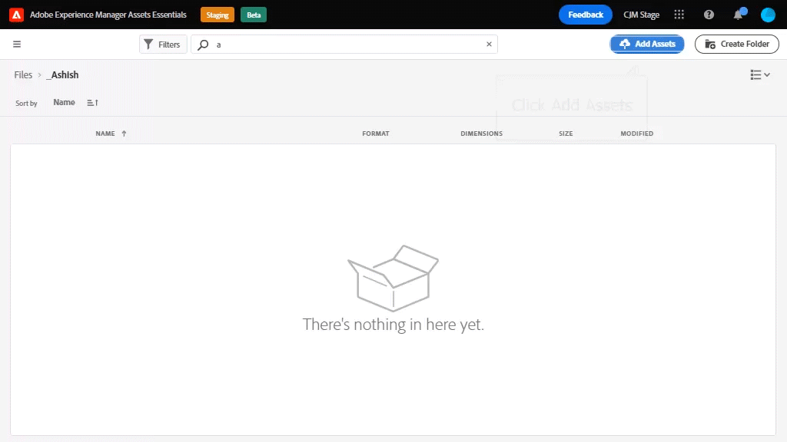
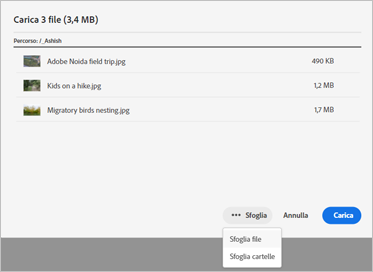
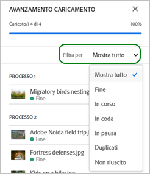
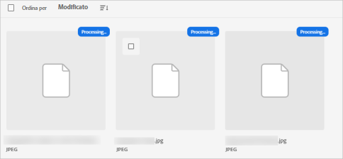
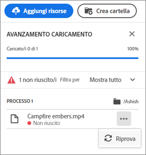
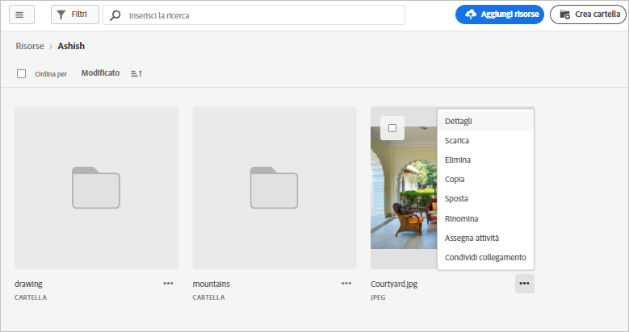

# Caricare le risorse {#add-assets}

Per aggiungere nuove risorse con cui lavorare, carica alcune risorse dal file system locale. <!-- TBD: Many of the [common file formats are supported](/help/supported-file-formats.md). -->

Puoi utilizzare i seguenti metodi per caricare una o più risorse o una cartella contenente risorse:

* Trascina risorse o cartelle nell’interfaccia utente e segui le istruzioni visualizzate.
* Fai clic su **[!UICONTROL Add Assets]** nella barra degli strumenti e aggiungi alcuni file alla finestra di dialogo di caricamento.

<!-- TBD: Update this GIF
 -->

Puoi utilizzare uno qualsiasi di questi metodi per caricare le risorse dopo aver creato una cartella. Per creare una cartella vuota, fai clic su **[!UICONTROL Create Folder]** nella barra degli strumenti. Mentre [!DNL Assets Essentials] offre una potente funzionalità di ricerca full-text, puoi anche utilizzare le cartelle per organizzare meglio le risorse.

Dopo aver selezionato i file, viene visualizzata una finestra di dialogo di conferma per aggiungere altri file o rimuovere i file già selezionati. Per aggiungere altri file a una selezione, fare clic su **[!UICONTROL Browse]** e selezionare **[!UICONTROL Browse files]** o **[!UICONTROL Browse folders]**. Aggiungi più file o cartelle dalla stessa cartella o da una cartella diversa.

Una volta messi in coda tutti i file, fai clic su **[!UICONTROL Upload]**.

*Figura: Prima di caricare le risorse selezionate, potete aggiungere o rimuovere le risorse dalla coda.*

>[!CAUTION]
>
>Utilizza risorse prive di spazio vuoto nei nomi dei file. Le risposte ai commenti non funzionano per tali risorse.

## Visualizza stato e avanzamento del caricamento {#upload-progress}

Quando carichi molte risorse o cartelle nidificate in [!DNL Assets Essentials], il caricamento di alcune risorse può non riuscire per vari motivi, ad esempio per problemi di risorse duplicate e di rete.

Per tenere traccia dell’avanzamento del caricamento, fai clic su **[!UICONTROL Upload Progress]** nella barra degli strumenti. Un pannello mostra l’avanzamento del caricamento di tutte le risorse.

Per visualizzare un sottoinsieme di risorse in base all’avanzamento o allo stato del caricamento, utilizza il filtro nella barra laterale **[!UICONTROL Upload Progress]**. I vari filtri consentono di visualizzare tutte le risorse, i caricamenti completati, i caricamenti in corso, le risorse in coda da caricare, i caricamenti in pausa, le risorse duplicate e le risorse non caricate.

*Figura: Filtra le risorse che hai tentato di caricare in base al loro stato di caricamento o all’avanzamento del caricamento.*

Immediatamente dopo il caricamento delle risorse, [!DNL Assets Essentials] elabora le risorse per generare miniature ed elaborare metadati. Per molte risorse, l’elaborazione richiede un po’ di tempo. Se non visualizzi una miniatura e vedi un messaggio di elaborazione sulla miniatura del segnaposto, controlla nuovamente la cartella dopo alcuni minuti.

## Rendering delle risorse {#renditions}

[!DNL Assets Essentials] elabora le risorse caricate in tempo quasi reale e per molti tipi di file supportati genera rappresentazioni. Creati per le immagini, i rendering sono versioni ridimensionate dell&#39;immagine caricata. Puoi scaricare non solo la risorsa, ma anche le rappresentazioni per utilizzare una versione appropriata. Puoi visualizzare tutte le rappresentazioni di una risorsa quando [visualizzi l&#39;anteprima di una risorsa](/help/navigate-view.md#preview-assets).

## Gestire i caricamenti non riusciti {#resolve-upload-fails}

Se il caricamento di una risorsa supportata non riesce per qualche motivo, fai clic su **[!UICONTROL Retry]** nel riquadro [!UICONTROL Upload Progress].

*Figura: Riprova se il caricamento di un file supportato non riesce per qualche motivo.*

Se tenti di caricare risorse duplicate, queste non vengono caricate finché non confermi esplicitamente il caricamento. Inizialmente, le risorse duplicate vengono contrassegnate come caricamenti non riusciti. Per risolvere il problema, puoi semplicemente creare una versione, eliminare e sostituire le risorse esistenti o creare una copia duplicata rinominando la risorsa. Puoi risolvere tali errori una risorsa alla volta o farlo in blocco per tutti i duplicati non riusciti in una sola volta.

*Figura: Per le risorse duplicate che non possono essere caricate per impostazione predefinita, risolvi il problema una risorsa alla volta.*

*Figura: Per le risorse duplicate che non possono essere caricate per impostazione predefinita, risolvi i problemi per tutte le risorse alla volta.*

>[!TIP]
>
>Puoi caricare le risorse nell’archivio DAM direttamente dalle applicazioni desktop [!DNL Creative Cloud]. Scopri come [[!DNL Assets Essentials] si integra con [!DNL Adobe Asset Link]](/help/integration.md).

## Eliminare risorse o cartelle {#delete-assets}

Gli utenti possono eliminare singole risorse o cartelle che non sono più necessarie. Per eliminare una risorsa o una cartella, effettua una delle seguenti operazioni:

* Utilizza l’opzione disponibile sulla miniatura di una risorsa o di una cartella.

   

* Seleziona una risorsa o una cartella e fai clic su **[!UICONTROL Delete]**  nella barra degli strumenti.
