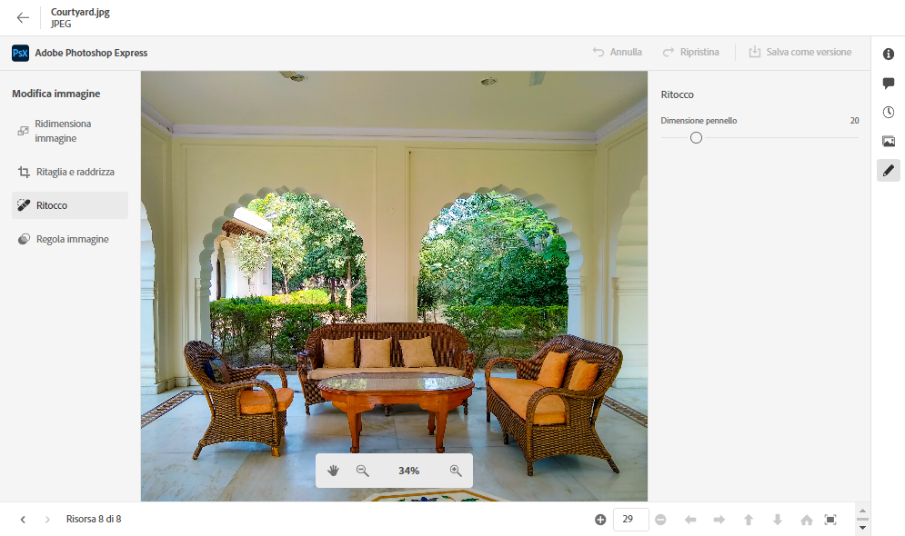
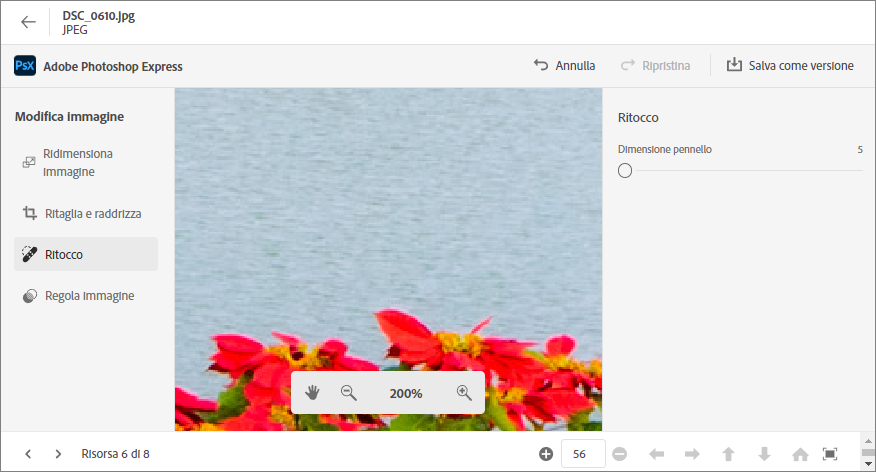
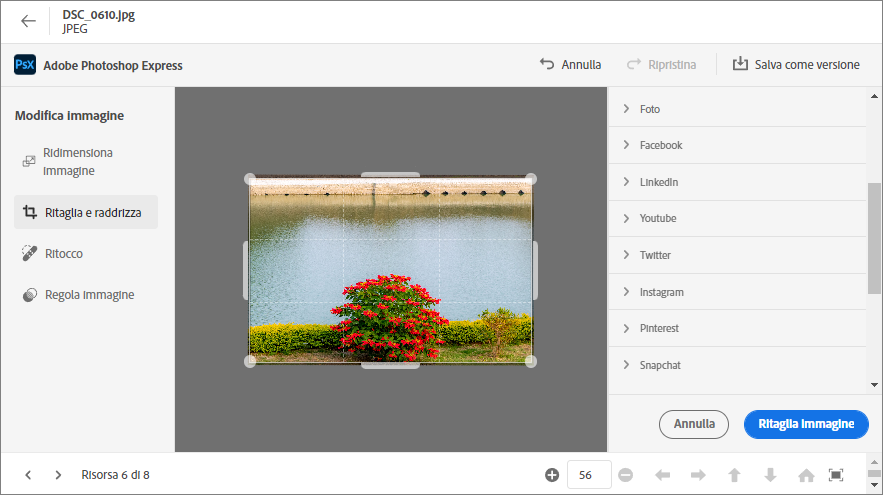
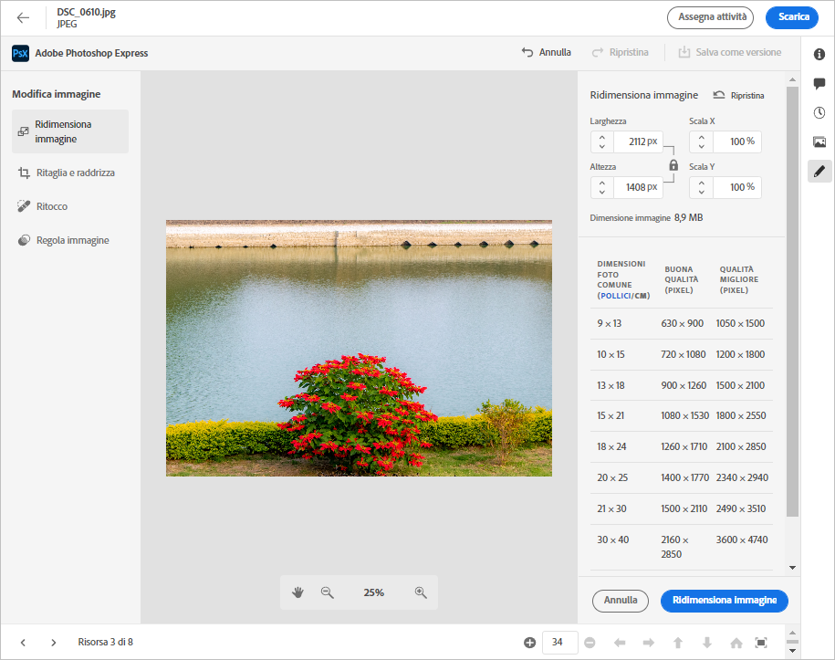
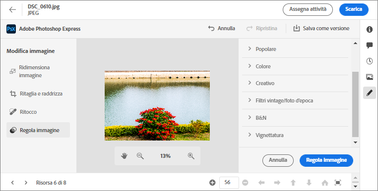

# Modifica delle immagini in [!DNL Assets Essentials] {#edit-images}

[!DNL Assets Essentials] offre opzioni di modifica intuitive basate su [!DNL Adobe Photoshop Express]. Le azioni di modifica disponibili sono: guarigione a punti, ritaglio e raddrizzamento, Ridimensiona immagine e Regola immagine.

Dopo aver modificato un’immagine, puoi salvarla come nuova versione. Se necessario, il controllo delle versioni consente di ripristinare la risorsa originale in un secondo momento. Per modificare un&#39;immagine, [apri anteprima](/help/navigate-view.md#preview-assets) e fai clic su **[!UICONTROL Modifica immagine]**  dalla barra a destra.

*Figura: Le opzioni per la modifica delle immagini si basano su [!DNL Adobe Photoshop Express].*

## Immagini di correzione a punti {#spot-heal-images}

Se in un’immagine sono presenti punti minori o oggetti di piccole dimensioni, è possibile modificare e rimuovere tali punti utilizzando la funzione di correzione delle aree fornita da Adobe Photoshop.

Il pennello campiona l&#39;area ritoccata e fa sì che i pixel riparati si fondano perfettamente nel resto dell&#39;immagine. Utilizzare una dimensione del pennello solo leggermente più grande del punto da correggere.

<!-- TBD: See if we should give backlinks to PS docs for these concepts.
For more information about how Spot Healing works in Photoshop, see [retouching and repairing photos](https://helpx.adobe.com/photoshop/using/retouching-repairing-images.html). -->

## Ritaglia e raddrizza le immagini {#crop-straighten-images}

Utilizzando l’opzione di ritaglio e raddrizzamento è possibile eseguire ritaglio di base, ruotare l’immagine, capovolgerla orizzontalmente o verticalmente e ritagliarla in dimensioni adatte per i siti web di social media più popolari.

Per salvare le modifiche, fai clic su **[!UICONTROL Ritaglio immagine]**. Dopo la modifica, puoi salvare la nuova immagine come versione.

Molte opzioni predefinite consentono di ritagliare l’immagine alle proporzioni migliori che si adattano a vari profili e post di social media.

## Ridimensiona immagine {#resize-image}

Il ridimensionamento di un’immagine a una dimensione specifica è un caso d’uso comune. [!DNL Assets Essentials] consente di ridimensionare rapidamente le immagini per adattarle alle dimensioni comuni delle foto, fornendo nuove risoluzioni precalcolate per dimensioni specifiche. Puoi visualizzare le dimensioni comuni delle foto in centimetri o pollici per conoscere le dimensioni. Per impostazione predefinita, il metodo di ridimensionamento mantiene le proporzioni. Per ignorare manualmente le proporzioni, fai clic su .

Inserisci le dimensioni e fai clic su **[!UICONTROL Ridimensiona immagine]** per ridimensionare l’immagine. Prima di salvare le modifiche come versione, fai clic su per annullare tutte le modifiche apportate prima di salvarle [!UICONTROL Annulla] oppure puoi modificare il passaggio specifico nel processo di modifica facendo clic su [!UICONTROL Ripristina].

## Regola immagine {#adjust-image}

[!DNL Assets Essentials] consente di regolare il colore, il tono, il contrasto e molto altro con pochi clic. Fai clic su **[!UICONTROL Regola immagine]** nella finestra di modifica. Nella barra laterale destra sono disponibili le seguenti opzioni:

* **Popolare**: [!UICONTROL Contrasto e dettagli elevati], [!UICONTROL Contrasto], [!UICONTROL Foto invecchiata], [!UICONTROL Bianco e nero]e [!UICONTROL Bianco e nero tonalità seppia].
* **Colore**: [!UICONTROL Naturale], [!UICONTROL Luminoso], [!UICONTROL Contrasto elevato], [!UICONTROL Contrasto e dettagli elevati], [!UICONTROL Vivido]e [!UICONTROL Matte].
* **Creativo**: [!UICONTROL Contrasto], [!UICONTROL Luce fredda], [!UICONTROL Turchese e rosso], [!UICONTROL Morsa morbida], [!UICONTROL Instant Vintage], [!UICONTROL Contrasto caldo], [!UICONTROL Piatta e verde], [!UICONTROL Matte di incremento rosso], [!UICONTROL Ombre calde]e [!UICONTROL Foto invecchiata].
* **Bianco e nero**: [!UICONTROL Orizzontale in bianco e nero], [!UICONTROL Contrasto elevato in bianco e nero], [!UICONTROL Punzonatura in bianco e nero], [!UICONTROL Contrasto basso in bianco e nero], [!UICONTROL B&amp;B piatto], [!UICONTROL Bianco e nero], [!UICONTROL Infrarossi in bianco e nero], [!UICONTROL Tonalità selenio bianco e nero], [!UICONTROL Bianco e nero tonalità seppia]e [!UICONTROL Tono diviso in bianco e nero].
* **Vignettatura**: [!UICONTROL Nessuno], [!UICONTROL Luce], [!UICONTROL Media]e [!UICONTROL Pesante].

<!--
TBD: Insert a video of the available social media options.
-->

>[!MORELIKETHIS]
>
>* [Visualizzare la cronologia delle versioni di una risorsa](/help/navigate-view.md)

