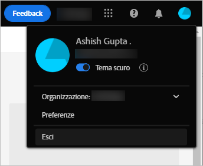
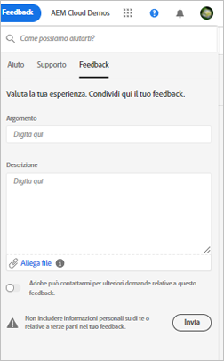

# Iniziare a utilizzare [!DNL Experience Manager Assets Essentials] {#assets-essentials-get-started}

<!-- TBD: Make links for these steps. -->

La gestione delle risorse digitali tramite [!DNL Assets Essentials] richiede solo tre semplici passaggi:

* **Passaggio 1**: [Caricare](/help/add-delete.md) e [visualizzare](/help/navigate-view.md) le risorse.
* **Passaggio 2**: [Cercare](/help/search.md) e [scaricare](/help/manage-organize.md#download) le risorse.
* **Passaggio 3**: [Gestire e organizzare](/help/manage-organize.md) le risorse.

Per utilizzare [!DNL Assets Essentials], accedi a [https://experience.adobe.com/#/assets](https://experience.adobe.com/#/assets). Durante l’accesso, seleziona `Company or School Account`. Per ricevere l’accesso, contatta l’amministratore della tua organizzazione.

Inoltre, consulta la documentazione che descrive [l’interfaccia utente](/help/navigate-view.md), [i casi d’uso](#use-cases), <!-- TBD: [supported file types](/help/supported-file-formats.md), --> e [i problemi noti](/help/release-notes.md#known-issues).

## Ricevere l’accesso a [!DNL Assets Essentials] {#get-access}

Adobe esegue il provisioning della soluzione e aggiunge come amministratore la persona designata dalla tua organizzazione. Gli amministratori possono fornire l’accesso a vari utenti dell’organizzazione utilizzando [[!DNL Admin Console]](https://helpx.adobe.com/it/enterprise/using/admin-console.html). Per le richieste relative all’accesso, contatta l’amministratore della tua organizzazione.

Al momento dell’accesso, dopo che hai fornito le tue credenziali, [!DNL Assets Essentials] ti chiede di selezionare un account. In questo caso, seleziona `Company or School Account` per procedere.

## Configurare [!DNL Assets Essentials] {#configuration}

Per aprire le preferenze, fai clic sull’avatar in alto a destra nell’interfaccia utente. Nelle preferenze della soluzione, puoi scegliere di usare il tema chiaro o scuro.

Se fai parte di organizzazioni diverse, puoi anche cambiare l’organizzazione e accedere ai tuoi account per le diverse organizzazioni.

Per modificare le [!UICONTROL Preferenze di Experience Cloud], fai clic su [!UICONTROL Preferenze].

## Casi di utilizzo di [!DNL Assets Essentials] {#use-cases}

Di seguito sono indicate le varie attività di gestione delle risorse digitali (DAM) che puoi eseguire con [!DNL Assets Essentials].

| Attività utente | Funzionalità e informazioni |
|-----|------|
| Sfogliare e visualizzare le risorse | <ul> <li>[Sfogliare l’archivio](/help/navigate-view.md#view-assets-and-details) </li> <li> [Visualizzare in anteprima una risorsa](/help/navigate-view.md#preview-assets) <li> [Visualizzare le rappresentazioni di una risorsa](/help/add-delete.md#renditions) </li> <li>[Visualizzare le versioni di una risorsa](/help/manage-organize.md#view-versions)</li></ul> |
| Aggiungere nuove risorse | <ul> <li>[Caricare nuove risorse e cartelle](/help/add-delete.md#add-assets)</li> <li>[Monitorare l’avanzamento del caricamento e gestire i caricamenti](/help/add-delete.md#upload-progress)</li> <li>[Risolvere i duplicati](/help/add-delete.md#resolve-upload-fails)</li> </ul> |
| Aggiornare le risorse o le informazioni correlate | <ul> <li>[Modificare le immagini](/help/edit-images.md)</li> <li>[Creare le versioni](/help/manage-organize.md#create-versions) e [visualizzare le versioni](/help/manage-organize.md#view-versions)</li> <li>[Modificare le immagini](/help/edit-images.md)</li> </ul> |
| Modificare le risorse | <ul> <li>[Modifiche nel browser con Adobe Photoshop Express](/help/edit-images.md)</li> <li>[Ritagliare in base a un profilo social media](/help/edit-images.md#crop-straighten-images)</li> <li>[Visualizzare e gestire le versioni](/help/manage-organize.md#view-versions)</li> <li>[Utilizzare [!DNL Adobe Asset Link]](/help/integration.md#integrations)</ul></ul> |
| Cercare le risorse nell’archivio | <ul> <li>[Ricerca in una cartella specifica](/help/search.md#refine-search-results)</li> <li>[Ricerche salvate](/help/search.md#saved-search)</li> <li>[Cercare le risorse visualizzate di recente](/help/search.md)</li> <li>[Ricerca testuale](/help/search.md) |
| Scaricare le risorse | <ul> <li> [Visualizzare in anteprima una risorsa](/help/navigate-view.md#preview-assets) </li> <li> [Scaricare le risorse](/help/manage-organize.md#download) <li> [Scaricare le rappresentazioni](/help/add-delete.md#renditions) </li></ul> |
| Operazioni relative ai metadati | <ul> <li>[Visualizzare i metadati nel dettaglio](/help/metadata.md) </li> <li> [Aggiornare i metadati](/help/metadata.md#update-metadata)</li> <li> [Creare un nuovo modulo di metadati](/help/metadata.md#metadata-forms) </li> </ul> |
| Integrazione con altre soluzioni | <ul> <li>[Utilizzare il selettore risorse in [!DNL Adobe Journey Optimizer]](/help/integration.md)</li> <li>[[!DNL Adobe Asset Link] per [!DNL Creative Cloud]](/help/integration.md)</li> <li>[Integrazione con [!DNL Adobe Workfront]](/help/integration.md)</li> </ul> |

<!--TBD: Merge the below rows in the table when the use cases are documented/available.

| How do I delete assets? | <ul> <li>[Delete assets](/help/manage-organize.md)</li> <li>Recover deleted assets</li> <li>Permanently delete assets</li> </ul> |
| How do I share assets or find shared assets? | <ul> <li>Shared by me</li> <li>Shared with me</li> <li>Share for comments and review</li> <li>Unshare assets</li> </ul> |
| How do I collaborate with others and get my assets reviewed | <ul> <li>Share for review</li> <li>Provide comments. Resolve and filter comments</li> <li>Annotations on images</li> <li>Assign tasks to specific users and prioritize</li> </ul> |

-->

##  Fornire feedback sul prodotto {#provide-feedback}

Adobe invita gli utenti a fornire un feedback sulla soluzione. Per fornire un feedback direttamente dall’applicazione in uso, utilizza l’opzione [!UICONTROL Feedback] nell’interfaccia utente. Puoi anche allegare file come una schermata o registrazione video di un problema.

Per fornire un feedback sulla documentazione, fai clic su [!UICONTROL Modifica questa pagina]  o [!UICONTROL Segnala un problema]  nella barra laterale destra. Puoi effettuare una delle seguenti operazioni:

* Aggiorna i contenuti e invia una richiesta pull GitHub.
* Crea un problema o un ticket in GitHub. Quando crei un problema, mantieni il nome dell’articolo popolato automaticamente.

>[!MORELIKETHIS]
>
>* [Interfaccia utente](/help/navigate-view.md).
>* [Note sulla versione e problemi noti](/help/release-notes.md).

<!-- TBD: 
>* [Supported file types](/help/supported-file-formats.md).
-->
