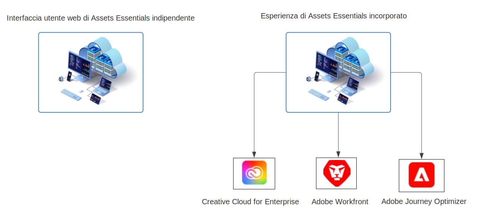

# Panoramica di [!DNL Adobe Experience Manager Assets Essentials] {#assets-essentials}

<!-- TBD: Update this banner to remove Beta label. 

-->

Adobe offre solide soluzioni Digital Asset Management (DAM) per trarre il massimo dalle risorse digitali. Adobe Experience Manager Assets Essentials è la soluzione di gestione delle risorse leggera di Adobe per archiviare, gestire, scoprire e utilizzare le risorse digitali.

## Cos’è Assets Essentials? {#assets-essemtials-overview}

Experience Manager Assets Essentials è un&#39;edizione leggera del Cloud Service Adobe Experience Manager Assets. Assets Essentials fornisce una gestione unificata delle risorse e una collaborazione con un’interfaccia utente semplificata e moderna. La soluzione intuitiva consente ai team creativi e di marketing di archiviare, scoprire e distribuire risorse digitali.

Assets Essentials consente di:

* Gestire, organizzare e gestire le risorse a una posizione centrale.

* Collabora allo sviluppo di contenuti tra i team.

* Accedi, cerca e trova le risorse approvate finali.

* Condividi e scarica risorse per la distribuzione a valle.

## Come accedere ad Assets Essentials? {#access-options}

Assets Essentials offre un’interfaccia utente web indipendente per gli utenti finali e gli amministratori, consentendo loro di accedere a tutte le funzionalità della soluzione. Gli utenti di altre soluzioni Adobe possono inoltre accedere e lavorare con le risorse di Assets Essentials tramite un’esperienza incorporata, disponibile in Creative Cloud per le applicazioni aziendali, Adobe Journey Optimizer e Adobe Workfront.

## Perché Assets Essentials? {#assets-essentials-features}

Assets Essentials offre vantaggi chiave che ti consentono di:

* **Introduzione rapida** con strumenti di gestione delle risorse pronti all’uso.

* Estendi l’accesso alle risorse a più team per fornire esperienze cliente coerenti con **gestione semplificata delle risorse**.

* Unificare il ciclo di vita dei contenuti con quello nativo **integrazioni in altre soluzioni Adobe**.

* Sfruttare un **piattaforma basata su cloud**, sicuro e pronto per essere scalato in qualsiasi momento, ovunque.

* Inizia con le funzionalità principali di DAM e **crescere** a DAM aziendale.

**Introduzione rapida**

La soluzione Assets Essentials viene fornita ai clienti per Adobe e disponibile al termine del processo di provisioning. Gli amministratori possono accedere al prodotto in Adobe Admin Console e avviare immediatamente la configurazione del sistema e l’onboarding degli utenti.

Ulteriori informazioni su Assets Essentials [amministrazione e onboarding degli utenti](deploy-administer.md).

**Gestione semplificata delle risorse**

L’interfaccia utente semplificata di Assets Essentials semplifica la gestione, l’individuazione e la distribuzione delle risorse digitali. Un’ampia gamma di utenti tra diverse funzioni, compresi team creativi, di marketing e di business, può collaborare sulle risorse e accedere alle risorse approvate, quando e dove ne hanno bisogno.

Per ulteriori informazioni, consulta [Guida introduttiva alle esigenze di gestione delle risorse con Assets Essentials](get-started.md).

**Integrazione con altre applicazioni Adobe**

Assets Essentials si integra con le soluzioni Adobe supportate e fornisce un’esperienza incorporata dalle interfacce di queste applicazioni. Consente agli utenti di accedere facilmente alle risorse di cui hanno bisogno direttamente nella loro applicazione. Tutti gli utenti possono lavorare con le stesse risorse gestite a livello centrale nei propri strumenti e applicazioni familiari.

L’esperienza Assets Essentials incorporata è disponibile per Creative Cloud per le applicazioni enterprise, Adobe Journey Optimizer e Adobe Workfront.

Per ulteriori informazioni, consulta [Integrazioni con altre soluzioni Adobe](integration.md).

**Piattaforma basata su cloud**

Basato sull’infrastruttura cloud di Adobe, Assets Essentials consente alle organizzazioni di concentrarsi sulle esigenze aziendali relative alla creazione, gestione e distribuzione di risorse digitali. Inoltre, l&#39;Adobe garantisce che la soluzione sia disponibile, sicura, scalabile e sempre aggiornata, con innovazioni di prodotto fornite agli utenti senza problemi tramite frequenti aggiornamenti.

**Funzionalità sempre più avanzate**

Inizia subito a usare Assets Essentials per sfruttare le funzionalità principali di Digital Asset Management tra i vari team.

Quando le tue esigenze aziendali aumentano e hai bisogno di supporto per requisiti avanzati di Digital Asset Management, come personalizzazioni, estensibilità e integrazioni, automazione, Dynamic Media e Brand Portal, Adobe offre anche [Risorse Adobe Experience Manager as a Cloud Service](https://experienceleague.adobe.com/docs/experience-manager-cloud-service/content/assets/home.html?lang=en).

## Passaggi successivi {#next-steps}

* Fornisci feedback sui prodotti utilizzando [!UICONTROL Feedback] opzione disponibile nell’interfaccia utente di Assets Essentials

* Fornire feedback alla documentazione utilizzando [!UICONTROL Modifica questa pagina]  o [!UICONTROL Segnala un problema]  disponibile sulla barra laterale destra

* Contatto [Assistenza clienti](https://experienceleague.adobe.com/?support-solution=General#support)

>[!MORELIKETHIS]
>
>* [[!DNL Assets Essentials] pagina dei tutorial](https://experienceleague.adobe.com/docs/experience-manager-learn/assets-essentials/overview.html?lang=en)

