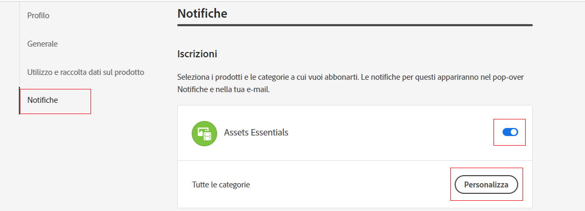
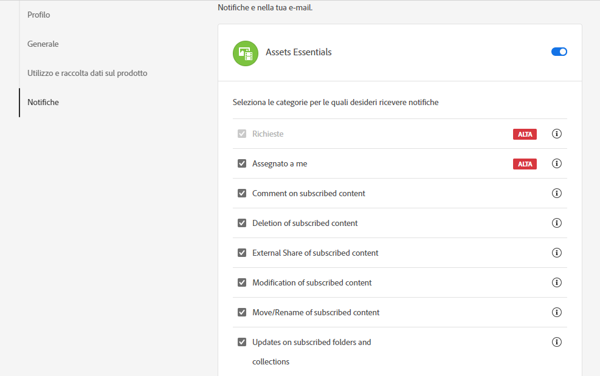
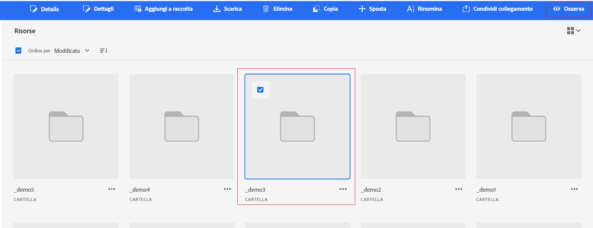

# Gestione delle notifiche {#manage-notifications}

Le notifiche Assets Essentials ti consentono di monitorare le operazioni eseguite sulle risorse o cartelle disponibili nell’archivio. Devi selezionare e abbonarti al contenuto per il quale ti vengono inviate le notifiche. Puoi anche configurare le categorie per le quali vengono inviate le notifiche.

## Iscriviti alle categorie di notifica {#subscribe-to-notification-categories}

Puoi scegliere e iscriverti a un elenco di categorie per ricevere le notifiche. Assets Essentials invia le notifiche solo per le categorie selezionate tra le opzioni disponibili:

<table>
    <tbody>
     <tr>
      <th><strong>Categoria di notifica</strong></th>
      <th><strong>Descrizione</strong></th>
     </tr>
     <tr>
      <td>Richieste</td>
      <td>Quando si assegna un'attività a un utente, si ricevono notifiche quando l'utente esegue azioni su tale attività.</td>
     </tr>
     <tr>
      <td>Assegnato a me</td>
      <td>Ricevi una notifica quando un’attività ti è stata assegnata da un altro utente.</td>
     </tr>
     <tr>
      <td>Commento sul contenuto iscritto</td>
      <td>Ricevi una notifica quando un utente commenta la risorsa sottoscritta.</td>
     </tr>
     <tr>
      <td>Eliminazione del contenuto iscritto</td>
      <td>Ricevi una notifica quando un utente elimina la risorsa o la cartella sottoscritta.</td>
     </tr>
     <tr>
      <td>Condivisione esterna del contenuto iscritto</td>
      <td>Ricevi una notifica quando un utente genera un collegamento pubblico per la risorsa o la cartella sottoscritta.</td>
     </tr>
     <tr>
      <td>Modifica del contenuto iscritto</td>
      <td>Ricevi una notifica quando un utente crea una nuova versione per la risorsa sottoscritta.</td>
     </tr>
     <tr>
      <td>Spostamento/ridenominazione del contenuto sottoscritto</td>
      <td>Ricevi una notifica quando un utente sposta o rinomina la risorsa o la cartella sottoscritta.</td>
     </tr>
     <tr>
      <td>Aggiornamenti alle cartelle e alle raccolte sottoscritte</td>
      <td>Ricevi una notifica quando un utente aggiunge o rimuove una risorsa da una cartella sottoscritta.</td>
     </tr>    
    </tbody>
   </table>

Per iscriversi alle categorie di notifica:

1. Fai clic su  all’estremità destra della barra dei menu nell’interfaccia utente di Assets Essentials.

1. Fai clic su  per visualizzare [!UICONTROL Preferenze di Experience Cloud] pagina.

1. Fai clic sul pulsante **[!UICONTROL Notifiche]** nel riquadro a sinistra.

1. In **[!UICONTROL Notifiche]** , passa alla sezione [!UICONTROL Assets Essentials] e assicurarsi che l&#39;opzione di attivazione sia attivata.

   

1. Fai clic su **[!UICONTROL Personalizza]** per visualizzare le categorie di notifiche.
   

1. Seleziona le categorie di notifica per le quali devi ricevere una notifica.

## Visualizzare e deselezionare cartelle o risorse {#watch-unwatch-assets}

Dopo [sottoscrizione alle categorie di notifica](#subscribe-to-notification-categories), devi abbonarti al contenuto per iniziare a ricevere le notifiche.

>[!NOTE]
>
>Per **[!UICONTROL Richieste]** e **[!UICONTROL Assegnato a me]** categorie di notifiche, non è necessario iscriversi al contenuto dopo l’iscrizione alle categorie di notifica. Le notifiche vengono inviate automaticamente per le richieste create dall&#39;utente e quando un&#39;attività viene assegnata all&#39;utente.

Per iscriverti al contenuto, seleziona la cartella o la risorsa a cui devi abbonarti e fai clic su **[!UICONTROL Guarda]**.

Assets Essentials visualizza un messaggio di successo. Puoi fare clic su **[!UICONTROL Vai alle preferenze per le notifiche]** disponibile nel messaggio di successo per modificare il [sottoscrizione a categorie di notifica](#subscribe-to-notification-categories).

Assets Essentials ora invia notifiche per le categorie sottoscritte. Puoi anche selezionare più risorse o cartelle e fare clic su **[!UICONTROL Guarda]** per risparmiare tempo. Tuttavia, se selezioni più entità tra le quali alcune sono già state sottoscritte, la **[!UICONTROL Guarda]** l&#39;opzione non viene visualizzata.

Allo stesso modo, per annullare l’iscrizione, seleziona la risorsa o la cartella per la quale ti sei iscritto e fai clic su **[!UICONTROL Annulla controllo]**.

## Visualizza notifiche {#view-notifications}

Le notifiche vengono visualizzate all’estremità destra della barra dei menu nell’interfaccia utente di Assets Essentials.

Quando fai clic su una notifica, Assets Essentials ti consente di passare alla risorsa o alla cartella appropriata a cui si fa riferimento nella notifica.

