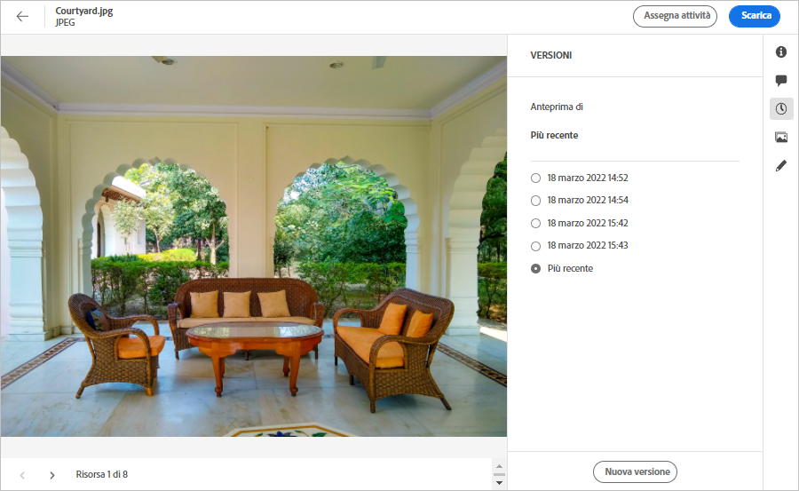
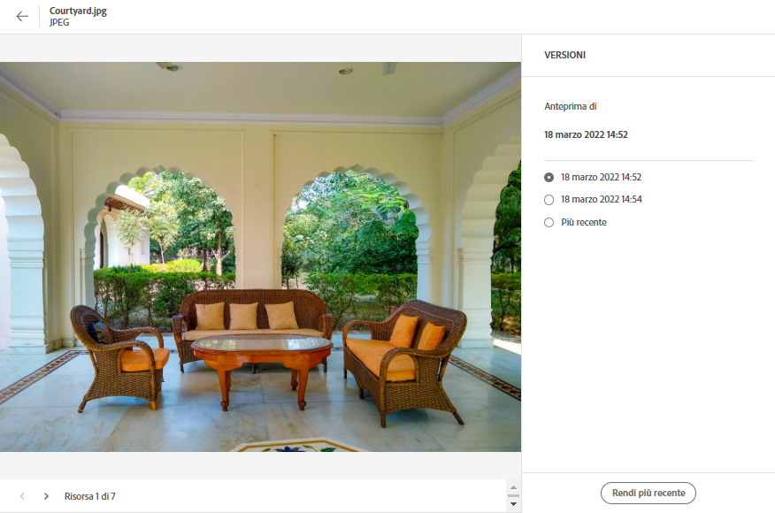

# Gestire le risorse {#manage-assets}

Puoi eseguire facilmente diverse attività di gestione delle risorse digitali (DAM) utilizzando l’interfaccia intuitiva di [!DNL Assets Essentials]. Dopo aver aggiunto le risorse, puoi cercare, scaricare, spostare, copiare, rinominare, eliminare, aggiornare e modificare le risorse.

Utilizza [!DNL Assets Essentials] per eseguire le seguenti attività di gestione delle risorse. Quando selezioni una risorsa, nella barra degli strumenti nella parte superiore vengono visualizzate le seguenti opzioni:

*Figura: Opzioni disponibili nella barra degli strumenti per un’immagine selezionata.*

*  iconaDeseleziona la selezione.
*  Fai clic su per visualizzare in anteprima una risorsa e visualizzare i metadati dettagliati. Quando visualizzi l’anteprima, puoi visualizzare le versioni e modificare un’immagine.
*  iconaScarica la risorsa selezionata nel file system locale.
*  iconaElimina la risorsa o la cartella selezionata.
* 

   <!--  --> Checkout an asset.
*  iconaCopia il file o la cartella selezionati.
*  iconaSposta la risorsa o la cartella selezionata in una posizione diversa nella gerarchia del repository.
*  iconaRinomina la risorsa o la cartella selezionata. In caso contrario, la ridenominazione non riesce e viene visualizzato un avviso. Riprova con un nuovo nome.
* 
   <!--  --> Assign tasks to other users to collaborate on an asset.

Puoi visualizzare le stesse opzioni sulle miniature delle risorse.

[!DNL Assets Essentials] visualizza nella barra degli strumenti solo le opzioni pertinenti in base al tipo di risorsa selezionata.

*Figura: Opzioni disponibili nella barra degli strumenti per una cartella selezionata.*

*Figura: Opzioni disponibili nella barra degli strumenti per un file PDF selezionato.*

## Scaricare e distribuire le risorse {#download}

È possibile selezionare una o più risorse o cartelle o una combinazione di entrambe e scaricare la selezione nel file system locale. Puoi modificare le risorse e caricarle nuovamente o distribuirle all’esterno di [!DNL Assets Essentials]. Puoi anche [scaricare i rendering](/help/add-delete.md#renditions) di una risorsa.

## Controllo delle versioni delle risorse {#versions-of-assets}

<!-- 
TBD: query for engineering: How many versions are maintained. What happens when we reach that limit? Are old versions automatically removed? -->

[!DNL Assets Essentials] versioni le risorse quando vengono caricate di nuovo che vengono aggiornate o modificate. Puoi visualizzare la cronologia delle versioni precedenti e ripristinare una versione precedente delle risorse come versione più recente, ripristinata se necessario a una versione precedente. Le versioni delle risorse vengono create nei seguenti scenari:

* Carica una nuova risorsa con lo stesso nome file di una risorsa esistente e nella stessa cartella della risorsa esistente. [!DNL Assets Essentials] richiede di sovrascrivere la risorsa precedente o di salvare la nuova risorsa come versione. Consulta [caricare risorse duplicate](/help/add-delete.md#resolve-upload-fails).

   

   *Figura: Quando carichi una risorsa con lo stesso nome di una risorsa esistente, puoi creare una versione della risorsa.*

* Modifica un’immagine e fai clic su **[!UICONTROL Save as Version]**. Consulta [modificare le immagini](/help/edit-images.md).

   

   *Figura: Salva l’immagine modificata come versione.*

* Apri le versioni di una risorsa esistente. Fai clic su **[!UICONTROL New Version]** e carica una versione più recente della risorsa nell’archivio.

   

### Visualizzare le versioni di una risorsa {#view-versions}

Quando carichi una copia duplicata o una copia modificata di una risorsa, puoi crearne le versioni. Il controllo delle versioni consente di rivedere le risorse storiche e, se necessario, ripristinare una versione precedente.

Per visualizzare le versioni, apri l’anteprima di una risorsa e fai clic su **[!UICONTROL Versions]**  nella barra laterale destra. Per visualizzare in anteprima una versione specifica, selezionala. Per ripristinarlo, fai clic su **[!UICONTROL Make Latest]**.

Puoi anche creare versioni dalla timeline delle versioni. Seleziona la versione più recente, fai clic su **[!UICONTROL New Version]** e carica una nuova copia della risorsa dal file system locale.

*Figura: Visualizza le versioni di una risorsa, ripristina una versione precedente o carica un&#39;altra nuova versione.*
