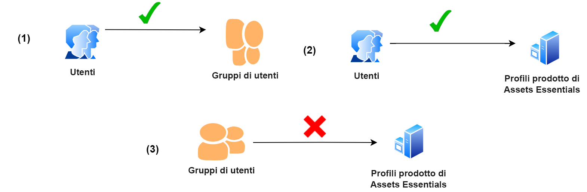
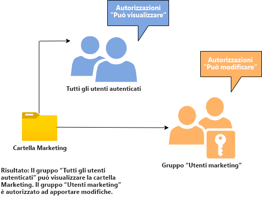
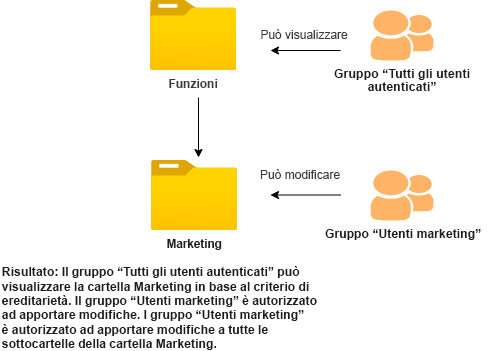
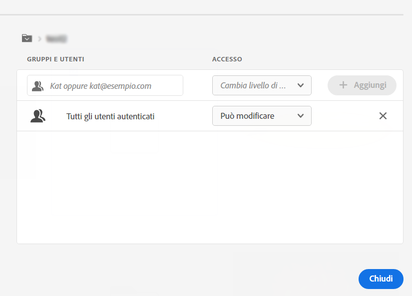

# Gestione delle autorizzazioni per le cartelle

Assets Essentials consente agli amministratori di gestire i livelli di accesso per le cartelle disponibili nell’archivio. In qualità di amministratore, puoi creare gruppi di utenti e assegnare autorizzazioni a tali gruppi per gestire i livelli di accesso. Puoi anche delegare i privilegi di gestione delle autorizzazioni ai gruppi di utenti a livello di cartella.

Il diagramma di flusso di dati seguente illustra la sequenza di attività eseguite per configurare e gestire le autorizzazioni sulle cartelle disponibili nell’archivio Assets Essentials:

## Prima di gestire le autorizzazioni per le cartelle {#before-managing-permissions}

Prima di iniziare a gestire le autorizzazioni per le cartelle nell’archivio Assets Essentials, è necessario eseguire alcune attività, ad esempio aggiungere amministratori in grado di creare una struttura logica di cartelle, creare gruppi di utenti e gestire le autorizzazioni per le cartelle per vari gruppi di utenti.

### Aggiungi amministratori {#add-admin-users}

Aggiungi amministratori per l&#39;applicazione Assets Essentials in modo che possano gestire le autorizzazioni della cartella per altri gruppi di utenti.

Per aggiungere amministratori:

1. Accesso [Admin Console](https://adminconsole.adobe.com) per la tua organizzazione, fai clic su **[!UICONTROL Prodotti]** nella barra superiore, fai clic su **[!UICONTROL Nozioni di base su AEM Assets]**, quindi fai clic su [!DNL Assets Essentials] ambiente. [!DNL Assets Essentials] dispone di tre profili di prodotto che rappresentano l’accesso per gli utenti amministratori, regolari e consumer.

   

1. Per aggiungere un utente a un gruppo, fai clic sul gruppo Amministratori di Assets Essentials, seleziona **[!UICONTROL Aggiungi utente]**, fornisci i dettagli utente e fai clic su **[!UICONTROL Salva]**.

   

   Quando aggiungi un utente, questo riceve un invito e-mail per iniziare. Puoi disattivare gli inviti e-mail nelle impostazioni del profilo di prodotto in [!DNL Admin Console].

1. Per rimuovere un utente da un gruppo, fare clic sul gruppo, selezionare un utente esistente e selezionare **[!UICONTROL Rimuovi utente]**.

### Aggiungi gruppi di utenti {#add-user-groups}

Crea gruppi di utenti e assegna le autorizzazioni a tali gruppi per gestire i livelli di accesso alle cartelle nell’archivio Assets Essentials. Puoi quindi assegnare gli utenti ai gruppi di utenti.

Puoi aggiungere utenti ai gruppi di utenti (1) e [utenti nei profili di prodotto di Assets Essentials (2)](#add-admin-users). Tuttavia, non è possibile aggiungere gruppi di utenti direttamente ai profili di prodotto di Assets Essentials (3).

Per informazioni su come gestire i gruppi di utenti, consulta `Create user groups` e `Edit user groups` disponibile all&#39;indirizzo [Gestione dei gruppi di utenti](https://helpx.adobe.com/enterprise/using/user-groups.html).

>[!NOTE]
>
>Se l’Admin Console è configurato per sfruttare un sistema esterno per gestire le assegnazioni di utenti/gruppi, ad esempio i connettori di Azure o Google, lo strumento di sincronizzazione degli utenti o l’API di ripristino della gestione utenti, i gruppi e le assegnazioni utente vengono configurati automaticamente. Per ulteriori informazioni, consulta [Utenti Adobe Admin Console](https://helpx.adobe.com/enterprise/using/users.html).

### Aggiungi utenti ai gruppi {#add-users-to-uesr-groups}

Dopo aver creato i gruppi di utenti, puoi iniziare ad aggiungere gli utenti ai gruppi di utenti.

Per informazioni su come gestire l’aggiunta di utenti ai gruppi di utenti, consulta `Add users to groups` disponibile all&#39;indirizzo [Gestione dei gruppi di utenti](https://helpx.adobe.com/in/enterprise/using/user-groups.html#add-users-to-groups).

### Crea struttura cartelle {#create-folder-structure}

Per creare una struttura di cartelle nell’archivio Assets Essentials, puoi utilizzare i seguenti metodi:

* Fai clic sul pulsante **[!UICONTROL Crea cartella]** per creare una cartella vuota, è disponibile nella barra degli strumenti.

* Fai clic su **[!UICONTROL Aggiungere risorse]** opzione disponibile nella barra degli strumenti per [caricare una struttura di cartelle disponibile nel computer locale](add-delete.md).

Creare una struttura di cartelle che funzioni bene con gli obiettivi aziendali dell&#39;organizzazione. Se carichi una struttura di cartelle esistente nell’archivio Assets Essentials, devi rivederla. Per ulteriori informazioni, consulta [Best practice per una gestione efficace delle autorizzazioni](permission-management-best-practices.md).

## Gestione delle autorizzazioni sulle cartelle {#manage-permissions-folders}

Puoi assegnare le seguenti autorizzazioni ai gruppi di utenti o agli utenti. Adobe sconsiglia di assegnare autorizzazioni agli utenti.

| Nome autorizzazione | Descrizione |
|-----|------|
| Can View | <ul><li>Accesso in lettura alle cartelle di visualizzazione e navigazione </li><li>Anteprima delle risorse</li><li>Scaricare le risorse</li><li>Copiare le risorse</li><li>Condividere collegamenti alle risorse</li><ul> |
| Può modificare | <ul><li>Tutti i privilegi disponibili per le autorizzazioni Can View </li><li>Creare cartelle</li><li>Rimuovi cartelle</li><li>Rinomina cartelle</li><li>Creare risorse</li><li>Aggiornare le risorse</li><li>Rimuovere le risorse</li><li>Spostare le risorse</li><li>Rinominare le risorse</li><ul> |
| Proprietario | <ul><li>Tutti i privilegi disponibili per le autorizzazioni di Can Edit</li><li>Gestire le autorizzazioni in una cartella e nelle relative sottocartelle</li>Questa autorizzazione consente agli amministratori di delegare i privilegi di amministratore ad altri utenti per una cartella e le relative sottocartelle.<ul> |
| Nega accesso | Rimuovi le autorizzazioni Può visualizzare, Può modificare e Proprietario per una cartella e le relative sottocartelle. |

**Autorizzazioni predefinite**

Tutti gli utenti autenticati e in grado di accedere all’applicazione Assets Essentials hanno `Can Edit` inizialmente le autorizzazioni per l’archivio Assets Essentials. L&#39;amministratore può modificare le autorizzazioni predefinite tramite [autorizzazioni di modifica per l’intero archivio Assets Essentials](#edit-permissions-entire-repository).

**Sequenza per assegnare le autorizzazioni della cartella ai gruppi di utenti**

Creare regole per assegnare le autorizzazioni della cartella ai gruppi di utenti. La sequenza utilizzata per assegnare le autorizzazioni a una cartella è importante e determina l’accesso disponibile per i gruppi di utenti e, in ultima analisi, per gli utenti.

Ad esempio, se assegni il `Can View` autorizzazioni per una cartella a un super gruppo e quindi assegnare `Can Edit` autorizzazioni per il sottogruppo, solo i membri del sottogruppo dispongono delle autorizzazioni di modifica per la cartella. Gli utenti del super gruppo possono visualizzare l&#39;accesso alla cartella.

Se devi fornire le autorizzazioni di modifica al `Marketing` solo al reparto marketing della tua organizzazione e visualizza le autorizzazioni ad altri, assegna `Can View` autorizzazioni per super gruppo `All Authenticated Users` e `Can Edit` autorizzazioni per il sottogruppo `Marketing`.

**Ereditarietà delle autorizzazioni**

Assets Essentials utilizza l’ereditarietà delle autorizzazioni, che consente di ereditare i permessi impostati per la cartella padre nella cartella figlio. Ad esempio, se la cartella principale ha `Can View` autorizzazioni per `All Authenticated Users` gruppo e la cartella figlio ha `Can Edit` autorizzazioni per `Marketing` gruppo di utenti, consente a tutti gli utenti autenticati di avere le autorizzazioni di visualizzazione per la cartella figlio e `Marketing` gruppo di utenti per disporre delle autorizzazioni di modifica per la cartella figlio. La `Marketing` gruppo di utenti dispone delle autorizzazioni di modifica per ulteriori livelli di cartelle nella cartella figlio (Marketing).

>[!NOTE]
>
> Impostazione di un `Deny Access` autorizzazioni per un gruppo in una cartella di livello superiore e quindi ripristino dell&#39;accesso (`Can view`, `Can edit` o `Owner`) per quel gruppo o il relativo membro non è supportato. Utilizzo `Deny Access` con cura.

### Aggiungere autorizzazioni ai gruppi di utenti {#add-permissions}

Per assegnare le autorizzazioni di gruppo alle cartelle:

1. Seleziona la cartella e fai clic su **[!UICONTROL Gestire le autorizzazioni]**.

1. Sulla **[!UICONTROL Gestire le autorizzazioni]** specifica il nome del gruppo o di un utente nel **[!UICONTROL Gruppi e utenti]** campo .

1. Seleziona la [livello di accesso](#manage-permissions-folders) dal **[!UICONTROL Accesso]** elenco a discesa.

1. Fai clic su **[!UICONTROL Aggiungi]** per apportare una modifica immediata alle autorizzazioni per l&#39;utente o il gruppo di utenti.

1. Ripeti i passaggi 1-3 per aggiungere altre regole al **[!UICONTROL Gestire le autorizzazioni]** finestra di dialogo.

   

   >[!NOTE]
   >
   > L’ordine utilizzato per assegnare le autorizzazioni a una cartella è importante e determina l’accesso disponibile per i gruppi di utenti e infine gli utenti aggiunti ai gruppi.

   Se gestisci le autorizzazioni per più cartelle, puoi anche selezionare qualsiasi altra cartella dal riquadro a sinistra e iniziare a gestire le autorizzazioni per tale cartella.

1. Fai clic su **[!UICONTROL Chiudi]**.

>[!CAUTION]
>
> Si consiglia di gestire le autorizzazioni per i gruppi di utenti anziché per i singoli utenti. Impostazione della `Deny access` Le autorizzazioni sono supportate solo per i gruppi di utenti, ma non per i singoli utenti.

### Modifica autorizzazioni assegnate a gruppi di utenti {#edit-permissions}

Per modificare le autorizzazioni assegnate a gruppi di utenti nelle cartelle:

1. Seleziona la cartella e fai clic su **[!UICONTROL Gestire le autorizzazioni]**.

1. Sulla **[!UICONTROL Gestire le autorizzazioni]** finestra di dialogo, modifica [livello di accesso](#manage-permissions-folders) dal **[!UICONTROL Accesso]** elenco a discesa.

1. [Aggiungi altri gruppi di utenti o utenti](#add-permissions) alle regole di autorizzazione esistenti, se necessario.

1. Fai clic su X per rimuovere le autorizzazioni assegnate a un gruppo di utenti.

### Modifica le autorizzazioni per l’intero archivio Assets Essentials {#edit-permissions-entire-repository}

Un amministratore dell’applicazione può modificare le autorizzazioni per l’intero archivio Assets Essentials da un valore predefinito `Can Edit` a qualsiasi altro livello di accesso.

Per modificare le autorizzazioni per l’intero archivio Assets Essentials:

1. Seleziona una cartella e fai clic su **[!UICONTROL Gestire le autorizzazioni]**.

1. Sulla **[!UICONTROL Gestire le autorizzazioni]** finestra di dialogo, fai clic su **[!UICONTROL Tutte le risorse]** nella barra a sinistra.

1. [Modificare le autorizzazioni](#edit-permissions) e chiudi la finestra di dialogo.

>[!NOTE]
>
>Impossibile selezionare l&#39;opzione `Deny Access` livello di autorizzazione per l’intero archivio Assets Essentials per garantire che gli utenti abbiano almeno accesso in lettura all’applicazione. Analogamente, `All Authenticated Users` disporre di almeno autorizzazioni di lettura per l&#39;archivio, anche se l&#39;amministratore rimuove esplicitamente il `Can Edit` autorizzazioni per [!UICONTROL Gestire le autorizzazioni] finestra di dialogo.

## Esempi di gestione efficace delle autorizzazioni {#example-permission-management}

**Caso d’uso**

* Tutti i gruppi Utenti autenticati hanno accesso alla directory archivio.
* I gruppi di utenti specifici del team dispongono delle autorizzazioni di modifica per la propria cartella specifica della funzione.
* La cartella legale non è disponibile per la visualizzazione per qualsiasi utente autenticato, ad eccezione del team legale.

Crea i seguenti gruppi di utenti nell&#39;Admin Console:

* Team di marketing

* Team approvatori del marchio

* Team di Project Manager

* Team X del progetto

* Gruppo legale

Il diagramma seguente illustra la gerarchia delle cartelle e le autorizzazioni assegnate a ciascun gruppo di utenti:

Di seguito sono riportati i livelli di accesso per tutti i gruppi di utenti nella gerarchia delle cartelle:

* /Tutte le risorse: L&#39;amministratore modifica le autorizzazioni a livello principale dal valore predefinito `Can Edit` a `Can View`. Tutti gli utenti possono visualizzare cartelle e risorse ma non possono modificarle.

* /marketing: Tutti gli utenti possono visualizzare le cartelle e le relative sottocartelle in base all’ereditarietà delle autorizzazioni. Tuttavia, il gruppo di utenti Marketing Team dispone delle autorizzazioni di modifica per la cartella.

* /brand: Tutti gli utenti possono visualizzare le cartelle e le relative sottocartelle in base all’ereditarietà delle autorizzazioni, tuttavia, il gruppo di utenti del team di approvatori del marchio dispone delle autorizzazioni di modifica per la cartella.

* /progetti: Tutti gli utenti possono visualizzare le cartelle e le relative sottocartelle in base all’ereditarietà delle autorizzazioni. Gruppo utenti del team di Project Manager:

   * Modifica autorizzazioni

   * Autorizzazioni proprietario: Consente di gestire le autorizzazioni per una cartella e le relative sottocartelle.

* /projects/project-x: Tutti gli utenti possono visualizzare le cartelle e le relative sottocartelle. Il gruppo utenti Team di Project Manager dispone di autorizzazioni di modifica e può gestire le autorizzazioni per una cartella e le relative sottocartelle (autorizzazioni Proprietario). Il gruppo di utenti del team di Project X dispone di autorizzazioni di modifica.

* /legale: Nessuno degli utenti può accedere alla cartella in base al `Deny Access` autorizzazioni per `All Authenticated Users` gruppo. Il gruppo di utenti del team legale dispone di autorizzazioni di modifica.
