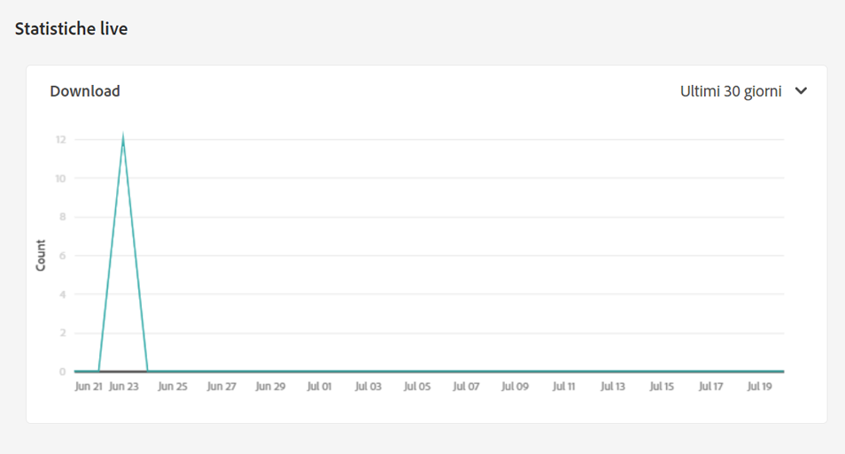
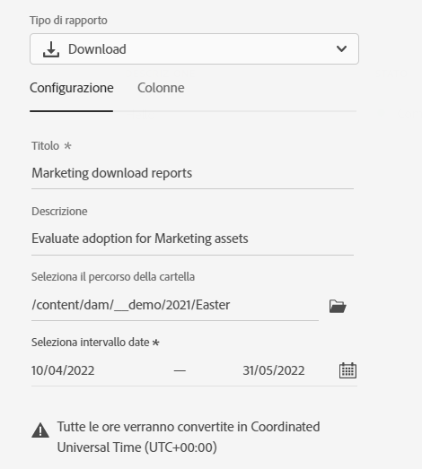
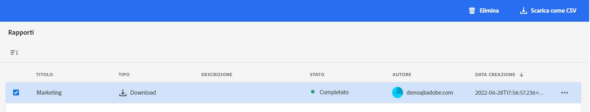

# Gestire i rapporti {#manage-reports}

Il reporting delle risorse offre agli amministratori la visibilità delle attività dell’ambiente Adobe Experience Manager Assets Essentials. Questi dati forniscono informazioni utili su come gli utenti interagiscono con il contenuto e il prodotto.

## Accedere ai rapporti {#access-reports}

Tutti gli utenti assegnati al [Profilo di prodotto Amministratori Assets Essentials](deploy-administer.md) può accedere al dashboard Live Statistics e creare report definiti dall&#39;utente in Assets Essentials.

## Visualizzare le statistiche dal vivo {#view-live-statistics}

Assets Essentials ti consente di visualizzare i dati in tempo reale per il tuo ambiente Assets Essentials con il dashboard Live Statistics. Puoi visualizzare le metriche degli eventi in tempo reale negli ultimi 30 giorni o negli ultimi 12 mesi.

Passa a **[!UICONTROL Impostazioni]** > **[!UICONTROL Statistiche live]** per visualizzare i dati di download generati automaticamente.

## Creare un rapporto {#create-report}

Per creare un rapporto:

1. Passa a **[!UICONTROL Impostazioni]** > **[!UICONTROL Rapporti]** e fai clic su **[!UICONTROL Crea rapporto]**.

1. Nella scheda [!UICONTROL Configurazione] specifica un titolo e una descrizione facoltativa per il rapporto.

1. Seleziona il percorso della cartella, che comprende le risorse su cui eseguire il rapporto, utilizzando il campo **[!UICONTROL Seleziona il percorso della cartella]**.

1. Seleziona l’intervallo di date per il rapporto.

1. Nella scheda [!UICONTROL Colonne] seleziona i nomi delle colonne da visualizzare nel rapporto.

1. Fai clic su **[!UICONTROL Crea]**.

   

La tabella seguente descrive tutte le colonne che è possibile aggiungere al rapporto:

<table>
    <tbody>
     <tr>
      <th><strong>Nome colonna</strong></th>
      <th><strong>Descrizione</strong></th>
     </tr>
     <tr>
      <td>Titolo</td>
      <td>Titolo della risorsa.</td>
     </tr>
     <tr>
      <td>Percorso</td>
      <td>Percorso della cartella in cui la risorsa è disponibile in Assets Essentials.</td>
     </tr>
     <tr>
      <td>Tipo</td>
      <td>Tipo MIME della risorsa.</td>
     </tr>
     <tr>
      <td>Dimensione</td>
      <td>Dimensione della risorsa.</td>
     </tr>
     <tr>
      <td>Scaricato da</td>
      <td>ID e-mail dell’utente che ha scaricato la risorsa.</td>
     </tr>
     <tr>
      <td>Data di download</td>
      <td>Data in cui è stata eseguita l’azione di download della risorsa.</td>
     </tr>
     <tr>
      <td>Autore</td>
      <td>Autore della risorsa.</td>
     </tr>
     <tr>
      <td>Data creazione</td>
      <td>La data in cui la risorsa è stata caricata in Assets Essentials.</td>
     </tr>
     <tr>
      <td>Data di modifica</td>
      <td>Data dell’ultima modifica apportata alla risorsa.</td>
     </tr>
     <tr>
      <td>Scaduta</td>
      <td>Stato di scadenza della risorsa.</td>
     </tr>
     <tr>
      <td>Scaricato da nome utente</td>
      <td>Nome dell’utente che ha scaricato la risorsa.</td>
     </tr>           
    </tbody>
   </table>

## Visualizzare i rapporti esistenti {#view-report-list}

Dopo [creazione del rapporto](#create-report), puoi visualizzare l’elenco dei rapporti esistenti e selezionare se scaricarli in formato CSV o eliminarli.

Per visualizzare l’elenco dei rapporti, passa a **[!UICONTROL Impostazioni]** > **[!UICONTROL Rapporti]**.

Per ogni rapporto puoi visualizzare il titolo, il tipo di rapporto, la descrizione specificata durante la creazione, lo stato del rapporto, l’ID e-mail dell’autore che ha creato il rapporto e la data di creazione del rapporto.

Lo stato `Completed ` indica che il rapporto è pronto per il download.

## Scaricare un rapporto CSV {#download-csv-report}

Per scaricare un rapporto in formato CSV:

1. Passa a **[!UICONTROL Impostazioni]** > **[!UICONTROL Rapporti]**.

1. Seleziona un rapporto e fai clic su **[!UICONTROL Scarica come CSV]**.

Il rapporto selezionato viene scaricato in formato CSV. Le colonne visualizzate nel rapporto CSV dipendono da quellle selezionate quando [si crea il rapporto](#create-report).

## Eliminare un rapporto {#delete-report}

Per eliminare un rapporto:

1. Passa a **[!UICONTROL Impostazioni]** > **[!UICONTROL Rapporti]**.

1. Seleziona un rapporto e fai clic su **[!UICONTROL Elimina]**.
