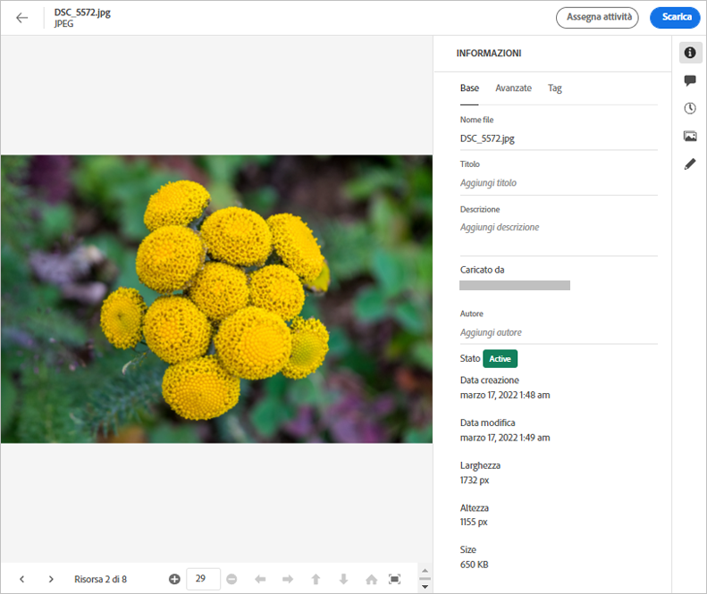
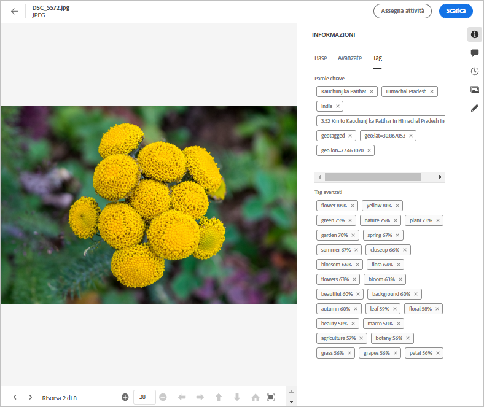

# Metadati in [!DNL Assets Essentials] {#metadata}

Metadati significa dati o descrizione dei dati. Ad esempio, le immagini come risorsa possono contenere informazioni sulla fotocamera su cui è stato fatto clic o informazioni sul copyright. Queste informazioni sono metadati dell&#39;immagine. I metadati sono fondamentali per una gestione efficiente delle risorse. I metadati sono la raccolta di tutti i dati disponibili per una risorsa, ma potrebbero non essere necessariamente contenuti in essa.

I metadati consentono di categorizzare ulteriormente le risorse ed è utile man mano che la quantità di informazioni digitali cresce. È possibile gestire poche centinaia di file in base solo ai nomi dei file, alle miniature e alla memoria. Tuttavia, questo approccio non è scalabile. Non è sufficiente quando il numero di persone coinvolte e il numero di attività gestite aumentano.

Con l’aggiunta dei metadati, il valore di una risorsa digitale aumenta, perché la risorsa diventa,

* Più accessibile: i sistemi e gli utenti possono trovarlo facilmente.
* Gestione più semplice: puoi trovare più facilmente le risorse con lo stesso set di proprietà e applicarvi le modifiche necessarie.
* Completo : la risorsa contiene ulteriori informazioni e contenuti con più metadati.

Per questi motivi, Assets offre i mezzi giusti per creare, gestire e scambiare metadati per le risorse digitali.

## Visualizzare i metadati {#view-metadata}

Per visualizzare i metadati di una risorsa, cerca la risorsa o la risorsa, seleziona la risorsa e fai clic su **[!UICONTROL Details]** nella barra degli strumenti.

*Figura: Per visualizzare una risorsa e i relativi metadati, fai clic su **[!UICONTROL Details]**nella barra degli strumenti o fai doppio clic sulla risorsa.*

I metadati di base come titolo, descrizione e data di caricamento sono disponibili nella scheda [!UICONTROL Basic] . La scheda [!UICONTROL Advanced] contiene metadati più avanzati, ad esempio il modello di fotocamera, i dettagli dell&#39;obiettivo e i geotag. La scheda [!UICONTROL Tags] contiene tag applicati automaticamente in base al contenuto dell’immagine.

## Aggiornare i metadati {#update-metadata}

Puoi aggiornare manualmente alcuni campi di metadati. I campi includono [!UICONTROL Title], [!UICONTROL Description], [!UICONTROL Author] e [!UICONTROL Keywords].

## Tag {#tags}

[!DNL Assets Essentials] utilizza l’intelligenza artificiale fornita da  [Adobe ](https://www.adobe.com/it/sensei.html) Senseito per applicare automaticamente tag rilevanti a tutte le risorse caricate. Questi tag, giustamente denominati Tag avanzati, consentono di velocizzare i contenuti dei progetti grazie alla possibilità di trovare rapidamente le risorse rilevanti. Gli smart tag sono un esempio di metadati non contenuti nell’immagine.

Gli smart tag vengono applicati in tempo quasi reale e vengono generati in base al contenuto dell’immagine. Quando carichi una risorsa, per un certo periodo di tempo l’interfaccia utente visualizza [!UICONTROL Processing] sulla miniatura della risorsa. Una volta completata l&#39;elaborazione, è possibile [visualizzare i metadati](#view-metadata) e gli smart tag.

*Figura: Per visualizzare i tag avanzati di una risorsa, fai clic su **[!UICONTROL Details]**nella barra degli strumenti o fai doppio clic sulla risorsa.*

I tag avanzati contengono anche un punteggio di affidabilità in percentuale. Indica l’affidabilità associata al tag applicato. È possibile moderare gli smart tag applicati automaticamente.

## Aggiungi o aggiorna tag {#manually-tag}

Puoi aggiungere più tag alle risorse, oltre ai tag avanzati che vengono aggiunti automaticamente utilizzando il servizio [!DNL Adobe Sensei] avanzato . Apri una risorsa per l’anteprima, fai clic su [!UICONTROL Tags] e digita le parole chiave desiderate nel campo [!UICONTROL Keywords] . Per aggiungere il tag, premere Invio. [!DNL Assets Essentials] indicizza la parola chiave in tempo quasi reale e il tuo team può presto cercare le risorse aggiornate utilizzando le nuove parole chiave.

Puoi anche rimuovere i tag dalla sezione [!UICONTROL Smart Tags] che vengono aggiunti automaticamente da [!DNL Assets Essentials] a tutte le risorse caricate.

<!-- TBD: Queries for PM and engg.

Can we edit the existing metadata in any form?

How to moderate smart tags?

Allow or deny list for smart tags?

What about Tags displayed just above Smart Tags in the UI?

Is there a detailed metadata tab. Where do the other details of an asset go?

How can one search based strictly on the metadata. Similar to AEM Assets GQL queries.
-->

<!-- TBD: Link to related articles if any.

>[!MORELIKETHIS]
>
>* [Search assets](search.md).
-->
