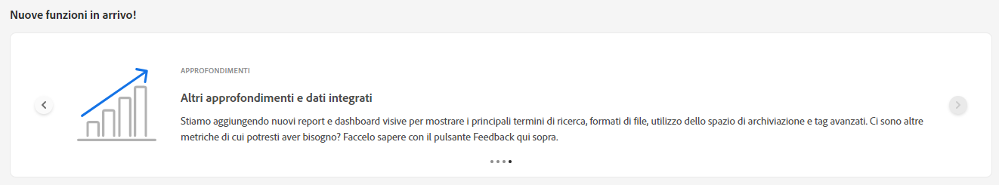
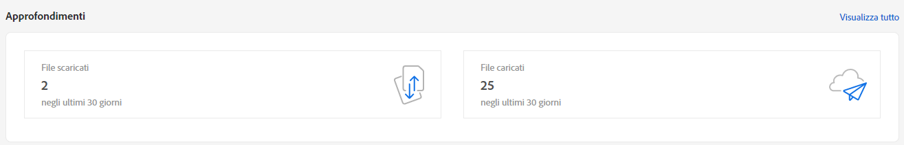
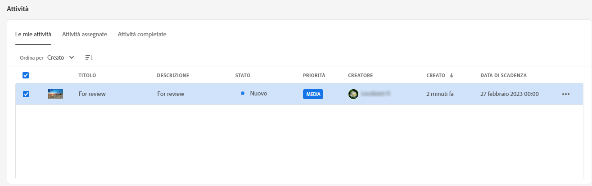
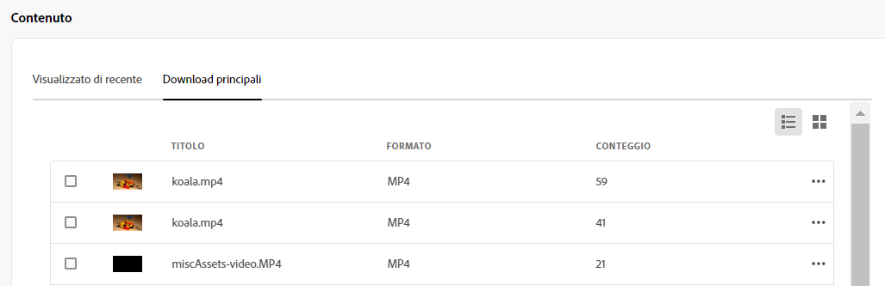
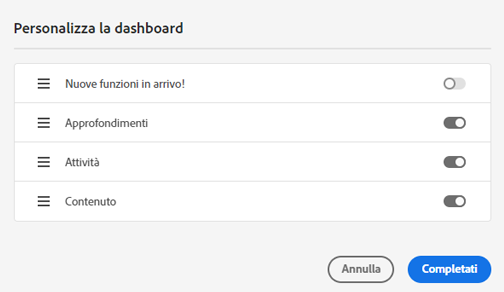

# Area di lavoro personale per risorse {#my-workspace}

Assets ora include un’area di lavoro personalizzabile che fornisce widget per l’accesso semplificato alle aree chiave dell’interfaccia utente di Assets e alle informazioni più pertinenti per l’utente. Questa pagina funge da soluzione one-stop per fornire una panoramica degli elementi di lavoro e consentire un accesso rapido ai flussi di lavoro chiave. L&#39;accesso più comodo a queste opzioni aumenta l&#39;efficienza e la velocità dei contenuti.

Per accedere a Area di lavoro personale, fai clic su **[!UICONTROL Area di lavoro personale]** dagli elementi disponibili nel riquadro di navigazione a sinistra. L’area di lavoro include diversi widget che mostrano nuove funzioni in arrivo, approfondimenti, attività e widget di contenuto. Puoi configurare la modalità di visualizzazione di questi widget nell’area di lavoro in base alle tue preferenze.

>[!NOTE]
>
>Il widget Approfondimenti è visibile solo agli amministratori.

**Nuove funzionalità disponibili a breve**

Evidenzia le prossime funzioni di Assets.

**Approfondimenti**

Gli amministratori possono visualizzare un riepilogo del numero di download e caricamenti eseguiti nell’ambiente Assets negli ultimi 30 giorni. Puoi fare clic su **[!UICONTROL Visualizza tutto]** per passare rapidamente alla pagina Approfondimenti e visualizzare dashboard più dettagliati.

**Attività**

Visualizza l&#39;elenco delle attività attualmente assegnate nel **[!UICONTROL Attività personali]** , creato da **[!UICONTROL Attività assegnate]** e le attività già completate nel **[!UICONTROL Completato]** scheda . Puoi selezionare un’attività e fare clic su **[!UICONTROL Attività completa]** per approvare o rifiutare un&#39;attività. Puoi anche selezionare un’attività e fare clic su **[!UICONTROL Apri dettagli attività]** per visualizzare l&#39;attività e approvarla, rifiutarla, modificarla o eliminarla.

>[!NOTE]
>
> La **[!UICONTROL Assegna task]** l’opzione per assegnare un’attività su una risorsa a un altro utente è disponibile quando selezioni una risorsa o quando apri la visualizzazione delle informazioni sulla risorsa.

**Contenuto**

Visualizza le visualizzazioni assortite delle risorse, compreso l’elenco delle risorse visualizzate di recente. È possibile selezionare per visualizzare le risorse nel widget in una vista a elenco, in una vista a griglia, in una vista a raccolta o in una vista a cascata e ordinare le risorse per nome, dimensione e data modificata. Puoi anche selezionare una risorsa per visualizzarne i dettagli o rimuoverla dall’elenco delle risorse visualizzate di recente.

## Personalizza area di lavoro {#configure-widgets}

Tutti i widget vengono visualizzati per impostazione predefinita, ma è possibile abilitare o disabilitare i widget visualizzati in Area di lavoro personale. Le preferenze sono specifiche per ogni utente.

1. Fai clic su **[!UICONTROL Area di lavoro personale]** disponibile nel riquadro di navigazione a sinistra e fai clic su **[!UICONTROL Personalizza]**.

1. Disattiva l’interruttore per il widget che non è necessario visualizzare nell’area di lavoro. Puoi anche trascinare un widget in una posizione appropriata per aggiornare l’ordine di visualizzazione in Workspace.

1. Fai clic su **[!UICONTROL Fine]** per salvare le modifiche.

   
