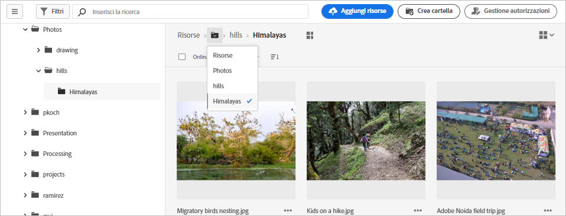
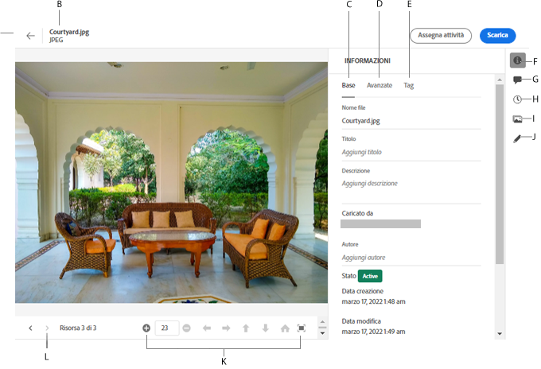

# Accedere ai file e alle cartelle e visualizzare le risorse {#view-assets-and-details}

<!-- TBD: Give screenshots of all views with many assets. Zoom out to showcase how the thumbnails/tiles flow on the UI in different views. -->

<!-- TBD: The options in left sidebar may change. Shared with me and Shared by me are missing for now. Update this section as UI is updated. -->

## Interfaccia utente di [!DNL Assets Essentials] {#understand-interface-navigation}

[!DNL Assets Essentials] offre un’interfaccia utente intuitiva. che consente di trovare e ricordare facilmente le risorse e le relative informazioni.

Quando accedi a [!DNL Assets Essentials], viene visualizzata la seguente interfaccia.

<!-- TBD: Update this screenshot. Remove top bar. Remove 2 labels from top bar. -->

![[!DNL Assets Essentials] - Interfaccia utente](assets/essentials-interface1.png)

*Figura: Prima schermata dopo l’accesso e funzioni principali.*
    *A: Barra laterale a sinistra per sfogliare l’archivio e accedere ad alcune altre opzioni*
    *B: Visualizzare o comprimere la barra laterale a sinistra per aumentare l’area di visualizzazione delle risorse*
    *C: Filtrare i risultati della ricerca*
    *D: Casella di ricerca*
    *E: Opzioni per ordinare le risorse*
    *F: Fornire feedback sul prodotto*
    *G: Modificare le preferenze utente o uscire*
    *H: Passare da una visualizzazione all’altra*

<!-- TBD: Need an embedded video here with narration. It has to be hosted on MPC to be embeddable. -->

## Sfogliare e visualizzare le risorse e le cartelle {#browse-repository}

È possibile sfogliare le cartelle dall’interfaccia utente principale o dalla barra laterale a sinistra. Durante la navigazione, puoi visualizzare le miniature delle risorse per sfogliare visivamente l’archivio oppure i dettagli delle risorse per trovare rapidamente quella desiderata. Le opzioni disponibili nella barra laterale a sinistra sono:

* **Risorse**: elenco di tutte le cartelle a cui ai accesso, con struttura ad albero.
* **Visualizzate di recente**: elenco delle risorse visualizzate in anteprima di recente. [!DNL Assets Essentials] mostra solo le risorse visualizzate in anteprima. Non visualizza le risorse che scorri quando esplori i file o le cartelle dell’archivio.
* **Cestino**: Elenca le risorse eliminate dalla cartella principale **[!UICONTROL Risorse]**. È possibile selezionare una risorsa nella cartella Cestino per ripristinarla nella posizione originale o eliminarla definitivamente.

<!-- TBD: Not sure if we want to publish these right now. CC Libs are beta as per Greg.
* **Libraries**: Access to [!DNL Adobe Creative Cloud Team] (CCT) Libraries view. This view is visible only if the user is entitled to CCT Libraries.
-->

<!-- TBD: My Work Space shows task inbox and it is not visible on AEM Cloud Demos as of now. It is the source of truth server hence not documenting My Work Space option for now.
-->

Puoi aprire o comprimere la barra laterale a sinistra per aumentare l’area disponibile per la visualizzazione delle risorse.

In [!DNL Assets Essentials], puoi visualizzare le risorse, le cartelle e i risultati di ricerca in quattro diversi tipi di layout.

*  [!UICONTROL Vista elenco]
*  [!UICONTROL Vista griglia]
*  [!UICONTROL Vista galleria]
*  [!UICONTROL Vista cascata]

Per individuare una risorsa, puoi ordinare le risorse in ordine crescente o decrescente di `Name`, `Relevancy`, `Size`, `Modified` e `Created`.

Per accedere a una cartella, fai doppio clic sulle miniature della cartella oppure selezionala dalla barra laterale a sinistra. Per visualizzare i dettagli di una cartella, selezionala e fai clic su Dettagli nella barra degli strumenti in alto. Per spostarsi verso l’alto o il basso nella gerarchia, utilizza la barra laterale a sinistra o le breadcrumb in alto.

*Figura: Per sfogliare la gerarchia, utilizza le breadcrumb in alto o la barra laterale a sinistra.*

## Visualizzare l’anteprima delle risorse {#preview-assets}

Prima di utilizzare, condividere o scaricare una risorsa, puoi visualizzarla più da vicino. La funzione di anteprima consente di visualizzare non solo le immagini ma anche alcuni altri tipi di risorse supportati.

Per visualizzare in anteprima una risorsa, selezionala e fai clic sull’[!UICONTROL Dettagli]  dalla barra degli strumenti nella parte superiore. Inoltre, puoi visualizzarne i metadati e intraprendere altre azioni.

*A: Tornare alla cartella corrente o al risultato della ricerca corrente nell’archivio*
*B: Nome e formato del file che visualizzato in anteprima*
*C: Metadati di base*
*D: Metadati avanzati*
*E: Parole chiave e tag avanzati*
*F: Visualizzare l’anteprima della risorsa e le informazioni sui metadati*
*G: Aggiungere commenti e annotazioni*
*H: Visualizzare e gestire le versioni*
*I: Visualizza le rappresentazioni dell’immagine*
*J: Modificare l’immagine*
*K: Visualizzare un’anteprima più dettagliata. Zoom, schermo intero e altre opzioni.*
*L: Passare alla risorsa precedente o successiva nella cartella corrente senza tornare alla cartella*

Puoi anche visualizzare in anteprima i video.

Se visualizzi esplicitamente l’anteprima di una risorsa, [!DNL Assets Essentials] la mostra come risorsa visualizzata di recente.

<!-- TBD: Describe the options.

Explicitly previewed assets are displayed as recently viewed assets. Give screenshot of this.
Other use cases after previewing.
-->

## Passaggi successivi {#next-steps}

* Fornisci feedback sui prodotti utilizzando l’opzione [!UICONTROL Feedback] disponibile nell’interfaccia utente di Assets Essentials

* Fornisci feedback alla documentazione utilizzando [!UICONTROL Modifica questa pagina]  o [!UICONTROL Segnala un problema]  disponibile sulla barra laterale destra

* Contatta il [Servizio clienti](https://experienceleague.adobe.com/?support-solution=General&amp;lang=it#support)

>[!MORELIKETHIS]
>
>* [Visualizzare le versioni di una risorsa](/help/manage-organize.md#view-versions).

