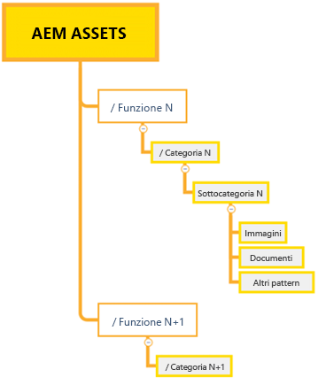
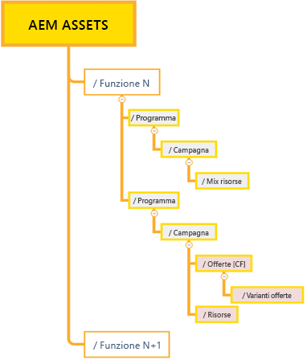
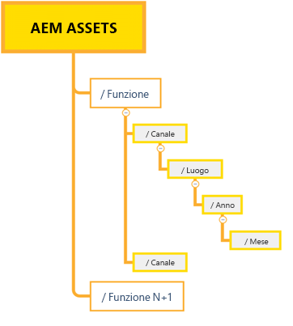

# Best practice per una gestione efficace delle autorizzazioni {#best-practices-permissions-management}

In qualità di amministratore, prima di iniziare a gestire le autorizzazioni per le cartelle per l’archivio Assets Essentials, puoi implementare diverse best practice per rendere l’infrastruttura intuitiva per gli amministratori e gli utenti finali in un secondo momento durante la gestione delle operazioni.

Puoi incorporare queste best practice mentre:

* [Creazione di gruppi di utenti in Admin Console](#admin-console-best-practices)

* [Creazione della struttura delle cartelle nell’archivio Assets Essentials](#folder-structure-assets-essentials)

* [Gestione delle autorizzazioni nell’archivio Assets Essentials](#folder-permissions)

## Admin Console {#admin-console-best-practices}

Identifica le esigenze di accesso in base ai gruppi di utenti della tua organizzazione. Pianifica e crea gruppi di utenti per la tua organizzazione e aggiungi utenti a tali gruppi di utenti. È più facile gestire le autorizzazioni delle cartelle in base ai gruppi di utenti e non ai singoli utenti.

## Struttura delle cartelle per l’archivio Assets Essentials {#folder-structure-assets-essentials}

Quando inizi a pianificare la creazione di una struttura di cartelle nell’archivio Assets Essentials, considera quanto segue:

* Governance futura: Le cartelle gestite dagli amministratori e le cartelle che sono [delegati per le autorizzazioni ad altri utenti come proprietari](manage-permissions.md##manage-permissions-folders).

* Scalabile: La struttura delle cartelle deve soddisfare le esigenze future della tua organizzazione e deve essere facilmente scalabile.

* Dimensioni: Una cartella non deve contenere troppe risorse. Potrebbe causare problemi di usabilità e diventare difficile da gestire.

* Intuitivo: La struttura delle cartelle deve essere facile da sfogliare e intuitiva per gli utenti finali. Gli utenti devono essere in grado di identificare facilmente dove caricare una nuova risorsa nella struttura delle cartelle.

Puoi utilizzare diversi tipi di struttura delle cartelle possibili per la tua organizzazione. Di seguito sono riportati alcuni esempi di strutture di cartelle tipiche:

* Basato su funzioni e categorie

   

* Basato su campagna

   

* Basato sulla posizione dell’offerta (o sul canale)

   

## Autorizzazioni cartella {#folder-permissions}

Dopo aver creato gruppi di utenti per la tua organizzazione, aggiunto gli utenti a tali gruppi di utenti e selezionato e creato una struttura di cartelle nell’archivio di Assets Essentials in base alle esigenze della tua organizzazione, puoi iniziare a gestire le autorizzazioni per le cartelle per la tua organizzazione. Quando inizi a gestire le autorizzazioni della cartella, considera quanto segue:

* Applica le autorizzazioni per i gruppi di utenti, non per i singoli utenti. Ciò si traduce in una struttura delle autorizzazioni più semplice ed efficiente.

* Mantenere la struttura delle autorizzazioni il più semplice possibile per l&#39;efficienza operativa.

* Utilizzare attentamente le autorizzazioni di accesso non consentiti e preferire applicare le autorizzazioni positive (Può modificare, Può visualizzare, Proprietario) alla struttura della cartella.

Per esempi su come ottenere una struttura delle cartelle semplice ed efficiente, consulta [Gestione delle autorizzazioni sulle cartelle](manage-permissions.md##manage-permissions-folders).

