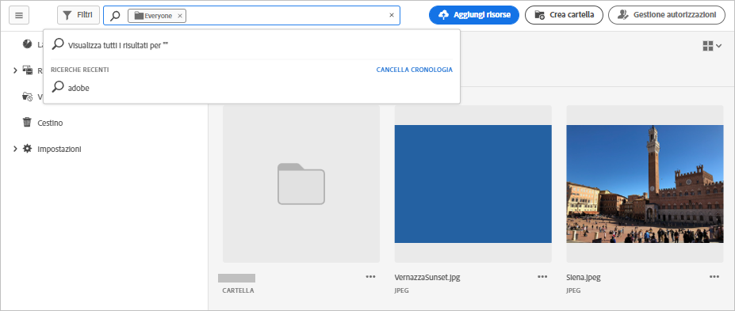
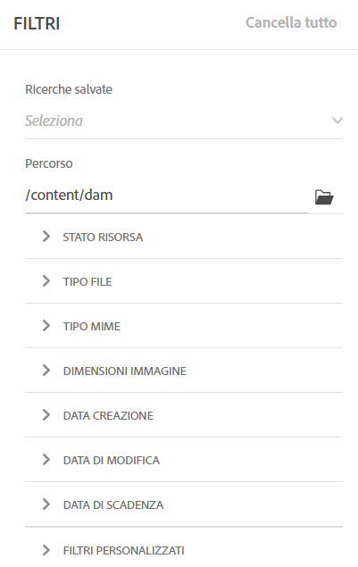
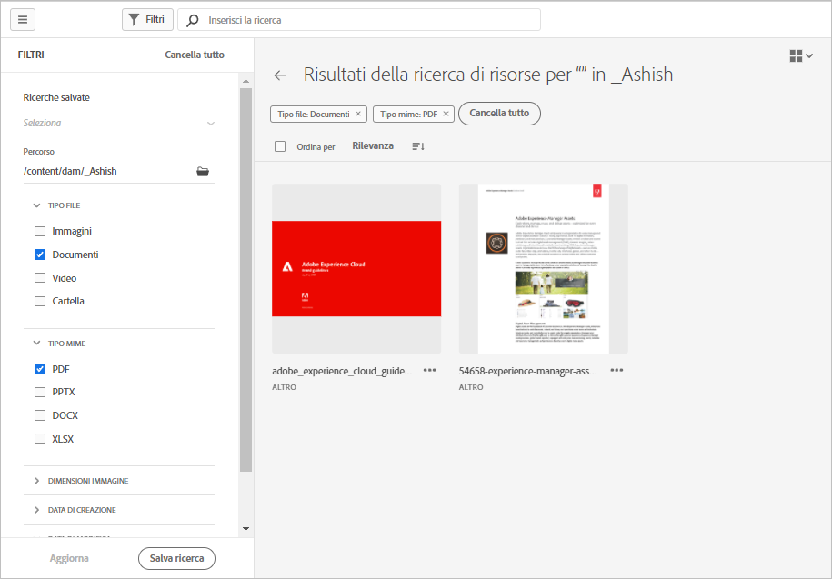

# Cercare risorse in [!DNL Assets Essentials] {#search-assets}

[!DNL Assets Essentials] fornisce una funzione di ricerca efficace e attiva per impostazione predefinita. Si tratta di una ricerca full-text completa. La potente funzionalità di ricerca consente di trovare rapidamente la risorsa appropriata e velocizza le attività relative ai contenuti. [!DNL Assets Essentials] consente di effettuare ricerche full-text, anche nei metadati, quali tag avanzati, titolo, data di creazione e copyright.

Per cercare le risorse, effettua le operazioni seguenti:

* Fai clic nella casella di ricerca nella parte superiore della pagina. Per impostazione predefinita, la ricerca viene eseguita all’interno della cartella attuale. Effettua una delle operazioni seguenti:

   

   * Cerca utilizzando una parola chiave e, se necessario, cambia la cartella. Premi Invio.

   * Per iniziare a lavorare su una risorsa visualizzata di recente, fai clic nella casella di ricerca e seleziona una delle risorse visualizzate di recente che vengono proposte.

## Filtrare i risultati della ricerca {#refine-search-results}

Puoi filtrare i risultati della ricerca in base ai seguenti parametri.

*Figura: Filtrare le risorse trovate in base a vari parametri.*

* Stato risorsa: Filtrare i risultati della ricerca utilizzando un’ `Approved`, `Rejected`oppure `No Status` stato della risorsa.

* Tipo file: filtra i risultati della ricerca in base ai tipi di file supportati come `Images`, `Documents` e `Videos`.
* Tipo MIME: filtra uno o più formati di file supportati. <!-- TBD:  [supported file formats](/help/supported-file-formats.md). -->
* Dimensioni immagine: fornisci una o più dimensioni minima e massima per filtrare le immagini. Le dimensioni vengono fornite in pixel e non corrispondono alle dimensioni del file delle immagini.
* Data di creazione: la data di creazione della risorsa, specificata nei metadati. Il formato di data standard è `yyyy-mm-dd`.
* Data di modifica: data dell’ultima modifica delle risorse. Il formato di data standard è `yyyy-mm-dd`.

Puoi ordinare le risorse trovate in ordine crescente o decrescente per `Name`, `Relevancy`, `Size`, `Modified` e `Created`.

## Gestire i filtri personalizzati {#custom-filters}

**Autorizzazioni richieste:** `Can Edit`, `Owner` o Amministratore.

Assets Essentials consente inoltre di aggiungere filtri personalizzati all’interfaccia utente. Puoi applicare i filtri personalizzati in aggiunta ai [filtri standard](#refine-search-results), per perfezionare i risultati della ricerca.

Assets Essentials fornisce i seguenti filtri personalizzati:

<table>
    <tbody>
     <tr>
      <th><strong>Nome filtro personalizzato</strong></th>
      <th><strong>Descrizione</strong></th>
     </tr>
     <tr>
      <td>Titolo</td>
      <td>Filtra le risorse utilizzando il titolo della risorsa. Puoi utilizzare un operatore con caratteri jolly (*) per consentire ad Assets Essentials di visualizzare le risorse nei risultati che corrispondono parzialmente ai criteri di ricerca. Ad esempio, se definisci <b>ma*</b> come criterio di ricerca, Assets Essentials mostra le risorse con titolo, ad esempio, mercato, marketing, uomo, manchester e così via nei risultati.</td>
     </tr>
     <tr>
      <td>Nome</td>
      <td>Filtra le risorse utilizzando il nome del file della risorsa. Puoi utilizzare un operatore con caratteri jolly (*) per consentire ad Assets Essentials di visualizzare le risorse nei risultati che corrispondono parzialmente ai criteri di ricerca.</td>
     </tr>
     <tr>
      <td>Dimensione risorsa</td>
      <td>Filtra le risorse definendo un intervallo di dimensioni, in byte, nei criteri di ricerca per visualizzare la risorsa nei risultati.</td>
     </tr>
     <tr>
      <td>Tag previsti</td>
      <td>Filtra le risorse utilizzando i tag avanzati della risorsa. Puoi utilizzare un operatore con caratteri jolly (*) per consentire ad Assets Essentials di visualizzare le risorse nei risultati che corrispondono parzialmente ai criteri di ricerca. Nei criteri di ricerca è possibile specificare più tag avanzati separati da una virgola.</td>
     </tr>    
    </tbody>
   </table>

### Aggiungere filtri personalizzati {#add-custom-filters}

Per aggiungere filtri personalizzati:

1. Fai clic su **[!UICONTROL Filtri]**.

1. Nella sezione **[!UICONTROL Filtri personalizzati]**, fai clic su **[!UICONTROL Modifica]** o **[!UICONTROL Aggiungere filtri]**.

   

1. Nella finestra di dialogo **[!UICONTROL Gestione filtri personalizzati]** seleziona i filtri da aggiungere all’elenco di filtri esistente. Seleziona **[!UICONTROL Filtri personalizzati]** per selezionare tutti i filtri.

1. Fai clic su **[!UICONTROL Conferma]** per aggiungere i filtri all’interfaccia utente.

### Rimuovere i filtri personalizzati {#remove-custom-filters}

Per rimuovere i filtri personalizzati:

1. Fai clic su **[!UICONTROL Filtri]**.

1. Nella sezione **[!UICONTROL Filtri personalizzati]**, fai clic su **[!UICONTROL Modifica]**.

1. Nella finestra di dialogo **[!UICONTROL Gestione filtri personalizzati]** deseleziona i filtri da rimuovere dall’elenco di filtri esistente.

1. Fai clic su **[!UICONTROL Conferma]** per rimuovere i filtri dall’interfaccia utente.

## Ricerche salvate {#saved-search}

La funzionalità di ricerca di [!DNL Assets Essentials] è semplice. Nella casella di ricerca, puoi sia digitare una parola chiave e premere Invio per visualizzare i risultati, sia cercare rapidamente con un solo clic, richiamando parole chiave già utilizzate di recente.

Puoi anche filtrare i risultati della ricerca in base a criteri specifici, secondo i metadati e il tipo di risorse. [!DNL Assets Essentials] consente di salvare i parametri dei filtri utilizzati di frequente, per migliorare l’esperienza di ricerca. Puoi quindi selezionare una ricerca salvata per eseguirla di nuovo applicandone il filtro con un solo clic.

Per salvare una ricerca, cerca le risorse, applica uno o più filtri e fai clic su [!UICONTROL Salva ricerca] nel pannello [!UICONTROL Filtri].

<!-- TBD: Search behavior. Full-text search. Ranking and rank boosts. Hidden assets.
Report poor UX that users can only save a filtered search and not a simple search.
.
Are other supported files fully indexed and support full-text search? Eg. audio/videos files can at best have metadata indexed.
Anything about ranking of assets displayed in search results?

What about temporarily hiding an asset (suspending search on it) from the search results? If an asset is undergoing review collaboration, should it be used by others? Should it be hidden in search?

When userA is searching and userB add an asset that matches search results, will the asset display in search as soon as userA refreshes the page? Assuming indexing is near real-time. May not be so for bulk uploads.
-->

## Passaggi successivi {#next-steps}

* [Guarda un video per cercare le risorse in Assets Essentials](https://experienceleague.adobe.com/docs/experience-manager-learn/assets-essentials/basics/using.html)

* Fornisci feedback sui prodotti utilizzando [!UICONTROL Feedback] opzione disponibile nell’interfaccia utente di Assets Essentials

* Fornire feedback alla documentazione utilizzando [!UICONTROL Modifica questa pagina]  o [!UICONTROL Segnala un problema]  disponibile sulla barra laterale destra

* Contatto [Assistenza clienti](https://experienceleague.adobe.com/?support-solution=General#support)
