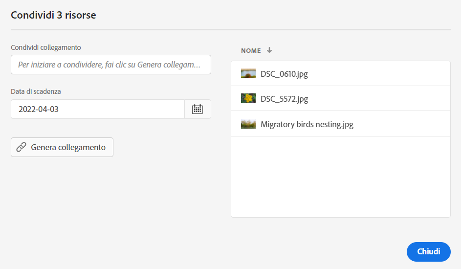
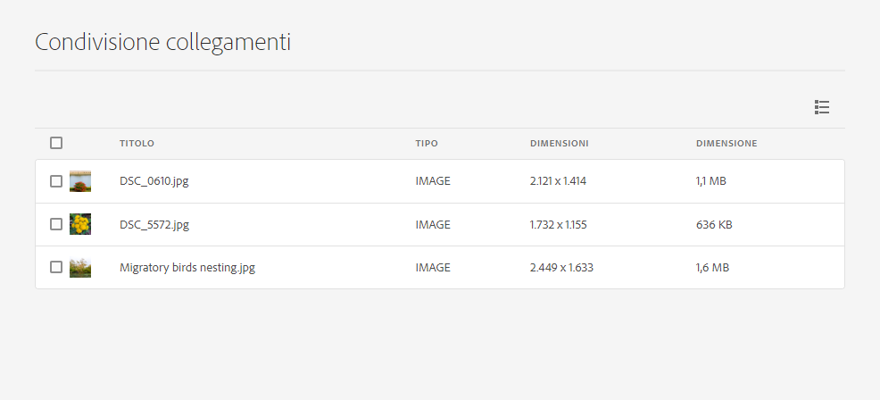

# Condividere collegamenti alle risorse {#share-links-assets}

[!DNL Assets Essentials] consente di generare un collegamento e di condividere le risorse con le parti interessate che non hanno accesso all’applicazione [!DNL Assets Essentials]. Puoi definire una data di scadenza del collegamento e condividerlo con altri utilizzando il metodo di comunicazione preferito, ad esempio e-mail o servizi di messaggistica. I destinatari del collegamento possono visualizzare in anteprima le risorse e scaricarle.

## Generare un collegamento per le risorse {#generate-link-for-assets}

Per generare un collegamento per una risorsa o una cartella contenente risorse:

1. Seleziona le risorse e/o le cartelle contenenti le risorse e fai clic su **[!UICONTROL Condividi collegamento]**.

1. Se desideri modificarlo, fai clic sull’icona Calendario per definire una data di scadenza del collegamento utilizzando il campo **[!UICONTROL Data di scadenza]**. Puoi anche specificare una data direttamente nel formato `yyyy-mm-dd`. Per impostazione predefinita, la data di scadenza di un collegamento è impostata su 2 settimane dalla data di condivisione.

1. Fai clic su **[!UICONTROL Genera collegamento]**.

1. Fai clic su **[!UICONTROL Copia collegamento]** per copiarlo. Puoi anche copiare il collegamento dal campo **[!UICONTROL Condividi collegamento]**.

   

1. Fai clic su **[!UICONTROL Chiudi]** e condividi il collegamento tramite e-mail o altri strumenti di collaborazione.

## Accedere alle risorse condivise {#access-shared-assets}

Dopo aver condiviso il collegamento pubblico per le risorse, i destinatari possono fare clic su tale collegamento per visualizzare in anteprima o scaricare le risorse condivise in un browser web senza dover accedere a [!DNL Assets Essentials].

Fai clic sul collegamento, fai clic sulla cartella per passare alla risorsa, infine fai clic sulla risorsa per visualizzarne l’anteprima. Puoi effettuare la selezione per visualizzare le risorse condivise in una vista a elenco o a schede.

Puoi passare il cursore del mouse sulla risorsa condivisa o sulla cartella delle risorse condivise per selezionare la risorsa o scaricarla.

Puoi anche selezionare più risorse e fare clic su **[!UICONTROL Scarica]**. [!DNL Assets Essentials] scarica le risorse selezionate come file zip. [!DNL Assets Essentials] crea una sottocartella nel file zip principale con lo stesso nome della risorsa, per ogni risorsa selezionata per il download.

Per scaricare tutte le risorse contemporaneamente, passa alla **[!UICONTROL Vista a elenco]**, fai clic su **[!UICONTROL Seleziona tutto]** quindi fai clic su **[!UICONTROL Scarica]**.

