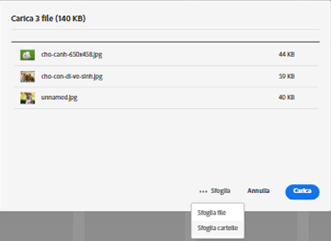
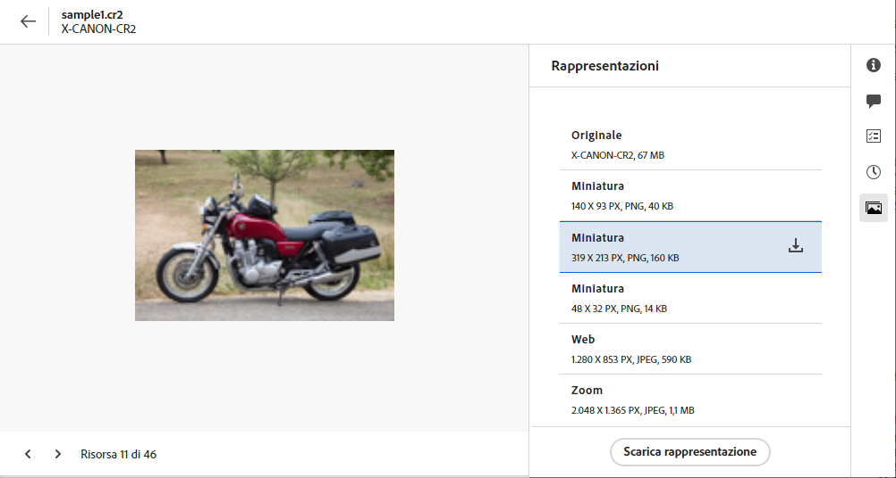
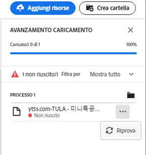
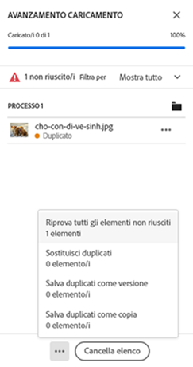
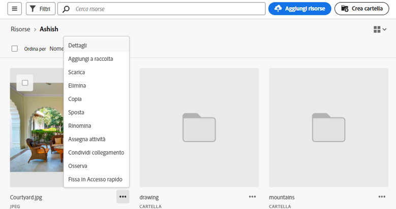

# Caricare le risorse {#add-assets}

Per aggiungere nuove risorse con cui lavorare, carica alcune risorse dal file system locale. <!-- TBD: Many of the [common file formats are supported](/help/using/supported-file-formats.md). -->

Per caricare una o più risorse o una cartella contenente risorse, puoi utilizzare i seguenti metodi:

* Trascina risorse o cartelle nell’interfaccia utente e segui le istruzioni visualizzate.
* Fai clic sull’opzione **[!UICONTROL Aggiungi risorse]** nella barra degli strumenti e aggiungi alcuni file nella finestra di dialogo di caricamento.

<!-- TBD: Update this GIF
 -->

Puoi utilizzare uno di questi metodi per caricare le risorse dopo aver creato una cartella. Per creare una cartella vuota, fai clic su **[!UICONTROL Crea cartella]** nella barra degli strumenti. [!DNL Assets Essentials] offre una potente funzionalità di ricerca full-text ma puoi anche utilizzare le cartelle per organizzare meglio le risorse.

Dopo aver selezionato i file, viene visualizzata una finestra di dialogo di conferma per aggiungere altri file o rimuovere i file già selezionati. Per aggiungere altri file a una selezione, fai clic su **[!UICONTROL Sfoglia]** e seleziona **[!UICONTROL Sfoglia file]** o **[!UICONTROL Sfoglia cartelle]**. Aggiungi più file o cartelle dalla stessa cartella o da una cartella diversa.

Una volta messi in coda tutti i file, fai clic su **[!UICONTROL Carica]**.

*Figura: Prima di caricare le risorse selezionate, si possono aggiungere o rimuovere le risorse dalla coda.*

>[!TIP]
>
>Se carichi una struttura di cartelle in Assets Essentials, puoi farlo direttamente senza la necessità di creare un file .ZIP con la struttura di cartelle. Un file .ZIP caricato su Assets Essentials viene memorizzato come una risorsa ZIP e non viene estratto automaticamente dopo il caricamento.

## Visualizzare lo stato e l’avanzamento del caricamento {#upload-progress}

Quando carichi più risorse o cartelle nidificate in [!DNL Assets Essentials], alcune possono non essere caricate per vari motivi, ad esempio se sono duplicate o in caso di problemi di rete.

Per tenere traccia dell’avanzamento del caricamento, fai clic sull’opzione **[!UICONTROL Avanzamento caricamento]** nella barra degli strumenti. Un pannello mostra l’avanzamento del caricamento di tutte le risorse.

Per visualizzare un sottoinsieme di risorse in base all’avanzamento o allo stato del caricamento, utilizza il filtro nella barra laterale **[!UICONTROL Avanzamento caricamento]**. I vari filtri consentono di visualizzare tutte le risorse; i caricamenti completati, in corso e in pausa; e le risorse in coda da caricare, duplicate e il cui caricamento non è riuscito.

*Figura: Filtrare le risorse da caricare in base allo stato o all’avanzamento del caricamento.*

Non appena caricate, le risorse vengono elaborate da [!DNL Assets Essentials] per generare miniature ed elaorare i metadati. Per molte risorse, l’elaborazione richiede un po’ di tempo. Se non vedi una miniatura e sulla miniatura segnaposto compare un messaggio di elaborazione, controlla nuovamente la cartella dopo qualche minuto. Durante l’elaborazione, [!DNL Assets Essentials] genera anche le rappresentazioni, aggiunge tag avanzati e indicizza i dettagli della risorsa che verranno usati per le ricerche.

*Figura: Sezioni delle risorse caricate, con la dicitura “Elaborazione in corso”.*

## Rappresentazioni delle risorse {#renditions}

[!DNL Assets Essentials] elabora le risorse caricate quasi in tempo reale e per molti tipi di file supportati genera le relative rappresentazioni. Create per le immagini, le rappresentazioni sono versioni ridimensionate dell’immagine caricata. Puoi scaricare non solo la risorsa, ma anche le sue rappresentazioni per utilizzare una versione appropriata all’utilizzo a cui è destinata. Puoi visualizzare tutte le rappresentazioni di una risorsa quando la [visualizzi in anteprima](/help/using/navigate-view.md#preview-assets).

*Figura: Visualizzare e scaricare le rappresentazioni.*

## Gestire i caricamenti non riusciti {#resolve-upload-fails}

Se il caricamento di una risorsa supportata non riesce per qualche motivo, fai clic su **[!UICONTROL Riprova]** nel riquadro [!UICONTROL Avanzamento caricamento].

*Figura: Riprovare il caricamento di un file supportato che per qualche motivo non riesce.*

Se tenti di caricare risorse duplicate, queste non vengono caricate finché non confermi esplicitamente il caricamento. Inizialmente, le risorse duplicate vengono contrassegnate come caricamenti non riusciti. Per risolvere il problema, puoi semplicemente creare una versione, eliminare e sostituire la risorsa esistente o creare una copia duplicata rinominando la risorsa. Puoi risolvere tali errori una risorsa alla volta oppure in blocco, per tutti i duplicati non riusciti.

*Figura: Per le risorse duplicate che non possono essere caricate per impostazione predefinita, risolvere il problema una risorsa alla volta.*

*Figura: Per le risorse duplicate che non possono essere caricate per impostazione predefinita, risolvi i problemi di tutte le risorse contemporaneamente.*

>[!TIP]
>
>Puoi caricare le risorse nell’archivio DAM direttamente dalle applicazioni desktop [!DNL Creative Cloud]. Scopri come [[!DNL Assets Essentials] si integra con [!DNL Adobe Asset Link]](/help/using/integration.md).

## Eliminare risorse o cartelle {#delete-assets}

Gli utenti possono eliminare singole risorse o cartelle che non sono più necessarie. Per eliminare una risorsa o una cartella, effettua una delle seguenti operazioni:

* Utilizza l’opzione disponibile sulla miniatura di una risorsa o cartella.

  

  *Figura: Le azioni per file e cartelle sono disponibili nella sezione della risorsa o cartella.*

* Seleziona una risorsa o una cartella e fai clic su **[!UICONTROL Elimina]**  nella barra degli strumenti.

## Passaggi successivi {#next-steps}

* [Guarda un video per caricare le risorse in Assets Essentials](https://experienceleague.adobe.com/docs/experience-manager-learn/assets-essentials/basics/creating.html?lang=it)

* Fornisci feedback sui prodotti utilizzando l’opzione [!UICONTROL Feedback] disponibile nell’interfaccia utente di Assets Essentials

* Fornisci feedback alla documentazione utilizzando [!UICONTROL Modifica questa pagina]  o [!UICONTROL Segnala un problema]  disponibile sulla barra laterale destra

* Contatta il [Servizio clienti](https://experienceleague.adobe.com/?support-solution=General&amp;lang=it#support)
