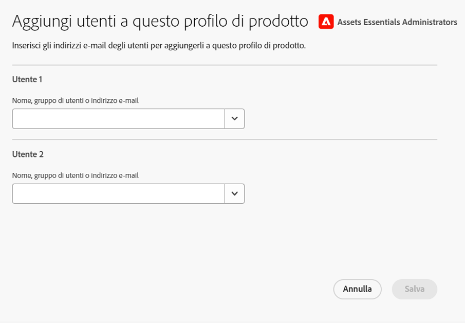

# Amministrare Experience Manager Assets Essentials {#administer-assets-essentials}

## Obiettivo

* **Pubblico**: amministratori Assets Essentials

* **Obiettivo**: configura l’accesso all’applicazione Assets Essentials utilizzando Admin Console, quindi gestisci le attività che possono essere eseguite dopo aver effettuato l’accesso all’applicazione Assets Essentials.

## Panoramica {#overview}

Il provisioning di [!DNL Adobe Experience Manager Assets Essentials] viene eseguito da Adobe per i propri clienti. Come parte del provisioning, [!DNL Assets Essentials] viene aggiunto a un’organizzazione del cliente in [!DNL Adobe Admin Console]. Gli amministratori utilizzano [!DNL Admin Console] per gestire i diritti utente alla soluzione [!DNL Assets Essentials] e assegnare gli amministratori dell’applicazione per configurare le autorizzazioni e i moduli di metadati in [!DNL Assets Essentials].

Il diagramma di flusso di dati seguente illustra la sequenza di attività che un amministratore deve eseguire per configurare e gestire Assets Essentials:

## Accedere a Admin Console {#access-admin-console}

Dopo il provisioning della soluzione Assets Essentials, l’amministratore riceve un messaggio e-mail da Adobe. L’e-mail contiene un messaggio di benvenuto e un collegamento per iniziare. Inoltre, Adobe avvia il processo di implementazione automatica di Assets Essentials. Il completamento del processo di implementazione richiede un’ora.

Utilizzando il link incluso nel messaggio e-mail, accedi ad [Admin Console](https://adminconsole.adobe.com). Se puoi accedere come amministratore a più account, seleziona l’organizzazione appropriata o passa a tale organizzazione utilizzando il [selettore organizzazione](https://helpx.adobe.com/it/enterprise/using/admin-console.html). Al termine dell’implementazione automatica, la scheda prodotto relativa a [!DNL AEM Assets Essentials] è visibile in [!DNL Admin Console].

## Gestione delle attività di Admin Console {#manage-admin-console-tasks}

Esegui le seguenti attività in Admin Console:

* [Aggiungere utenti ai profili di prodotto](#add-users-to-product-profiles)

* [Aggiungere gruppi di utenti](#add-user-groups)

* [Aggiungere utenti ai gruppi](#add-users-to-user-groups)

### Aggiungere utenti ai profili di prodotto {#add-users-to-product-profiles}

Aggiungi gli utenti ai profili di prodotto affinché possano accedere all’applicazione Assets Essentials.

Per aggiungere utenti ai profili di prodotto:

1. Accedi ad [Admin Console](https://adminconsole.adobe.com) per la tua organizzazione, fai clic su **[!UICONTROL Prodotti]** nella barra superiore, quindi su **[!UICONTROL AEM Assets Essentials]**, infine sull’istanza per [!DNL Assets Essentials]. Il nome dell’istanza potrebbe essere diverso rispetto alla schermata riportata di seguito.
   >[!NOTE]
   >
   >L’istanza di [!DNL Cloud Manager] è riservata all’amministratore per attività quali controllare lo stato del servizio e accedere ai registri del servizio; non può essere utilizzata per aggiungere utenti al prodotto. Per ulteriori informazioni, consulta la [guida per l’amministratore](deploy-administer.md#view-service-status-and-access-logs-view-logs).

   

   [!DNL Assets Essentials] dispone di tre profili prodotto che rappresentano il livello di accesso per amministratori, utenti standard e consumer.

   

1. Per aggiungere un utente al prodotto, fai clic su uno dei tre profili di prodotto di Assets Essentials, seleziona **[!UICONTROL Aggiungi utente]**, fornisci i dettagli dell’utente e fai clic su **[!UICONTROL Salva]**.

   

   Quando aggiungi un utente, quest’ultimo riceve un invito e-mail per poter iniziare a utilizzare la soluzione. È possibile disattivare gli inviti e-mail dalle impostazioni del profilo prodotto in [!DNL Admin Console].

1. Per rimuovere un utente da un gruppo, fai clic sul gruppo, seleziona un utente esistente, quindi seleziona **[!UICONTROL Rimuovi utente]**.

   >[!NOTE]
   >
   >Per eseguire attività amministrative nell’applicazione Assets Essentials, in Admin Console devi aggiungere un utente al profilo di prodotto per amministratori di Assets Essentials. Queste attività includono [creare una struttura di cartelle](#create-folder-structure), [gestire le autorizzazioni per le cartelle](#manage-permissions-for-folders) e [configurare i moduli di metadati](#metadata-forms).

### Aggiungere gruppi di utenti {#add-user-groups}

Crea dei gruppi di utenti, quindi assegna gli utenti ai gruppi. Questi gruppi di utenti saranno disponibili nell’applicazione Assets Essentials per impostare le autorizzazioni sulle cartelle.

Puoi aggiungere utenti ai gruppi di utenti (1) e [utenti ai profili di prodotto di Assets Essentials (2)](#add-admin-users). Tuttavia, non è possibile aggiungere gruppi di utenti direttamente ai profili di prodotto di Assets Essentials (3).

Per informazioni su come gestire i gruppi di utenti, consulta `Create user groups` e `Edit user groups` disponibili in [Gestione di gruppi di utenti](https://helpx.adobe.com/it/enterprise/using/user-groups.html).

>[!NOTE]
>
>Se Admin Console è configurata per sfruttare un sistema esterno per la gestione delle assegnazioni di utenti/gruppi, ad esempio i connettori di Azure o Google, lo strumento di sincronizzazione degli utenti o l’API REST di User Management, i gruppi e le assegnazioni utente vengono configurate automaticamente. Per ulteriori informazioni, consulta [Utenti Adobe Admin Console](https://helpx.adobe.com/it/enterprise/using/users.html).

### Aggiungere utenti ai gruppi {#add-users-to-user-groups}

Dopo aver creato i gruppi di utenti, puoi iniziare ad aggiungere gli utenti a tali gruppi.

Per informazioni su come gestire l’aggiunta di utenti ai gruppi di utenti, consulta `Add users to groups` disponibile in [Gestione di gruppi di utenti](https://helpx.adobe.com/it/enterprise/using/user-groups.html#add-users-to-groups).

## Gestire le attività di amministrazione di Assets Essentials {#manage-assets-essentials-tasks}

Dopo aver eseguito le attività di Admin Console, ora puoi eseguire le seguenti attività di amministrazione nell’applicazione Assets Essentials:

* [Creare una struttura di cartelle](#create-folder-structure)

* [Gestione delle autorizzazioni per le cartelle](#manage-permissions-for-folders)

* [Configurare i moduli di metadati](#metadata-forms)

>[!NOTE]
>
>Per poter gestire queste attività, in particolare le autorizzazioni, l’utente deve disporre di diritti di amministrazione dell’applicazione, e deve quindi essere aggiunto al [profilo del prodotto Assets Essentials per amministratori](#add-users-to-product-profiles).

### Creare una struttura di cartelle {#create-folder-structure}

Per creare una struttura di cartelle nell’archivio Assets Essentials, puoi utilizzare i seguenti metodi:

* Fai clic sull’opzione **[!UICONTROL Crea cartella]** disponibile nella barra degli strumenti per creare una cartella vuota.

* Fai clic sull’opzione **[!UICONTROL Aggiungi risorse]** disponibile nella barra degli strumenti per [caricare una struttura di cartelle disponibile nel computer locale](add-delete.md).

Crea una struttura di cartelle che sia adatta agli obiettivi aziendali dell’organizzazione. Se carichi nell’archivio Assets Essentials una struttura di cartelle già esistente, sarà necessario sottoporla a una verifica. Per ulteriori informazioni, consulta [Best practice per una gestione efficace delle autorizzazioni](permission-management-best-practices.md).

Quando inizi a pianificare la creazione di una struttura di cartelle nell’archivio Assets Essentials, considera quanto segue:

* Governance futura: le cartelle gestite dagli amministratori e quelle di cui le [autorizzazioni sono delegate ad altri utenti come proprietari](manage-permissions.md##manage-permissions-folders).

* Scalabilità: la struttura di cartelle deve soddisfare le esigenze future della tua organizzazione e deve essere facilmente scalabile.

* Dimensioni: una cartella non deve contenere un numero eccessivo di risorse. Potrebbe diventare difficile da usare e da gestire.

* Intuitività: la struttura di cartelle deve essere facile da sfogliare e intuitiva per gli utenti finali. Gli utenti devono essere in grado di capire facilmente dove caricare una nuova risorsa nella struttura di cartelle.

Sono disponibili vari tipi di strutture di cartelle che puoi utilizzare nella tua organizzazione. Di seguito sono riportati alcuni esempi di tipiche strutture di cartelle:

### Gestione delle autorizzazioni per le cartelle {#manage-permissions-for-folders}

Assets Essentials consente agli amministratori di gestire i livelli di accesso per le cartelle disponibili nell’archivio. In qualità di amministratore, puoi creare gruppi di utenti e assegnare autorizzazioni a tali gruppi per gestire i livelli di accesso. Puoi anche delegare i privilegi di gestione delle autorizzazioni ai gruppi di utenti a livello di cartella.

>[!VIDEO](https://video.tv.adobe.com/v/341104)

Per ulteriori informazioni, consulta [Gestione delle autorizzazioni per le cartelle](manage-permissions.md).

### Configurare i moduli di metadati {#metadata-forms}

Per impostazione predefinita, Assets Essentials fornisce molti campi di metadati standard. Spesso le organizzazioni hanno l’esigenza di aggiungere altri metadati, specifici per l’azienda. I moduli di metadati consentono alle aziende di aggiungere campi di metadati personalizzati alla pagina [!UICONTROL Dettagli] di una risorsa. I metadati specifici per l’azienda migliorano la governance e l’individuazione delle risorse. Puoi creare nuovi moduli o riutilizzare quelli esistenti.

Puoi configurare i moduli di metadati per diversi tipi di risorse (diversi tipi MIME). Utilizza un modulo con lo stesso nome del tipo MIME del file. Le funzioni di base confrontano automaticamente il tipo MIME delle risorse caricate con il nome del modulo e aggiornano i metadati delle risorse caricate in base ai campi del modulo.

Ad esempio, se è presente un modulo di metadati denominato `PDF` o `pdf`, i documenti PDF caricati contengono i campi di metadati definiti in tale modulo.

Assets Essentials utilizza la seguente sequenza per cercare i nomi dei moduli di metadati esistenti per applicare i campi di metadati alle risorse caricate di un particolare tipo:

Sottotipo MIME > Tipo MIME > Modulo `default` > Modulo fornito con il prodotto

Ad esempio, se è presente un modulo di metadati denominato `PDF` o `pdf`, i documenti PDF caricati contengono i campi di metadati definiti in tale modulo. Se non esiste un modulo di metadati denominato `PDF` o `pdf`, Assets Essentials verifica se è presente un modulo di metadati denominato `application`. Se è presente un modulo metadati denominato `application`, i documenti PDF caricati contengono campi di metadati definiti nel modulo. Se Assets Essentials non trova un modulo di metadati corrispondente, cerca il modulo metadati `default` per applicare ai documenti PDF caricati i campi metadati definiti nel modulo. Se nessuno di questi passaggi funziona, Assets Essentials applica a tutti i documenti PDF caricati i campi di metadati definiti nel modulo fornito con il prodotto.

>[!IMPORTANT]
>
>Un nuovo modulo di metadati per un tipo di file specifico sostituisce interamente quello predefinito fornito da [!DNL Assets Essentials]. Se elimini o rinomini un modulo di metadati, i campi di metadati predefiniti diventano di nuovo disponibili per le nuove risorse.

>[!VIDEO](https://video.tv.adobe.com/v/341275)

Per ulteriori informazioni su moduli di metadati, consulta [Moduli di metadati in Assets Essentials](metadata.md#metadata-forms).

## Prossimi passaggi

Dopo aver configurato e gestito l’applicazione Assets Essentials, [integra le applicazioni Creative Cloud con l’applicazione Experience Manager Assets Essentials](integrate-assets-essentials-creative-cloud.md).
