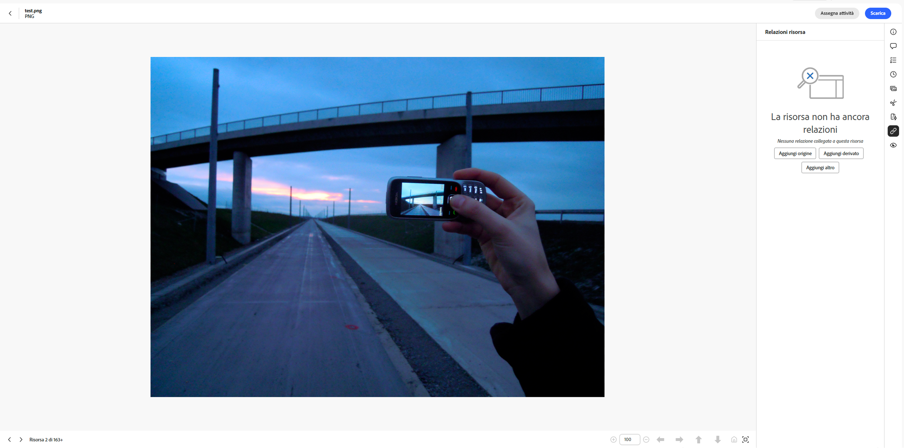
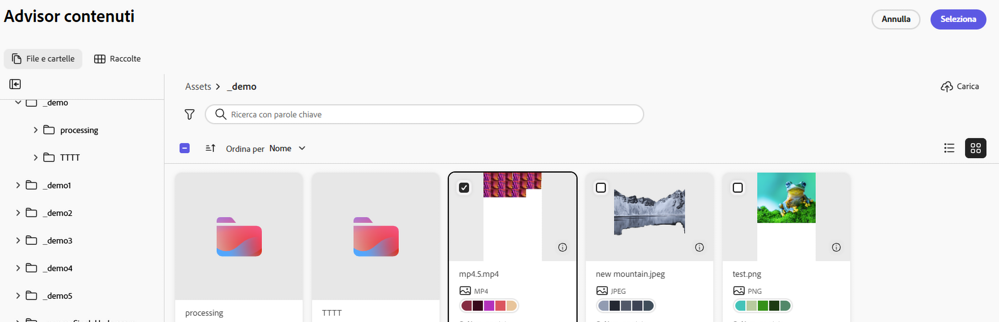
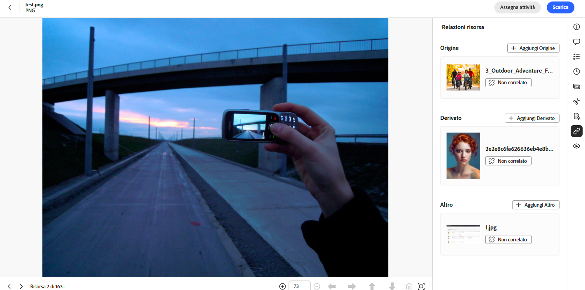

# Relazioni risorsa {#related-assets}

[!DNL Adobe Experience Manager Assets] consente di correlare manualmente le risorse in base alle esigenze dell’organizzazione utilizzando la funzionalità risorse correlate. Ad esempio, puoi correlare un file di licenza a una risorsa o a un’immagine o un video su un argomento simile. Puoi correlare risorse che condividono alcuni attributi comuni. Puoi anche utilizzare la funzione per creare relazioni origine/derivata tra risorse. Se ad esempio disponi di un file PDF generato da un file INDD, puoi correlare il file PDF al relativo file INDD di origine.

Grazie a questa funzione, è possibile condividere un file PDF a bassa risoluzione o un file JPG con fornitori o agenzie e rendere disponibile il file INDD ad alta risoluzione solo su richiesta.

>[!NOTE]
>
>Solo gli utenti con autorizzazioni di modifica delle risorse possono correlare e scollegare le risorse.

## Passaggi per correlare le risorse {#steps-to-relate-assets}

1. Dall’interfaccia [!DNL Experience Manager], apri la pagina **[!UICONTROL Proprietà]** per una risorsa da correlare.

   

1. Per correlare un’altra risorsa alla risorsa selezionata, fai clic su **[!UICONTROL Relazioni risorsa]** .
1. Effettua una delle seguenti operazioni:

   * Per correlare il file di origine della risorsa, seleziona **[!UICONTROL Aggiungi origine]** dall’elenco. Puoi associare una sola risorsa come origine.
   * Per correlare un file derivato, seleziona **[!UICONTROL Aggiungi derivato]** dall’elenco. È possibile associare più risorse in questa categoria.
   * Per creare una relazione bidirezionale tra le risorse, seleziona **[!UICONTROL Aggiungi altro]** dall’elenco. È possibile associare più risorse in questa categoria.

1. Dalla schermata **[!UICONTROL Seleziona risorse]**, individua il percorso della risorsa da correlare e selezionala. Puoi selezionare una o più risorse tenendo premuto il tasto Maiusc mentre fai clic; la selezione può includere uno qualsiasi dei [formati di file supportati nella vista Risorse](supported-file-formats.md).

   

1. Fai clic su **[!UICONTROL Seleziona]**. In base alla relazione scelta nel passaggio 3, la risorsa correlata viene elencata nella categoria pertinente all’interno della sezione **[!UICONTROL Relazioni risorsa]**. Se ad esempio la risorsa correlata è il file di origine della risorsa corrente, verrà elencata in **[!UICONTROL Origine]**.

   

1. Fai clic su **[!UICONTROL Annulla correlazione]**  disponibili per tutte le risorse correlate in ogni sezione ([!UICONTROL Origine], [!UICONTROL Derivata] e [!UICONTROL Altro]) per annullare la correlazione di una risorsa.

## Tradurre risorse correlate {#translating-related-assets}

La creazione di relazioni di tipo origine/derivata tra risorse utilizzando la funzione risorse correlate è utile anche nei flussi di lavoro di traduzione. Quando esegui un flusso di lavoro di traduzione su una risorsa derivata, [!DNL Experience Manager Assets] recupera automaticamente qualsiasi risorsa a cui il file di origine fa riferimento e la include per la traduzione. In questo modo, la risorsa a cui fa riferimento la risorsa di origine viene tradotta insieme alle risorse di origine e quelle derivate. Se il file di origine è correlato a un’altra risorsa, [!DNL Experience Manager Assets] recupera la risorsa di riferimento e la include per la traduzione.

Consulta [Tradurre risorse in AEM](https://experienceleague.adobe.com/it/docs/experience-manager-cloud-service/content/assets/admin/translate-assets).

## Passaggi successivi {#next-steps}

* Fornisci feedback sui prodotti utilizzando l’opzione [!UICONTROL Feedback] disponibile nell’interfaccia utente della vista Risorse

* Fornisci feedback alla documentazione utilizzando [!UICONTROL Modifica questa pagina]  o [!UICONTROL Segnala un problema]  disponibile sulla barra laterale destra

* Contatta il [Servizio clienti](https://experienceleague.adobe.com/it?support-solution=General#support)

>[!MORELIKETHIS]
>
>* [Visualizzare le versioni di una risorsa](manage-organize.md#view-versions)
>* [Tradurre risorse in AEM](https://experienceleague.adobe.com/it/docs/experience-manager-cloud-service/content/assets/admin/translate-assets)
>* [Formati di file supportati nella vista Risorse](supported-file-formats.md).
