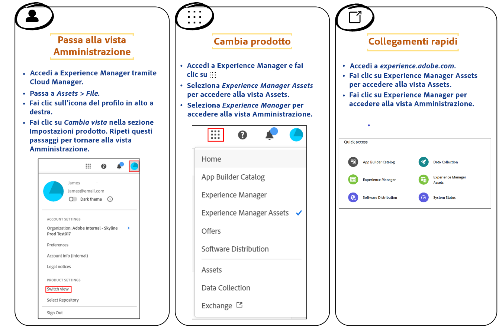

# Introduzione alla Vista risorse {#assets-view}

Nell’attuale panorama dinamico digitale, in cui la creazione e la distribuzione dei contenuti in tempo reale sono essenziali, è fondamentale disporre di un’esperienza di gestione delle risorse digitali (DAM) progettata per velocizzare le attività di marketing downstream. Adobe, sfruttando l’esperienza nel rafforzamento di professionisti del marketing e della creatività, introduce una nuova esperienza utente rivoluzionaria. Questo approccio orientato al flusso di lavoro rivoluziona il modo in cui le aziende gestiscono le risorse digitali dinamiche, consentendo ai marketer di ottimizzare l’efficienza nella ricerca, nella collaborazione, nella personalizzazione e nella distribuzione delle risorse. Questi flussi di lavoro semplificati accelerano la velocità dei contenuti e stimolano le attività di marketing verso nuovi traguardi.

## Come accedere alla Vista risorse? {#access-assets-view}

È possibile accedere alla Vista risorse nei modi seguenti:

<!--

* **Toggle in Admin view**

    * Log into [!DNL Experience Manager] using Cloud Manager.
    * Navigate to **[!UICONTROL Assets]** > **[!UICONTROL Files]**.
    * Click the profile icon on the top right corner.
    * Click **[!UICONTROL Switch View]** from the **[!UICONTROL Profile Settings]** section.
    Repeat these steps to switch back to the Admin view.

* **Product Switcher**
    * Log into [!DNL Experience Manager] and click .
    * Select **[!UICONTROL Experience Manager Assets]** to access the Assets view.
    * Select **[!UICONTROL Experience Manager]** to access the Admin view.

* **Quick Links** 
    * Log into experience.adobe.com.
    * Click **[!UICONTROL Experience Manager Assets]** to access the Assets view.
    * Click **[!UICONTROL Experience Manager Assets]** to access the Assets view.

    -->

## Perché è utile la Vista risorse?

La Vista Risorse offre i seguenti vantaggi chiave che non sono disponibili nella Vista amministrazione:

* [La dashboard dell’area di lavoro personale per fornire esperienze semplificate](#my-workspace-for-streamlined-experience)
* [Un approccio orientato alla ricerca per migliorare l’efficienza](#search-first)
* [Approfondimenti per prendere decisioni basate sui dati](#insights-data)
* [L’integrazione con Adobe Photoshop Express per accelerare la collaborazione](#accelerate-collaboration)
* [Caricamenti delle cartelle per impostare la struttura gerarchica per l’organizzazione](#folder-uploads)
* [L’iscrizione al contenuto dell’archivio per una gestione risorse efficiente](#subscribe-content)
* [L’eliminazione soft delle risorse per migliorare il controllo da parte degli amministratori](#soft-delete-assets)

### La dashboard dell’area di lavoro personale per fornire esperienze semplificate {#my-workspace-for-streamlined-experience}

Dai il benvenuto a una soluzione per la gestione delle risorse digitali che comprende le molteplici esigenze dei diversi ruoli organizzativi. La nuova Vista risorse dà priorità alla facilità d’uso e alla velocità, soddisfacendo la propensione dei marketer per l’aspetto visivo e per le aree di lavoro ordinate. Grazie a una dashboard personalizzata e specifica per l’utente dell’area di lavoro personale, i marketer possono trovare, visualizzare in anteprima, modificare, gestire e distribuire rapidamente le risorse con una notevole efficienza. Basta con le infinite ore di ricerca di risorse specifiche, dai il benvenuto a un’esperienza semplificata che ti mette a portata di mano tutto ciò che ti serve.

### Approfondimenti per prendere decisioni basate sui dati {#insights-data}

Per tenere il passo con la velocità dei contenuti, è essenziale disporre di approfondimenti utilizzabili. La nuova esperienza della Vista risorse offre approfondimenti avanzati all’interno dell’area di lavoro personale, fornendo dati preziosi sulle prestazioni delle risorse, sull’utilizzo da parte del pubblico e sui coinvolgimenti. I marketer possono prendere decisioni basate sui dati, ottimizzare le strategie di contenuto e perfezionare la distribuzione downstream per ottenere risultati ottimali. Grazie all’accesso a informazioni significative, le aziende possono mantenere un vantaggio competitivo e ottenere risultati eccezionali.

### L’integrazione con Adobe Photoshop Express per accelerare la collaborazione {#accelerate-collaboration}

La nuova esperienza offre un set completo di funzioni di collaborazione, tra cui la modifica in tempo reale con funzionalità di Adobe Photoshop integrate, controlli delle versioni e strumenti di annotazione. Questo consente una collaborazione perfetta tra i team di progettazione, creatività, branding e marketing, consentendo loro di eliminare gli ostacoli e accelerare il processo delle operazioni di marketing. I marketer dispongono ora di potenti strumenti per accelerare la consegna dei progetti e aumentare la produttività complessiva.

Guarda questo video per comprendere la potenza dell’integrazione della Vista risorse con Adobe Photoshop Express:

>[!VIDEO](https://video.tv.adobe.com/v/3420922)

Le prossime versioni includeranno anche l’[Integrazione di Adobe Firefly tramite Adobe Express](https://firefly.adobe.com/?gclid=EAIaIQobChMIlZeKuNfj_wIVeyCtBh3e5g2cEAAYASAAEgL56_D_BwE&amp;sdid=JM4FW6VL&amp;mv=search&amp;mv2=paidsearch&amp;ef_id=EAIaIQobChMIlZeKuNfj_wIVeyCtBh3e5g2cEAAYASAAEgL56_D_BwE:G:s&amp;s_kwcid=AL!3085!3!652077237594!e!!g!!adobe%20firefly!19870733758!148140507838).

### Caricamenti delle cartelle per impostare la struttura gerarchica per l’organizzazione {#folder-uploads}

Imposta rapidamente una struttura di cartelle per l’organizzazione utilizzando Visualizza Risorse caricando le cartelle esistenti sul file system locale. Creare cartelle nella cartella principale e quindi caricare manualmente le risorse in esse per mantenere la struttura gerarchica logica non è necessario. Tutte le cartelle e le risorse nella cartella principale vengono caricate automaticamente in Experience Manager Assets.

### Un approccio orientato alla ricerca per migliorare l’efficienza {#search-first}

Sfrutta il potenziale della libreria di risorse digitali dell’organizzazione grazie alla potenza della ricerca con funzionalità all’avanguardia. Puoi dire addio alla noia di cercare manualmente tra innumerevoli file e cartelle. Qualsiasi utente può individuare immediatamente l’immagine, il video o il documento perfetto per creare campagne di marketing straordinarie, presentazioni accattivanti e contenuti coinvolgenti. Il nostro motore di ricerca consente di navigare facilmente tra i tipi di risorse, i metadati, i tag avanzati e persino il contenuto stesso, senza conoscere la parola chiave esatta. Adotta il futuro di DAM con la nostra funzione Cerca prima e libera tutto il potenziale della tua libreria di risorse digitali.

### L’iscrizione al contenuto dell’archivio per una gestione risorse efficiente {#subscribe-content}

La vista delle risore consente di monitorare le operazioni eseguite su risorse, cartelle o raccolte disponibili nell’archivio. Devi selezionare e iscriverti al contenuto per il quale ti vengono inviate le notifiche. Puoi anche configurare i tipi di evento, ad esempio l’eliminazione dei contenuti a cui ti sei iscritto, le modifiche ai contenuti a cui ti sei iscritto e così via. Le notifiche vengono quindi inviate solo per questi tipi di evento.

### L’eliminazione soft delle risorse per migliorare il controllo da parte degli amministratori {#soft-delete-assets}

La cartella Cestino disponibile nella vista Risorse elenca le risorse eliminate dalla cartella principale Risorse. È possibile selezionare una risorsa nella cartella Cestino per ripristinarla nella posizione originale o eliminarla definitivamente. Puoi anche specificare una parola chiave o applicare filtri standard o personalizzati per cercare le risorse appropriate all’interno della cartella Cestino.

Oltre a queste funzioni, la vista Risorse consente di eseguire le seguenti funzioni non disponibili nella vista Amministratore:

* Carica una nuova versione di una risorsa, con un nome diverso, dal file system locale all’archivio delle risorse. La risorsa caricata è disponibile come nuova versione con lo stesso nome di quella originale.

* Rinomina le risorse e la cartella disponibili nell’archivio.

## Conclusione {#conclusion}

È arrivata l’era del digital first, ed è ora di trasformare i nostri strumenti di marketing per supportare lo scenario aziendale in evoluzione. La nuova vista di Experience Manager Assets di Adobe è personalizzata per semplificare i flussi di lavoro, promuovere la collaborazione e accelerare la consegna delle risorse. Adottando la velocità dei contenuti, gli esperti di marketing possono sfruttare appieno il potenziale delle loro risorse digitali e stimolare la creatività come mai prima d’ora. Preparati a sfruttare il potenziale della nuova esperienza di visualizzazione delle risorse di Adobe e ottenere risultati eccezionali nelle campagne di marketing. È il momento di abbracciare il futuro di DAM e di portare avanti la tua attività.

