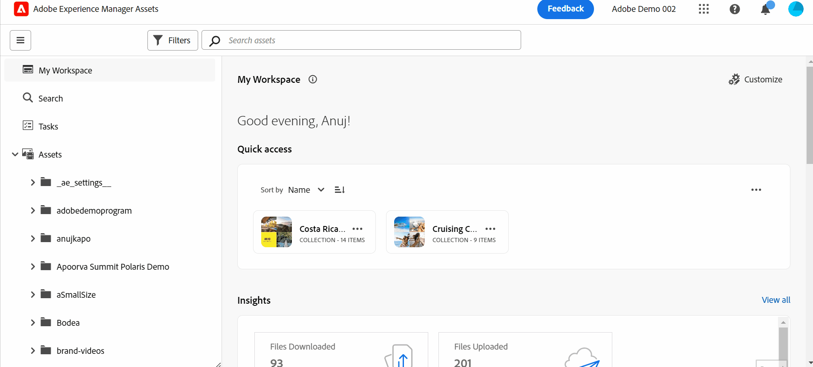

# Introduzione alla vista Risorse {#assets-view}

Nel panorama moderno e dinamico della digital-first, in cui la creazione e la distribuzione dei contenuti in tempo reale sono essenziali, è fondamentale disporre di un&#39;esperienza di gestione delle risorse digitali (DAM) progettata per velocizzare le attività di marketing a valle. Ad Adobe, sfruttando la sua esperienza nel rafforzamento dei professionisti del marketing e della creatività, introduce una nuova esperienza utente rivoluzionaria per Assets View. Questo approccio incentrato sul flusso di lavoro rivoluziona il modo in cui le aziende gestiscono le risorse digitali dinamiche, consentendo agli addetti al marketing di massimizzare l’efficienza nella ricerca, collaborazione, personalizzazione e distribuzione delle risorse. Questi flussi di lavoro semplificati accelerano la velocità dei contenuti e stimolano le attività di marketing a nuovi livelli.

## Come accedere alla vista Risorse? {#access-assets-view}

È possibile accedere alla vista Risorse nei modi seguenti:

* **Attiva/disattiva visualizzazione Amministratore**

   * Accedi a [!DNL Experience Manager] con Cloud Manager.
   * Accedi a **[!UICONTROL Risorse]** > **[!UICONTROL File]**.
   * Fai clic sull’icona del profilo nell’angolo in alto a destra.
   * Clic **[!UICONTROL Cambia visualizzazione]** dal **[!UICONTROL Impostazioni profilo]** sezione.
Ripeti questi passaggi per tornare alla vista Amministratore.

* **Commutatore prodotto**
   * Accedi a [!DNL Experience Manager] e fai clic su
   * Seleziona **[!UICONTROL Experience Manager Assets]** per accedere alla vista Risorse.
   * Seleziona **[!UICONTROL Experience Manager]** per accedere alla visualizzazione Amministratore.

* **Collegamenti rapidi**
   * Accedi a experience.adobe.com.
   * Clic **[!UICONTROL Experience Manager Assets]** per accedere alla vista Risorse.
   * Clic **[!UICONTROL Experience Manager Assets]** per accedere alla vista Risorse.

## Il mio dashboard di Workspace per fornire esperienze semplificate

Una soluzione per la gestione delle risorse digitali che comprenda le diverse esigenze dei diversi ruoli organizzativi. La nuova ed elegante visualizzazione Assets dà priorità alla facilità d&#39;uso e alla velocità, in linea con la preferenza degli esperti di marketing per spazi di lavoro di impatto visivo e privi di ingombri. Grazie a una dashboard personalizzata di My Workspace specifica dell’utente, gli esperti di marketing possono trovare, visualizzare in anteprima, modificare, gestire e distribuire rapidamente le risorse con una notevole efficienza. Dedica il tuo saluto alle infinite ore dedicate alla ricerca di risorse specifiche e ti diamo il benvenuto a un’esperienza semplificata che ti offre tutto ciò che ti serve a portata di mano.

## Approccio basato sulla ricerca per migliorare l&#39;efficienza

Sfrutta il potenziale della libreria di risorse digitali della tua organizzazione con la potenza della ricerca con funzionalità all’avanguardia. Puoi dire addio al problema di setacciare manualmente innumerevoli file e cartelle. Qualsiasi utente può individuare immediatamente l&#39;immagine, il video o il documento perfetto per creare campagne di marketing straordinarie, presentazioni accattivanti e contenuti coinvolgenti. Il nostro motore di ricerca ti consente di navigare facilmente tra i tipi di risorse, i metadati, i tag avanzati e persino il contenuto stesso senza conoscere la parola chiave esatta. Accetta il futuro di DAM con la nostra funzione Search-First e libera tutto il potenziale della tua libreria di risorse digitali.

## Informazioni per prendere decisioni basate sui dati {#insights-data}

Per tenere il passo con la velocità dei contenuti, è essenziale disporre di informazioni fruibili. La nuova esperienza Assets View offre informazioni avanzate all’interno di My Workspace, fornendo dati preziosi sulle prestazioni delle risorse, sull’utilizzo del pubblico e sul coinvolgimento. Gli addetti al marketing possono prendere decisioni basate sui dati, ottimizzare le strategie di contenuto e perfezionare la distribuzione a valle per ottenere risultati ottimali. Grazie all’accesso a informazioni significative, le aziende possono battere la concorrenza e ottenere risultati eccezionali.

