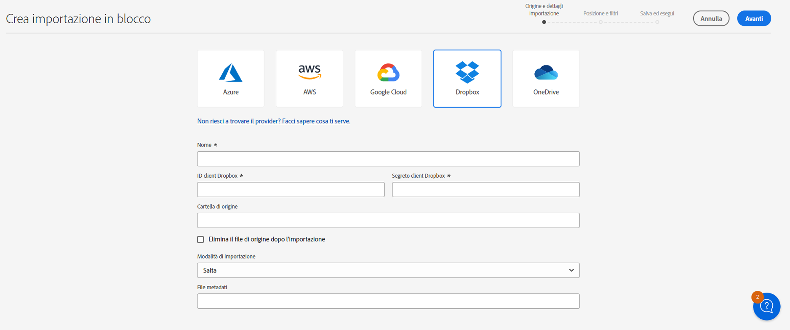

# Importare in blocco le risorse tramite Assets Essentials  {#bulk-import-essentials}

>[!CONTEXTUALHELP]
>id="assets_bulk_import"
>title="Importare in blocco le risorse"
>abstract="Gli amministratori ora possono importare un numero elevato di risorse da un’origine dati a Experience Manager Assets utilizzando Assets Essentials. Gli amministratori non devono più caricare singole risorse o cartelle in Experience Manager Assets. I provider di archiviazione cloud supportati per l’importazione in blocco includono Azure, AWS, Google Cloud e Dropbox."

L’importazione in blocco in AEM Assets Essentials consente agli amministratori di importare in AEM Assets un numero elevato di risorse da un’origine dati. Gli amministratori non devono più caricare singole risorse o cartelle in AEM Assets.

>[!NOTE]
>
>L’importazione in serie di Assets Essentials utilizza lo stesso back-end dell’importazione in serie as a Cloud Service di Assets. Tuttavia, Assets Essentials offre più origini dati da cui importare e un’esperienza utente più semplice.

Puoi importare le risorse dalle seguenti origini dati:

* Azure
* AWS
* Google Cloud
* Dropbox

## Prerequisiti {#prerequisites}

| Origine dati | Prerequisiti |
|-----|------|
| Azure | <ul> <li>Account archiviazione Azure </li> <li> Contenitore BLOB di Azure <li> Chiave di accesso Azure o token SAS in base alla modalità di autenticazione </li></ul> |
| AWS | <ul> <li>Area geografica AWS </li> <li> Bucket AWS <li> Chiave di accesso AWS </li><li> Segreto di accesso AWS </li></ul> |
| Google Cloud | <ul> <li>Bucket GCP </li> <li> E-mail account servizio GCP <li> Chiave privata account servizio GCP</li></ul> |
| Dropbox | <ul> <li>ID client Dropbox </li> <li> Segreto client Dropbox</li></ul> |

Oltre a questi prerequisiti basati sull’origine dati, è necessario conoscere il nome della cartella di origine disponibile nell’origine dati che contiene tutte le risorse che devono essere importate in AEM Assets.

## Creare una configurazione di importazione in blocco {#create-bulk-import-configuration}

Per creare una configurazione di importazione in blocco, effettua le seguenti operazioni:

1. Accedi a **[!UICONTROL Impostazioni]** > **[!UICONTROL Importazione in blocco]** e fai clic su **[!UICONTROL Crea importazione]**.
1. Seleziona l’origine dati. Le opzioni disponibili includono Azure, AWS, Google Cloud e Dropbox.
1. Specifica un nome per la configurazione dell’importazione in blocco nel campo **[!UICONTROL Nome]**.
1. Specifica le credenziali specifiche dell’origine dati, come indicato nei [Prerequisiti](#prerequisites).
1. Immetti il nome della cartella principale che contiene le risorse nell’origine dati nel campo **[!UICONTROL Cartella di origine]**.
1. (Facoltativo) Seleziona l’opzione **[!UICONTROL Elimina il file di origine dopo l’importazione]** per eliminare i file originali dall’archivio dati di origine dopo l’importazione in Experience Manager Assets.
1. Seleziona la **[!UICONTROL Modalità di importazione]**. Seleziona **[!UICONTROL Ignora]**, **[!UICONTROL Sostituisci]** o **[!UICONTROL Crea versione]**. La modalità Ignora è l’impostazione predefinita e, in questa modalità, l’importazione di una risorsa viene ignorata se esiste già.
   

1. (Facoltativo) Specifica il file di metadati da importare, fornito in formato CSV, nel campo File di metadati e fai clic su **[!UICONTROL Successivo]** per passare a **[!UICONTROL Posizione e filtri]**.
1. Per definire una posizione in DAM in cui importare le risorse utilizzando il campo **[!UICONTROL Cartella risorse di destinazione]**, specifica un percorso. Esempio: `/content/dam/imported_assets`.
1. (Facoltativo) Nella sezione **[!UICONTROL Scegli filtri]**, specifica la dimensione minima in MB del file delle risorse da includere nel processo di acquisizione nel campo **[!UICONTROL Filtra per dimensione min]**.
1. (Facoltativo) Specifica la dimensione massima in MB del file delle risorse da includere nel processo di acquisizione del campo **[!UICONTROL Filtra per dimensione max]**.
1. (Facoltativo) Seleziona i tipi MIME da includere nel processo di acquisizione utilizzando il campo **[!UICONTROL Includi tipo MIME]**. In questo campo è possibile selezionare più tipi MIME. Se non definisci un valore, tutti i tipi MIME vengono inclusi nel processo di acquisizione.

1. (Facoltativo) Seleziona i tipi MIME da escludere dal processo di acquisizione utilizzando il campo **[!UICONTROL Escludi tipo MIME]**. In questo campo è possibile selezionare più tipi MIME. Se non definisci un valore, tutti i tipi MIME vengono inclusi nel processo di acquisizione.

   

1. Fai clic su **[!UICONTROL Avanti]**. Seleziona **[!UICONTROL Salva ed esegui importazione]** per salvare la configurazione ed eseguire l’importazione in blocco. Seleziona **[!UICONTROL Salva importazione]** per salvare la configurazione in modo da poterla eseguire in un secondo momento.

   

1. Fai clic su **[!UICONTROL Salva]** per eseguire l’opzione selezionata.

### Gestione dei nomi dei file durante l’importazione in blocco {#filename-handling-bulkimport-assets-view}

Quando importi risorse o cartelle in blocco, [!DNL Experience Manager Assets] importa l&#39;intera struttura di ciò che esiste nell&#39;origine di importazione. [!DNL Experience Manager] segue le regole predefinite per i caratteri speciali nei nomi delle risorse e delle cartelle; pertanto, questi nomi di file devono essere bonificati. Sia per il nome della cartella che per quello della risorsa, il titolo definito dall’utente rimane invariato e viene memorizzato in `jcr:title`.

Durante l’importazione in blocco, [!DNL Experience Manager] cerca le cartelle esistenti per evitare di reimportare le risorse e le cartelle e verifica inoltre le regole di bonifica applicate nella cartella principale in cui avviene l’importazione. Se le regole di bonifica vengono applicate nella cartella padre, le stesse regole vengono applicate all&#39;origine di importazione. Per le nuove importazioni, per gestire i nomi file di risorse e cartelle vengono applicate le seguenti regole di bonifica.

Per ulteriori informazioni sui nomi non consentiti, sulla gestione dei nomi delle risorse e sulla gestione dei nomi delle cartelle durante l’importazione in blocco, consulta [Gestione dei nomi dei file durante l’importazione in blocco](https://experienceleague.adobe.com/docs/experience-manager-cloud-service/content/assets/manage/add-assets.html?lang=en#filename-handling-bulkimport).

## Visualizzare le configurazioni di importazione in blocco esistenti {#view-import-configuration}

Se selezioni di salvare la configurazione dopo averla creata, questa viene visualizzata nella scheda **[!UICONTROL Importazioni salvate]**.

Se selezioni di salvare ed eseguire l’importazione, la configurazione di importazione viene visualizzata nella scheda **[!UICONTROL Importazioni eseguite]**.

Se pianifichi un’importazione, questa viene visualizzata nella scheda **[!UICONTROL Importazioni pianificate]**.

## Modificare la configurazione dell’importazione in blocco {#edit-import-configuration}

Per modificare i dettagli della configurazione, fai clic sui tre punti (...) in corrispondenza del nome della configurazione, quindi fai clic su **[!UICONTROL Modifica]**. Durante l’operazione di modifica non è possibile modificare il titolo della configurazione e l’origine dati di importazione. Puoi modificare la configurazione dalle schede Importazioni eseguite, Importazioni pianificate e Importazioni salvate.

## Pianificare importazioni una tantum o ricorrenti {#schedule-imports}

Per pianificare un’importazione in blocco una tantum o ricorrente, effettua le seguenti operazioni:

1. Fai clic sui tre punti (...) in corrispondenza del nome della configurazione nella scheda **[!UICONTROL Importazioni eseguite]** o **[!UICONTROL Importazioni salvate]**, quindi fai clic su **[!UICONTROL Pianifica]**. Puoi anche riprogrammare un’importazione pianificata esistente: passa alla scheda **[!UICONTROL Importazioni pianificate]** e fai clic su **[!UICONTROL Pianifica]**.

1. Imposta un’acquisizione una tantum o una pianificazione oraria, giornaliera o settimanale. Fai clic su **[!UICONTROL Invia]**.

   

## Verificare lo stato dell’importazione {#import-health-check}

Per convalidare la connessione all’origine dati, fai clic sui tre punti (...) in corrispondenza del nome della configurazione, quindi fai clic su **[!UICONTROL Verifica]**. Se la connessione ha esito positivo, Experience Manager Assets presenta il seguente messaggio:

## Eseguire un’esecuzione di prova prima di eseguire un’importazione {#dry-run-bulk-import}

Fai clic sui tre punti (...) in corrispondenza del nome della configurazione e fai clic su **[!UICONTROL Prova]** per richiamare un’esecuzione di test per il processo di importazione in blocco. In Experience Manager Assets vengono visualizzati i dettagli seguenti sul processo di importazione in blocco:

## Eseguire un’importazione in blocco {#run-bulk-import}

Se hai salvato l’importazione durante la creazione della configurazione, passa alla scheda Importazioni salvate, fai clic sui tre punti (...) in corrispondenza della configurazione e fai clic su **[!UICONTROL Esegui]**.

Allo stesso modo, se devi eseguire un’importazione già eseguita, passa alla scheda Importazioni eseguite, fai clic sui tre punti (...) in corrisponza del nome della configurazione e fai clic su **[!UICONTROL Esegui]**.

## Interrompere o pianificare un’importazione in corso {#schedule-stop-ongoing-report}

Per pianificare o interrompere un’importazione in blocco in corso, puoi usare la finestra di dialogo sullo stato dell’importazione in blocco che viene visualizzata nella pagina home di Importazione in blocco durante un’importazione.

Puoi anche visualizzare le risorse importate nella cartella di destinazione, facendo clic su **[!UICONTROL Visualizza risorse]**.

## Eliminare una configurazione di importazione in blocco {#delete-bulk-import-configuration}

Fai clic sui tre punti (...) in corrispondenza del nome della configurazione esistente nelle schede **[!UICONTROL Importazioni eseguite]**, **[!UICONTROL Importazioni pianificate]** o **[!UICONTROL Importazioni salvate]** e fai clic su **[!UICONTROL Elimina]** per eliminare la configurazione Importazione in blocco.

## Passare alle risorse dopo l’importazione in blocco {#view-assets-after-bulk-import}

Per visualizzare il percorso di destinazione in cui le risorse vengono importate dopo l’esecuzione del processo di importazione in blocco, fai clic sui tre punti (...) in corrispondenza del nome della configurazione, quindi fai clic su **[!UICONTROL Visualizza risorse]**.
