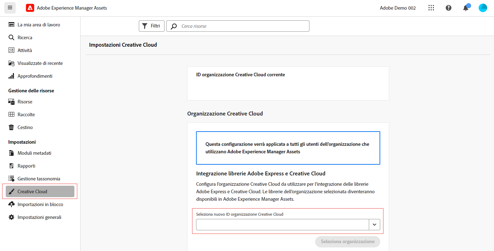

# Diritti per più organizzazioni per integrazioni Creative Cloud  {#cross-org-entitlements}

Experience Manager Assets è in grado di connettersi a una licenza Creative Cloud fornita a un’altra organizzazione IMS per utilizzare facilmente le più recenti integrazioni Creative Cloud in AEM Assets, inclusi Express e Creative Cloud Libraries.

Se per i prodotti Creative Cloud e AEM Assets è stato eseguito il provisioning per organizzazioni IMS separate, è possibile connettersi a un’organizzazione Creative Cloud diversa per eseguire flussi di lavoro integrati tra le due soluzioni.

## Prerequisiti {#prerequisites}

* Diritti di amministratore su Experience Manager Assets

* Diritto attivo a Creative Cloud per lo stesso ID utente utilizzato in Creative Cloud e Experience Manager. I diritti a ID personali e federati con lo stesso indirizzo e-mail vengono trattati come ID utente diversi.

## Connettersi a una nuova organizzazione Creative Cloud {#connect-to-creative-cloud-org}

Per connettersi a una nuova organizzazione Creative Cloud, effettua le seguenti operazioni:

1. Accedi a **[!UICONTROL Impostazioni]** > **[!UICONTROL Creative Cloud]**.

1. Seleziona la nuova organizzazione Creative Cloud utilizzando l’elenco a discesa **[!UICONTROL Seleziona nuovo ID organizzazione Creative Cloud]**. Nell’elenco vengono visualizzate tutte le organizzazioni a cui hai accesso. Seleziona l’organizzazione con diritti attivi per Creative Cloud.

1. Fai clic su **[!UICONTROL Cambia organizzazione]** per passare alla nuova organizzazione.

   

## Limitazioni {#limitations}

* Puoi collegare AEM Assets a un’organizzazione Creative Cloud alla volta. La connessione a più organizzazioni Creative Cloud alla volta non è supportata.

* L’organizzazione Creative Cloud a cui ti connetti in AEM Assets è applicabile a tutti gli utenti all’interno dell’organizzazione.
