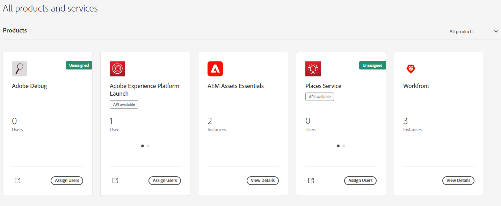

# Amministrare [!DNL Assets Essentials] e aggiungere utenti {#administer}

Il provisioning di [!DNL Adobe Experience Manager Assets Essentials] viene eseguito da Adobe per i propri clienti. Come parte del provisioning, [!DNL Assets Essentials] viene aggiunto a un’organizzazione del cliente in [!DNL Adobe Admin Console]. Gli amministratori utilizzano [!DNL Admin Console] per gestire i diritti utente alla soluzione [!DNL Assets Essentials] e assegnare gli amministratori dell’applicazione per configurare le autorizzazioni e i moduli di metadati in [!DNL Assets Essentials].

Il diagramma di flusso di dati seguente illustra la sequenza di attività che un amministratore deve eseguire per configurare e gestire Assets Essentials:

## Accedere a Admin Console {#access-admin-console}

Dopo il provisioning della soluzione Assets Essentials, l’amministratore riceve un messaggio e-mail da Adobe. L’e-mail contiene un messaggio di benvenuto e un collegamento per iniziare. Inoltre, Adobe avvia il processo di implementazione automatica di Assets Essentials. Il completamento del processo di implementazione richiede un’ora.

Utilizzando il link incluso nel messaggio e-mail, accedi ad [Admin Console](https://adminconsole.adobe.com). Se puoi accedere come amministratore a più account, seleziona l’organizzazione appropriata o passa a tale organizzazione utilizzando il [selettore organizzazione](https://helpx.adobe.com/it/enterprise/using/admin-console.html). Al termine dell’implementazione automatica, la scheda prodotto relativa a [!DNL AEM Assets Essentials] è visibile in [!DNL Admin Console].

Esegui in Admin Console le seguenti attività per assegnare agli utenti i diritti necessari:

* [Creare un amministratore dell’applicazione per Assets Essentials](#create-assets-essentials-administrator)

* [Aggiungere gruppi di utenti](#add-user-groups)

* [Aggiungere gruppi di utenti ai profili di prodotto](#add-users-to-product-profiles)

### Creare un amministratore dell’applicazione per Assets Essentials {#create-assets-essentials-administrator}

Un amministratore di Admin Console deve aggiungere il profilo di prodotto per amministratore Assets Essentials a un utente e non a un gruppo di utenti. L’amministratore dell’applicazione Assets Essentials può quindi gestire attività quali la creazione di una struttura di cartelle, il caricamento delle risorse, la configurazione delle autorizzazioni e dei moduli per metadati e la creazione di raccolte pubbliche. Per informazioni su come assegnare un profilo amministratore dell’applicazione Assets Essentials a un utente, consulta [Aggiungere profili di prodotti a gruppi di utenti](#add-product-profiles-to-user-groups).

### Aggiungere gruppi di utenti {#add-user-groups}

Crea dei gruppi di utenti, quindi assegna gli utenti ai gruppi. Questi gruppi di utenti saranno disponibili nell’applicazione Assets Essentials per impostare le autorizzazioni sulle cartelle.

Per informazioni su come gestire i gruppi di utenti, consulta `Create user groups` e `Edit user groups` disponibili in [Gestione di gruppi di utenti](https://helpx.adobe.com/it/enterprise/using/user-groups.html).

>[!NOTE]
>
>Se Admin Console è configurata per sfruttare un sistema esterno per la gestione delle assegnazioni di utenti/gruppi, ad esempio i connettori di Azure o Google, lo strumento di sincronizzazione degli utenti o l’API REST di User Management, i gruppi e le assegnazioni utente vengono configurate automaticamente. Per ulteriori informazioni, consulta [Utenti Adobe Admin Console](https://helpx.adobe.com/it/enterprise/using/users.html).

Per informazioni su come gestire l’aggiunta di utenti ai gruppi di utenti, consulta `Add users to groups` in [Gestire gruppi di utenti](https://helpx.adobe.com/it/enterprise/using/user-groups.html#add-users-to-groups).

### Aggiungere profili di prodotti a gruppi di utenti {#add-product-profiles-to-user-groups}

Aggiungi profili di prodotti a gruppi di utenti affinché possano accedere all’applicazione Assets Essentials.

Per aggiungere profili di prodotti a gruppi di utenti:

1. Accedi ad [Admin Console](https://adminconsole.adobe.com) per la tua organizzazione, fai clic su **[!UICONTROL Prodotti]** nella barra superiore, quindi su **[!UICONTROL AEM Assets Essentials]**, infine sull’istanza per [!DNL Assets Essentials]. Il nome dell’istanza potrebbe essere diverso rispetto alla schermata riportata di seguito.
   >[!NOTE]
   >
   >L’istanza di [!DNL Cloud Manager] è riservata all’amministratore per attività quali controllare lo stato del servizio e accedere ai registri del servizio; non può essere utilizzata per aggiungere utenti al prodotto. 

   

   [!DNL Assets Essentials] dispone di tre profili prodotto che rappresentano il livello di accesso per amministratori, utenti standard e consumer.

   * **[!DNL Assets Essentials] - amministratori**: dispongono di accesso amministrativo all’applicazione. Oltre a tutte le capacità degli utenti finali, gli amministratori dell’applicazione di questo gruppo possono gestire le autorizzazioni per qualsiasi cartella e gruppo o utente nell’intero archivio dell’applicazione.

   * **[!DNL Assets Essentials] - utenti**: hanno accesso all’interfaccia utente completa. Possono caricare, organizzare, assegnare tag e trovare risorse digitali.

   * **[!DNL Assets Essentials]- utenti consumer**: possono eseguire operazioni di ricerca, anteprima e download in Assets Essentials. Inoltre, possono trovare e selezionare le risorse in Adobe Journey Optimizer, nonché quelle da utilizzare in Workfront.
Per ulteriori informazioni, consulta [Integrazioni con altre soluzioni](integration.md).

   

1. Per aggiungere un gruppo di utenti al prodotto, fai clic su uno dei tre profili di prodotto di Assets Essentials, seleziona **[!UICONTROL Aggiungi utente]**, fornisci i dettagli dell’utente e fa clic su **[!UICONTROL Salva]**.

   

   Quando aggiungi un utente, quest’ultimo riceve un invito e-mail per poter iniziare a utilizzare la soluzione. È possibile disattivare gli inviti e-mail dalle impostazioni del profilo prodotto in [!DNL Admin Console].

   >[!NOTE]
   >
   >Per eseguire attività amministrative nell’applicazione Assets Essentials, in Admin Console devi aggiungere un utente al profilo di prodotto per amministratori di Assets Essentials. Queste attività includono [creare una struttura di cartelle](#create-folder-structure), [gestire le autorizzazioni per le cartelle](#manage-permissions-for-folders) e [configurare i moduli di metadati](#metadata-forms).

## Accedere all’applicazione Assets Essentials {#access-assets-essentials-application}

Dopo aver assegnato agli utenti i diritti necessari in Admin Console, puoi accedere all’applicazione Assets Essentials per eseguire le seguenti attività:

* [Creare una struttura di cartelle](#create-folder-structure)

* [Caricare le risorse](#upload-assets)

* [Gestione delle autorizzazioni per le cartelle](#manage-permissions-for-folders)

* [Configurare i moduli di metadati](#metadata-forms)

* [Creare raccolte pubbliche](#create-public-collections)

### Creare una struttura di cartelle {#create-folder-structure}

Per creare una struttura di cartelle nell’archivio Assets Essentials, puoi utilizzare i seguenti metodi:

* Fai clic sull’opzione **[!UICONTROL Crea cartella]** disponibile nella barra degli strumenti per creare una cartella vuota.

* Fai clic sull’opzione **[!UICONTROL Aggiungi risorse]** disponibile nella barra degli strumenti per [caricare una struttura di cartelle disponibile nel computer locale](add-delete.md).

Crea una struttura di cartelle che sia adatta agli obiettivi aziendali dell’organizzazione. Se carichi nell’archivio Assets Essentials una struttura di cartelle già esistente, sarà necessario sottoporla a una verifica. Per ulteriori informazioni, consulta [Best practice per una gestione efficace delle autorizzazioni](permission-management-best-practices.md##folder-structure-assets-essentials).

Sono disponibili vari tipi di strutture di cartelle che puoi utilizzare nella tua organizzazione. Di seguito sono riportati alcuni esempi di tipiche strutture di cartelle:

>[!NOTE]
>
>Per poter gestire queste attività, in particolare le autorizzazioni, l’utente deve disporre di diritti di amministrazione dell’applicazione, e deve quindi essere aggiunto al [profilo del prodotto Assets Essentials per amministratori](#add-users-to-product-profiles).

### Caricare le risorse {#upload-assets}

Per aggiungere nuove risorse con cui lavorare, carica alcune risorse dal file system locale. Trascina risorse o cartelle nell’interfaccia utente e seguire le istruzioni visualizzate; oppure, fai clic su **[!UICONTROL Aggiungi risorse]** nella barra degli strumenti e aggiungi alcuni file alla finestra di dialogo di caricamento. [!DNL Assets Essentials] offre una potente funzionalità di ricerca full-text ma puoi anche utilizzare le cartelle per organizzare meglio le risorse. Per ulteriori informazioni, consulta [Caricare le risorse](add-delete.md).

### Gestione delle autorizzazioni per le cartelle {#manage-permissions-for-folders}

Assets Essentials consente agli amministratori di gestire i livelli di accesso per le cartelle disponibili nell’archivio. In qualità di amministratore, puoi creare gruppi di utenti e assegnare autorizzazioni a tali gruppi per gestire i livelli di accesso. Puoi anche delegare i privilegi di gestione delle autorizzazioni ai gruppi di utenti a livello di cartella.

>[!VIDEO](https://video.tv.adobe.com/v/341104)

Per ulteriori informazioni, consulta [Gestione delle autorizzazioni per le cartelle](manage-permissions.md).

### Configurare i moduli di metadati (Facoltativo) {#metadata-forms}

Per impostazione predefinita, Assets Essentials fornisce molti campi di metadati standard. Spesso le organizzazioni hanno l’esigenza di aggiungere altri metadati, specifici per l’azienda. I moduli di metadati consentono alle aziende di aggiungere campi di metadati personalizzati alla pagina [!UICONTROL Dettagli] di una risorsa. I metadati specifici per l’azienda migliorano la governance e l’individuazione delle risorse. Puoi creare nuovi moduli o riutilizzare quelli esistenti.

Puoi configurare i moduli di metadati per diversi tipi di risorse (diversi tipi MIME). Utilizza un modulo con lo stesso nome del tipo MIME del file. Le funzioni di base confrontano automaticamente il tipo MIME delle risorse caricate con il nome del modulo e aggiornano i metadati delle risorse caricate in base ai campi del modulo.

Ad esempio, se è presente un modulo di metadati denominato `PDF` o `pdf`, i documenti PDF caricati contengono i campi di metadati definiti in tale modulo.

Per ulteriori informazioni, consulta [Moduli di metadati](metadata.md#metadata-forms).

>[!VIDEO](https://video.tv.adobe.com/v/341275)

Per ulteriori informazioni su moduli di metadati, consulta [Moduli di metadati in Assets Essentials](metadata.md#metadata-forms).

### Creare raccolte pubbliche (facoltativo) {#create-public-collections}

Una raccolta è un insieme di risorse in Experience Manager Assets Essentials. Puoi utilizzare le raccolte per condividere le risorse tra i vari utenti.

A differenza delle cartelle, una raccolta può includere risorse da posizioni diverse. Puoi condividere più raccolte con un utente. Ogni raccolta contiene riferimenti alle risorse. L’integrità dei riferimenti alle risorse viene mantenuta tra le varie raccolte. Per ulteriori informazioni, consulta [Gestire le raccolte](manage-collections.md).

## Passaggi successivi {#next-steps}

<!-- THIS URL IS A 404 ERROR; NO REDIRECT WAS PUT IN PLACE * [Watch a video to deploy Assets Essentials](https://experienceleague.adobe.com/docs/experience-manager-learn/assets-essentials/provisioning.html?lang=en) -->

* Fornisci feedback sui prodotti utilizzando l’opzione [!UICONTROL Feedback] disponibile nell’interfaccia utente di Assets Essentials

* Fornisci feedback alla documentazione utilizzando [!UICONTROL Modifica questa pagina]  o [!UICONTROL Segnala un problema]  disponibile sulla barra laterale destra

* Contatta il [Servizio clienti](https://experienceleague.adobe.com/?support-solution=General&amp;lang=it#support)

>[!MORELIKETHIS]
>
>* Aiuto di [[!DNL Admin Console] ](https://helpx.adobe.com/it/enterprise/using/admin-console.html)
>* Aiuto di [[!DNL Cloud Manager] ](https://experienceleague.adobe.com/docs/experience-manager-cloud-manager/using/introduction-to-cloud-manager.html?lang=it)
>* [Documentazione di Adobe Journey Optimizer](https://experienceleague.adobe.com/docs/journey-optimizer/using/ajo-home.html?lang=it)
>* [Note sulla versione](release-notes.md)
>* [Iniziare a utilizzare [!DNL Assets Essentials]](get-started.md)
