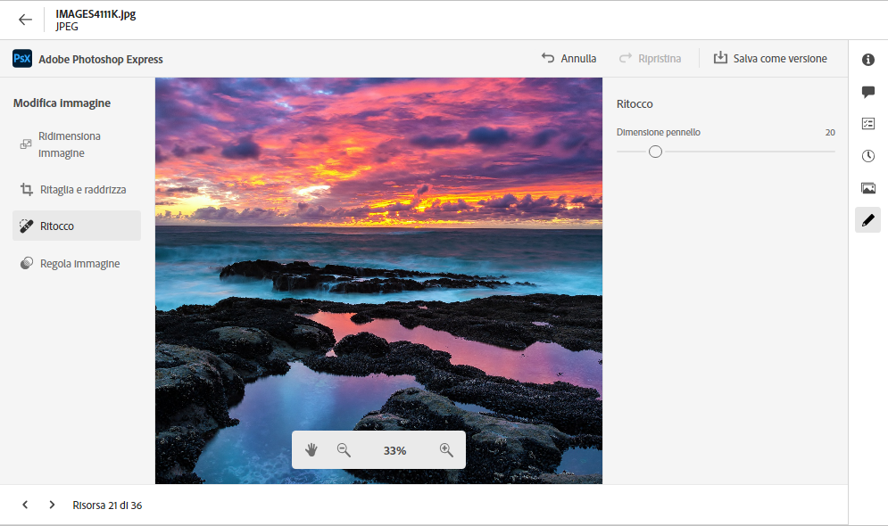
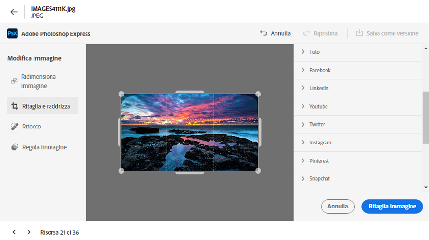
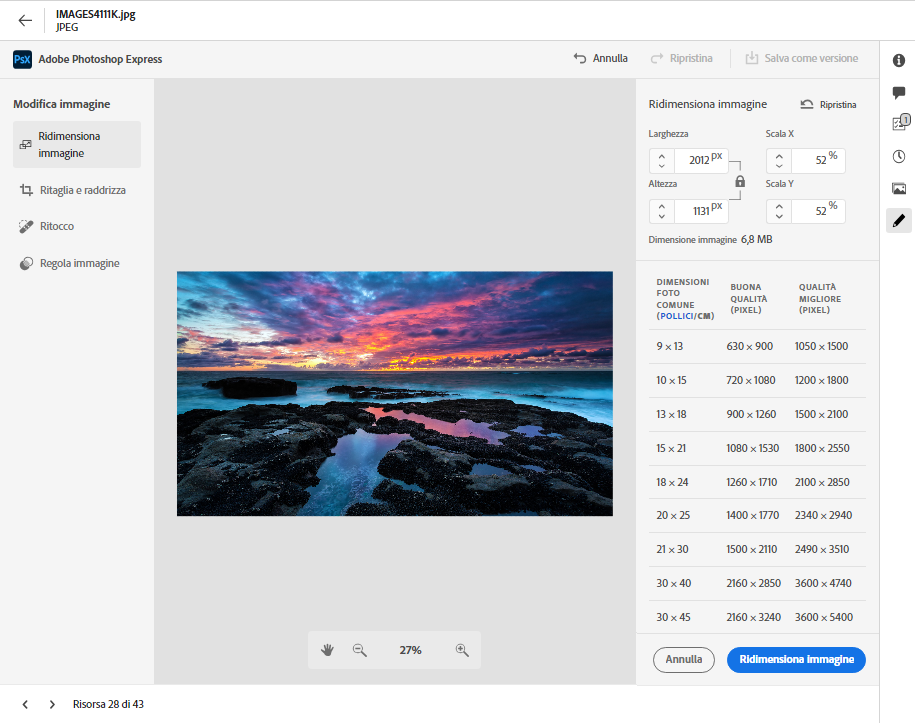
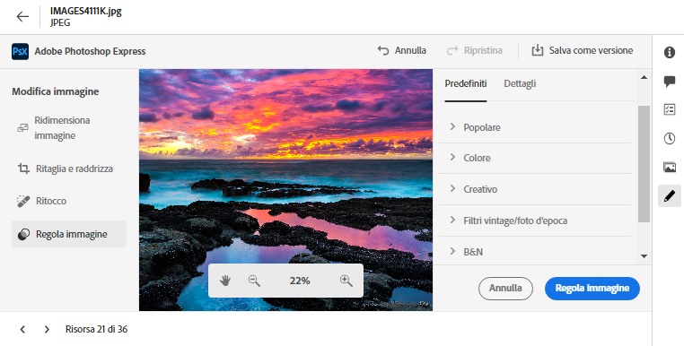

# Modificare le immagini in [!DNL Assets Essentials] {#edit-images-in-assets-essentials}

L’interfaccia utente di Assets Essentials consente di modificare le immagini di base, ad esempio con il ridimensionamento, la rimozione dello sfondo, il ritaglio e la conversione tra i formati JPEG e PNG. Inoltre, permette di apportare modifiche avanzate attraverso l’integrazione con Adobe Express. Dopo aver modificato un’immagine, puoi salvarla come nuova versione. Il controllo delle versioni consente di ripristinare la risorsa originale in un secondo momento, se necessario. Per modificare un’immagine: [apri l’anteprima](https://experienceleague.adobe.com/it/docs/experience-manager-assets-essentials/help/navigate-view#preview-assets) e fai clic su **Modifica immagine**.

>[!NOTE]
>
>È possibile modificare le immagini dei tipi di file PNG e JPEG utilizzando Adobe Express.

<!--The editing actions that are available are Spot healing, Crop and straighten, Resize image, and Adjust image.-->

## Modificare le immagini {#edit-images}

Accedi all’interfaccia utente di Assets Essentials utilizzando il collegamento: [Interfaccia utente di Assets Essentials](https://experience.adobe.com/#/assets) e seleziona l’archivio appropriato. Per ricevere l’accesso, contatta l’amministratore della tua organizzazione.
Per ulteriori informazioni di riferimento, consulta: [Introduzione all’utilizzo di Adobe Experience Manager Assets Essentials](https://experienceleague.adobe.com/it/docs/experience-manager-assets-essentials/help/get-started), [Interfaccia utente](https://experienceleague.adobe.com/it/docs/experience-manager-assets-essentials/help/navigate-view), [Casi d’uso di Assets Essentials](https://experienceleague.adobe.com/it/docs/experience-manager-assets-essentials/help/get-started#use-cases) e i [problemi noti](https://experienceleague.adobe.com/it/docs/experience-manager-assets-essentials/help/release-notes).

### Modificare le immagini utilizzando Adobe Express {#edit-images-using-adobe-express}

>[!CONTEXTUALHELP]
>id="assets_express_integration"
>title="Integrazione Adobe Express"
>abstract="Strumenti di editing delle immagini semplici e intuitivi gestiti da Adobe Express disponibili direttamente in AEM Assets per aumentare il riutilizzo dei contenuti e velocizzarne la creazione."

Dopo aver effettuato l’accesso all’interfaccia utente di Essentials, fai clic su **Assets**, seleziona un’immagine e quindi fai clic su **Modifica** dalla barra superiore. Nella nuova schermata vengono visualizzate le opzioni di modifica disponibili, tra cui il ridimensionamento, la rimozione dello sfondo, il ritaglio e la conversione tra i formati JPEG e PNG.

#### Ridimensionare l’immagine {#resize-image-using-express}

Spesso occorre ridimensionare un’immagine a una dimensione specifica. Assets Essentials consente di ridimensionare rapidamente le immagini per adattarle alle dimensioni comuni delle foto, fornendo nuove risoluzioni precalcolate per foto di dimensioni specifiche. Per ridimensionare l’immagine utilizzando Assets Essentials, effettua le seguenti operazioni:

1. Fai clic su **Ridimensiona immagine** dal riquadro di sinistra.
2. Seleziona la piattaforma di social media appropriata dall’elenco a discesa Ridimensiona e seleziona le dimensioni dell’immagine tra le opzioni visualizzate.
3. Ridimensiona l’immagine, se necessario, utilizzando il campo **Scala immagine**.
4. Fai clic su **Applica** per applicare le modifiche.
   

   L’immagine modificata è disponibile per il download. Puoi salvare la risorsa modificata come nuova versione della stessa risorsa oppure salvarla come nuova risorsa.
   

#### Rimuovere lo sfondo {#remove-background-using-express}

È possibile rimuovere lo sfondo da un’immagine in pochi semplici passaggi, come indicato di seguito:

1. Fai clic su **Rimuovi sfondo** dal riquadro a sinistra. In Experience Manager Assets l’immagine viene visualizzata senza sfondo.
2. Fai clic su **[!UICONTROL Applica]** per applicare le modifiche.
   

   L’immagine modificata è disponibile per il download. Puoi salvare la risorsa modificata come nuova versione della stessa risorsa oppure salvarla come nuova risorsa.

#### Ritagliare un’immagine {#crop-image-using-express}

Utilizzando alcune azioni rapide di [!DNL Adobe Express], è facile trasformare un’immagine affinché sia di dimensioni perfette.

1. Fai clic su **[!UICONTROL Ritaglia immagine]** dal riquadro a sinistra.
2. Trascina le maniglie agli angoli dell’immagine per creare il ritaglio desiderato.
3. Fai clic su **[!UICONTROL Applica]**.
   
L’immagine ritagliata è disponibile per il download. Puoi salvare la risorsa modificata come nuova versione della stessa risorsa oppure salvarla come nuova risorsa.

#### Convertire tra tipi di file immagine {#convert-image-types-using-express}

Puoi convertire rapidamente un’immagine JPEG in formato PNG utilizzando Adobe Express. Esegui i passaggi seguenti:

1. Fai clic su **Da JPEG a PNG** o **Da PNG a JPEG** dal riquadro a sinistra.
   
2. Fai clic su **[!UICONTROL Scarica]**.

#### Limitazioni {#limitations-adobe-express}

* Risoluzione immagine supportata: minima 50 pixel, massima 6000 pixel per dimensione.
* Dimensione file massima supportata: 17 MB.

### Modificare le immagine nell’editor integrato Adobe Express {#edit-images-in-adobe-express-embedded-editor}

Gli utenti con diritti di Express possono utilizzare l’editor Express incorporato dall’interfaccia utente di Assets Essentials per modificare facilmente i contenuti e crearne di nuovi con GenAI da Adobe Firefly. Ciò migliora il riutilizzo dei contenuti e li velocizza. Puoi anche utilizzare elementi predefiniti per migliorare la risorsa o eseguire azioni rapide per modificare l’immagine con pochi clic.
 Per modificare le immagini utilizzando l’editor incorporato di Adobe Express, effettua le seguenti operazioni:

1. Accedi all’interfaccia utente di AEM Assets Essentials utilizzando il collegamento [Interfaccia utente di AEM Assets Essentials](https://experience.adobe.com/#/assets) e seleziona l’archivio appropriato.
1. Fai clic su **Risorse**, immetti una cartella e seleziona un’immagine.
1. Fai clic su **Apri in Adobe Express**. L’immagine si apre in un’area di lavoro Express.
1. Apporta le modifiche necessarie all’immagine.
1. Se il progetto richiede l’aggiunta di ulteriori pagine, fai clic su **Aggiungi**, seleziona Risorse, immetti una cartella, seleziona un’immagine da inserire nella pagina dell’area di lavoro, quindi apporta all’immagine le modifiche necessarie.
1. Per salvare le immagini, fai clic su **Salva**. Viene visualizzata la finestra di dialogo Salva.

   >[!NOTE]
   >
   > **1. Per pagina singola**
   >
   > **Salva come versione:** questa funzione supporta il salvataggio di una sola risorsa. Seleziona questa opzione per esportare l’immagine come nuova versione (mantenendo il formato originale) e salvarla nella stessa cartella.
   > **Salva come nuova risorsa:** seleziona questa opzione per esportare la risorsa in un formato diverso da quello originale e salvarla in una cartella come nuova risorsa.
   >  
   > **2. Per più pagine**
   >
   > **Salva come versione:** questa funzione supporta il salvataggio di una sola risorsa. Se vuoi salvare una singola pagina da più pagine, seleziona questa opzione per salvare la risorsa nel formato e nella posizione originali.\
   > **Salva come nuova risorsa:** con questa opzione, esporta più risorse o una singola risorsa in una qualsiasi cartella e salvale come nuove risorse con il lformato di file originale o diverso.

1. Nella finestra di dialogo Salva:
   1. Immetti un nome per il file nel campo **Salva con nome**.
   1. Seleziona una cartella di destinazione.
   1. Facoltativo: fornisci dettagli quali nome del progetto o della campagna, parole chiave, canali, arco temporale e area geografica.
1. Fai clic su **Salva come versione** o **Salva come nuova risorsa** per salvare le risorse.

#### Limitazioni della modifica delle immagini nell’editor di Express {#limitations-of-editing-images-in-the-express-editor}

* Tipo di file supportato: JPEG o PNG.
* Dimensione file massima supportata: 40 MB.
* Intervallo di larghezza e altezza supportato: tra 50 e 8000 pixel.
* Ricarica la pagina per visualizzare l’ultima nuova risorsa salvata nella cartella di origine.

### Creare nuove risorse con Adobe Express {#create-new-assets-using-embedded-editor}

Assets Essentials consente di creare un nuovo modello da zero utilizzando l’editor integrato Adobe Express. Per creare una nuova risorsa utilizzando Adobe Express, effettua le seguenti operazioni:

1. Accedi a **La mia area di lavoro** e fai clic su **Crea** all’interno del banner di Adobe Express visualizzato all’interno di Adobe Express nella parte superiore. Nell’interfaccia utente di Assets Essentials viene visualizzata un’area di lavoro di Adobe Express vuota.
1. Crea i contenuti utilizzando i [modelli](https://helpx.adobe.com/it/express/using/work-with-templates.html). In caso contrario, accedi a Le tue risorse per modificare contenuti esistenti.
1. Dopo aver completato la modifica, fai clic su **Salva**.
1. Specifica il percorso di destinazione della risorsa creata e fai clic su **Salva come nuova risorsa**.

#### Limitazioni {#limitations}

* Puoi modificare solo le immagini in formato `JPEG` e `PNG`.
* La dimensione della risorsa deve essere inferiore a 40 MB.
* Puoi salvare un’immagine in formato `PDF`, `JPEG` o `PNG`.

<!--
## Edit images using [!DNL Adobe Photoshop Express] {#edit-using-photoshop-express}

<!--
After editing an image, you can save the new image as a new version. Versioning helps you to revert to the original asset later, if needed. To edit an image, [open its preview](/help/using/navigate-view.md#preview-assets) and click **[!UICONTROL Edit Image]**  from the rail on the right.

*Figure: The options to edit images are powered by [!DNL Adobe Photoshop Express].*
-->
<!--
### Spot heal images {#spot-heal-images-using-photoshop-express}

If there are minor spots or small objects on an image, you can edit and remove the spots using the spot healing feature provided by Adobe Photoshop.

The brush samples the retouched area and makes the repaired pixels blend seamlessly into the rest of the image. Use a brush size that is only slightly larger than the spot you want to fix.

<!-- 
TBD: See if we should give backlinks to PS docs for these concepts.
For more information about how Spot Healing works in Photoshop, see [retouching and repairing photos](https://helpx.adobe.com/photoshop/using/retouching-repairing-images.html). 
-->
<!--
### Crop and straighten images {#crop-straighten-images-using-photoshop-express}

Using the crop and straighten option that you can do basic cropping, rotate image, flip it horizontally or vertically, and crop it to dimensions suitable for popular social media websites.

To save your edits, click **[!UICONTROL Crop Image]**. After editing, you can save the new image as a version.

Many default options let you crop your image to the best proportions that fit various social media profiles and posts.

### Resize image {#resize-image-using-photoshop-express}

You can view the common photo sizes in centimeters or inches to know the dimensions. By default, the resizing method retains the aspect ratio. To manually override the aspect ratio, click .

Enter the dimensions and click **[!UICONTROL Resize Image]** to resize the image. Before you save the changes as a version, you can either undo all the changes done before saving by clicking [!UICONTROL Undo] or you can change the specific step in the editing process by clicking [!UICONTROL Revert].

### Adjust image {#adjust-image-using-photoshop-express}

[!DNL Assets Essentials] lets you adjust the color, tone, contrast, and more, with just a few clicks. Click **[!UICONTROL Adjust image]** in the edit window. The following options are available in the right sidebar:

* **Popular**: [!UICONTROL High Contrast & Detail], [!UICONTROL Desaturated Contrast], [!UICONTROL Aged Photo], [!UICONTROL B&W Soft], and [!UICONTROL B&W Sepia Tone].
* **Color**: [!UICONTROL Natural], [!UICONTROL Bright], [!UICONTROL High Contrast], [!UICONTROL High Contrast & Detail], [!UICONTROL Vivid], and [!UICONTROL Matte].
* **Creative**: [!UICONTROL Desaturated Contrast], [!UICONTROL Cool Light], [!UICONTROL Turquoise & Red], [!UICONTROL Soft Mist], [!UICONTROL Vintage Instant], [!UICONTROL Warm Contrast], [!UICONTROL Flat & Green], [!UICONTROL Red Lift Matte], [!UICONTROL Warm Shadows], and [!UICONTROL Aged Photo].
* **B&W**: [!UICONTROL B&W Landscape], [!UICONTROL B&W High Contrast], [!UICONTROL B&W Punch], [!UICONTROL B&W Low Contrast], [!UICONTROL B&W Flat], [!UICONTROL B&W Soft], [!UICONTROL B&W Infrared], [!UICONTROL B&W Selenium Tone], [!UICONTROL B&W Sepia Tone], and [!UICONTROL B&W Split Tone].
* **Vignetting**: [!UICONTROL None], [!UICONTROL Light], [!UICONTROL Medium], and [!UICONTROL Heavy].

<!--
TBD: Insert a video of the available social media options.
-->

### Passaggi successivi {#next-steps}

* Fornisci feedback sui prodotti utilizzando l’opzione [!UICONTROL Feedback] disponibile nell’interfaccia utente di Assets Essentials

* Fornisci feedback alla documentazione utilizzando [!UICONTROL Modifica questa pagina]  o [!UICONTROL Segnala un problema]  disponibile sulla barra laterale destra

* Contatta il [Servizio clienti](https://experienceleague.adobe.com/?support-solution=General&amp;lang=it#support)

>[!MORELIKETHIS]
>
>* [Visualizzare la cronologia delle versioni di una risorsa](/help/using/navigate-view.md)
