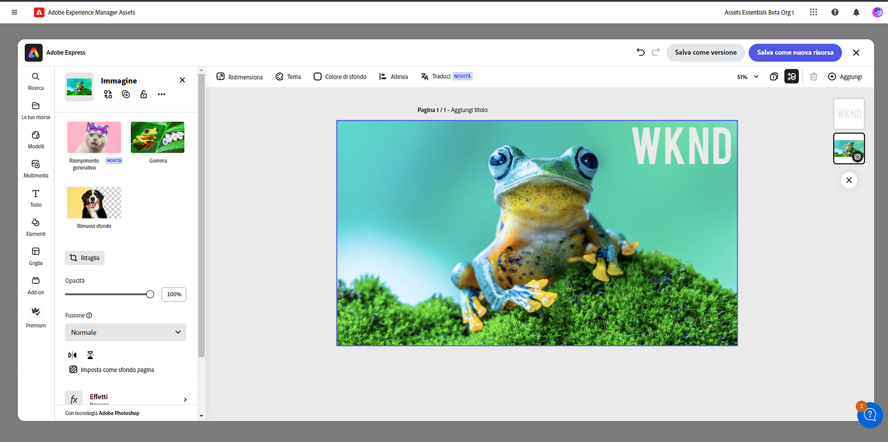

# Modificare le immagini in [!DNL Assets Essentials] {#edit-images}

[!DNL Assets Essentials] offre opzioni di modifica intuitive basate su [!DNL Adobe Express] e [!DNL Adobe Photoshop Express]. Le azioni di modifica disponibili tramite [!DNL Adobe Express] sono Ridimensiona immagine, Rimuovi sfondo, Ritaglia immagine e Converti JPEG in PNG.

Dopo aver modificato un’immagine, puoi salvarla come nuova versione. Se necessario, il controllo delle versioni consente di ripristinare la risorsa originale in un secondo momento. Per modificare un’immagine: [apri l’anteprima](/help/using/navigate-view.md#preview-assets) e fai clic su **[!UICONTROL Modifica immagine]**.

>[!NOTE]
>
>È possibile modificare le immagini PNG e JPEG utilizzando [!DNL Adobe Express].

<!--The editing actions that are available are Spot healing, Crop and straighten, Resize image, and Adjust image.-->

## Modificare le immagini con Adobe Express {#edit-using-express}

>[!CONTEXTUALHELP]
>id="assets_express_integration"
>title="Integrazione Adobe Express"
>abstract="Strumenti di editing delle immagini semplici e intuitivi gestiti da Adobe Express disponibili direttamente in AEM Assets per aumentare il riutilizzo dei contenuti e velocizzarne la creazione."

### Ridimensionare l’immagine {#resize-image-using-express}

Spesso occorre ridimensionare un’immagine a una dimensione specifica. [!DNL Assets Essentials] consente di ridimensionare rapidamente le immagini per adattarle alle dimensioni comuni delle foto, fornendo nuove risoluzioni precalcolate per dimensioni specifiche. Per ridimensionare l’immagine utilizzando [!DNL Assets Essentials], effettua le seguenti operazioni:

1. Seleziona un’immagine e fai clic su **Modifica**.
2. Fai clic su **[!UICONTROL Ridimensiona immagine]** dalle azioni rapide disponibili nel riquadro a sinistra.
3. Seleziona la piattaforma di social media appropriata dall’elenco a discesa **[!UICONTROL Ridimensiona per]** e seleziona le dimensioni dell’immagine tra le opzioni visualizzate.
4. Ridimensiona l’immagine, se necessario, utilizzando il campo **[!UICONTROL Scala immagine]**.
5. Fai clic su **[!UICONTROL Applica]** per applicare le modifiche.
   

   L’immagine modificata è disponibile per il download. Puoi salvare la risorsa modificata come nuova versione della stessa risorsa oppure salvarla come nuova risorsa.
   

### Rimuovere lo sfondo {#remove-background-using-express}

È possibile rimuovere lo sfondo da un’immagine in pochi semplici passaggi, come indicato di seguito:

1. Seleziona un’immagine e fai clic su **Modifica**.
2. Fai clic su **[!UICONTROL Rimuovi sfondo]** dalle azioni rapide disponibili nel riquadro a sinistra. In Experience Manager Assets l’immagine viene visualizzata senza sfondo.
3. Fai clic su **[!UICONTROL Applica]** per applicare le modifiche.
   

   L’immagine modificata è disponibile per il download. Puoi salvare la risorsa modificata come nuova versione della stessa risorsa oppure salvarla come nuova risorsa.

### Ritagliare un’immagine {#crop-image-using-express}

Utilizzando alcune azioni rapide di [!DNL Adobe Express], è facile trasformare un’immagine affinché sia di dimensioni perfette.

1. Seleziona un’immagine e fai clic su **Modifica**.
2. Fai clic su **[!UICONTROL Ritaglia immagine]** dalle azioni rapide nel riquadro a sinistra.
3. Trascina le maniglie agli angoli dell’immagine per creare il ritaglio desiderato.
4. Fai clic su **[!UICONTROL Applica]**.
   
L’immagine ritagliata è disponibile per il download. Puoi salvare la risorsa modificata come nuova versione della stessa risorsa oppure salvarla come nuova risorsa.

### Convertire da JPEG in PNG {#convert-jpeg-to-png-using-express}

Puoi convertire rapidamente un’immagine JPEG in formato PNG utilizzando Adobe Express. Esegui i passaggi seguenti:

1. Seleziona un’immagine e fai clic su **Modifica**.
2. Fai clic su **[!UICONTROL Da JPEG a PNG]** dalle azioni rapide nel riquadro a sinistra.
   
3. Fai clic su **[!UICONTROL Scarica]**.

### Limitazioni {#limitations-adobe-express}

* Risoluzione immagine supportata: minima - 50 pixel, massima - 6000 pixel per dimensione

* Dimensione massima file supportata: 17 MB

## Modificare le immagine utilizzando l’editor integrato Adobe Express {#edit-using-embedded-editor}

Gli utenti con accesso a Express ora dispongono di strumenti integrati per la modifica e la creazione di immagini da Adobe Express e Adobe Firefly disponibili direttamente all’interno di Assets Essentials, per migliorare il riutilizzo dei contenuti e accelerarne la velocità. Puoi anche utilizzare elementi predefiniti per migliorare la risorsa o eseguire azioni rapide per modificare l’immagine con pochi clic.

Per modificare le immagini mediante l’editor integrato [!DNL Adobe Express], effettua le seguenti operazioni:

1. Seleziona un’immagine dal tuo archivio di [!DNL Experience Manager] Assets.
1. Fai clic su **[!UICONTROL Apri in Adobe Express]**.

   

   Puoi sfruttare le funzionalità di [!DNL Adobe Express] per eseguire tutte le azioni correlate alla modifica delle immagini, ad esempio per [ridimensionare l’immagine](https://helpx.adobe.com/it/express/using/resize-image.html), [rimuovere o modificare il colore di sfondo](https://helpx.adobe.com/it/express/using/remove-background.html), [ritagliare l’immagine](https://helpx.adobe.com/it/express/using/crop-image.html) e molto altro.

1. Una volta completata la modifica dell’immagine, puoi scaricare una risorsa come nuova risorsa o salvarla come nuova versione.

## Creare nuove risorse con Adobe Express {#create-new-embedded-editor}

[!DNL Assets Essentials] consente di creare un nuovo modello da zero utilizzando l’editor integrato [!DNL Adobe Express]. Per creare una nuova risorsa tramite [!DNL Adobe Express], effettua le seguenti operazioni:

1. Accedi a **[!UICONTROL La mia area di lavoro]** e fai clic su **[!UICONTROL Crea]** all’interno del banner di Adobe Express visualizzato sopra la sezione [!UICONTROL Accesso rapido]. Un’area di lavoro vuota di [!DNL Adobe Express] viene visualizzata all’interno dell’interfaccia utente di [!DNL Assets Essentials].
1. Crea i contenuti utilizzando i [modelli](https://helpx.adobe.com/it/express/using/work-with-templates.html). In caso contrario, passa a **[!UICONTROL Le tue risorse]** per modificare contenuti esistenti.
1. Al termine, fai clic su **[!UICONTROL Salva come nuova risorsa]**.
1. Specifica il percorso di destinazione della risorsa creata e fai clic su **[!UICONTROL Salva]**.

>[!NOTE]
>
>* Puoi modificare solo le immagini in formato `JPEG` e `PNG`.
>* La dimensione della risorsa deve essere inferiore a 14 MB.
>* Puoi salvare un’immagine in formato `PDF`, `JPEG` o `PNG`.

## Modificare le immagini utilizzando [!DNL Adobe Photoshop Express] {#edit-using-photoshop-express}

<!--
After editing an image, you can save the new image as a new version. Versioning helps you to revert to the original asset later, if needed. To edit an image, [open its preview](/help/using/navigate-view.md#preview-assets) and click **[!UICONTROL Edit Image]**  from the rail on the right.

*Figure: The options to edit images are powered by [!DNL Adobe Photoshop Express].*
-->

### Correggere immagini al volo {#spot-heal-images-using-photoshop-express}

Se in un’immagine sono presenti piccole macchie o oggetti indesiderati, puoi modificarli e rimuoverli utilizzando il pennello Correzione al volo fornito da Adobe Photoshop.

Il pennello campiona l’area ritoccata e fa sì che i pixel riparati si fondano perfettamente nel resto dell’immagine. Utilizza una dimensione del pennello solo leggermente più grande del punto da correggere.

<!-- 
TBD: See if we should give backlinks to PS docs for these concepts.
For more information about how Spot Healing works in Photoshop, see [retouching and repairing photos](https://helpx.adobe.com/photoshop/using/retouching-repairing-images.html). 
-->

### Ritagliare e raddrizzare le immagini {#crop-straighten-images-using-photoshop-express}

Utilizzando l’opzione di ritaglio e raddrizzamento è possibile eseguire un ritaglio di base, ruotare l’immagine, capovolgerla in orizzontale o in verticale e ritagliarla con le proporzioni più adatte per i social media più popolari.

Per salvare le modifiche, fai clic su **[!UICONTROL Ritaglia immagine]**. Dopo la modifica, puoi salvare la nuova immagine come versione.

Molte opzioni predefinite consentono di ritagliare l’immagine alle proporzioni più adatte a vari profili e post di social media.

### Ridimensionare l’immagine {#resize-image-using-photoshop-express}

Puoi visualizzare le dimensioni comuni delle foto in centimetri o pollici per conoscerne la grandezza. Per impostazione predefinita, il metodo di ridimensionamento mantiene le proporzioni originali. Per modificare manualmente le proporzioni, fai clic su .

Inserisci le dimensioni e fai clic su **[!UICONTROL Ridimensiona immagine]** per ridimensionare l’immagine. Prima di salvare le modifiche come versione, puoi fare clic su [!UICONTROL Annulla] per annullare tutte le modifiche apportate prima di salvarle; oppure, per modificare un passaggio di modifica specifico, fai clic su [!UICONTROL Ripristina].

### Regolare l’immagine {#adjust-image-using-photoshop-express}

[!DNL Assets Essentials] consente di regolare il colore, il tono, il contrasto e molto altro con pochi clic. Fai clic su **[!UICONTROL Regola immagine]** nella finestra di modifica. Nella barra laterale a destra sono disponibili le seguenti opzioni:

* **Popolare**: [!UICONTROL Contrasto e dettagli elevati], [!UICONTROL Contrasto insaturo], [!UICONTROL Foto invecchiata], [!UICONTROL Bianco e nero morbido] e [!UICONTROL Tonalità seppia bianco e nero].
* **Colore**: [!UICONTROL Naturale], [!UICONTROL Luminosità], [!UICONTROL Contrasto elevato], [!UICONTROL Contrasto elevato e dettagli], [!UICONTROL Vivace] e [!UICONTROL Opaco].
* **Creativo**: [!UICONTROL Contrasto insaturo], [!UICONTROL Luce fredda], [!UICONTROL Turchese e rosso], [!UICONTROL Foschia leggera], [!UICONTROL Istante vintage], [!UICONTROL Contrasto caldo], [!UICONTROL Semplice e verde], [!UICONTROL Opacità sollevata rossa], [!UICONTROL Ombre calde] e [!UICONTROL Foto invecchiata].
* **Bianco e nero**: [!UICONTROL Paesaggio bianco e nero], [!UICONTROL Bianco e nero con contrasto elevato], [!UICONTROL Risalto bianco e nero], [!UICONTROL Bianco e nero con contrasto ridotto], [!UICONTROL Bianco e nero semplice], [!UICONTROL Bianco e nero morbido], [!UICONTROL Bianco e nero infrarossi], [!UICONTROL Tonalità selenio bianco e nero], [!UICONTROL Tonalità seppia bianco e nero] e [!UICONTROL Divisioni toni bianco e nero].
* **Vignettatura**: [!UICONTROL Nessuna], [!UICONTROL Chiara], [!UICONTROL Media] e [!UICONTROL Scura].

<!--
TBD: Insert a video of the available social media options.
-->

### Passaggi successivi {#next-steps}

* Fornisci feedback sui prodotti utilizzando l’opzione [!UICONTROL Feedback] disponibile nell’interfaccia utente di Assets Essentials

* Fornisci feedback alla documentazione utilizzando [!UICONTROL Modifica questa pagina]  o [!UICONTROL Segnala un problema]  disponibile sulla barra laterale destra

* Contatta il [Servizio clienti](https://experienceleague.adobe.com/?support-solution=General&amp;lang=it#support)

>[!MORELIKETHIS]
>
>* [Visualizzare la cronologia delle versioni di una risorsa](/help/using/navigate-view.md)
