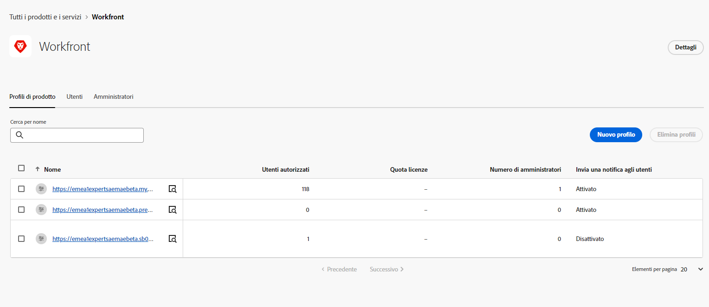
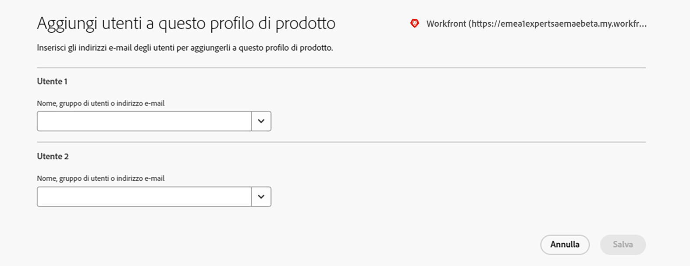

# Integrare Assets Essentials con Adobe Workfront {#integrate-assets-essentials-workfront}

## La storia finora

Dopo la [configurazione di Experience Manager Assets Essentials](adminster-aem-assets-essentials.md) e l’[integrazione delle applicazioni Creative Cloud con Assets Essentials](integrate-assets-essentials-creative-cloud.md), puoi sfruttare per integrare l’applicazione Adobe Workfront con Assets Essentials.

## Obiettivo

* **Pubblico**: amministratori Adobe Workfront

* **Obiettivo**: integra Assets Essentials con l’applicazione Adobe Workfront in modo da poter accedere all’archivio Assets Essentials all’interno dell’applicazione Workfront.

## Panoramica

[[!DNL Adobe Workfront]](https://www.workfront.com/) è un’applicazione per la gestione dell’intero ciclo di vita del lavoro, tutto in un’unica posizione. L’integrazione nativa tra [!DNL Adobe Workfront] e [!DNL Assets Essentials] consente alle organizzazioni di velocizzare le attività relative ai contenuti e il time-to-market, grazie a un collegamento intrinseco tra il lavoro e la gestione delle risorse. Nel contesto di gestione del lavoro, gli utenti possono accedere ai documenti e alle immagini necessari utilizzando la stessa soluzione.

Esegui le seguenti attività per integrare Workfront con Experience Manager Assets Essentials:

* [Aggiungere utenti ai profili di prodotto Workfront](#add-users-to-product-profiles)

* [Aggiungere utenti ai profili di prodotto di Assets Essentials](#add-workfront-users-assets-essentials-product-profiles)

* [Configurare l’integrazione di Experience Manager Assets Essentials](#configure-assets-essentials-integration)

## Aggiungere utenti ai profili di prodotto Workfront {#add-users-to-product-profiles}

Per aggiungere utenti ai profili di prodotto Workfront:

1. Accedi a [Admin Console](https://adminconsole.adobe.com) per la tua organizzazione, fai clic su **[!UICONTROL Prodotti]** nella barra superiore, fai clic su **[!UICONTROL Workfront]**, quindi fai clic sulla prima istanza nell’elenco. Non fare clic sulla seconda e sulla terza istanza dell’elenco.

   

   In Admin Console viene visualizzato l’unico profilo di prodotto disponibile.

1. Per aggiungere un utente a un profilo di prodotto, fai clic sul profilo e seleziona **[!UICONTROL Aggiungi utente]**, specifica i dettagli utente, quindi fai clic su **[!UICONTROL Salva]**.

   

   Quando aggiungi un utente, quest’ultimo riceve un invito e-mail per poter iniziare a utilizzare la soluzione. È possibile disattivare gli inviti e-mail dalle impostazioni del profilo prodotto in [!DNL Admin Console].

1. Per rimuovere un utente da un gruppo, fai clic sul gruppo, seleziona un utente esistente, quindi seleziona **[!UICONTROL Rimuovi utente]**.

Per ulteriori informazioni su come creare utenti e amministratori di sistema in Workfront con Adobe Admin Console, consulta [Gestione degli utenti in Adobe Admin Console](https://one.workfront.com/s/document-item?bundleId=the-new-workfront-experience&amp;topicId=Content%2FAdministration_and_Setup%2FAdd_users%2FCreate_and_manage_users%2Fadmin-console.htm&amp;_LANG=enus).

## Aggiungere utenti ai profili di prodotto di Assets Essentials {#add-workfront-users-assets-essentials-product-profiles}

Assegna gli utenti Workfront a uno dei seguenti profili di prodotto Assets Essentials:

* Gli utenti di **[!DNL Assets Essentials]** hanno accesso all’interfaccia utente completa di Assets Essentials. Questi utenti possono caricare, organizzare, assegnare tag e trovare risorse digitali nell’applicazione Assets Essentials. Inoltre, gli utenti possono accedere all’esperienza di selezione delle risorse incorporate nell’applicazione [!DNL Adobe Workfront].
* Gli utenti consumer di **[!DNL Assets Essentials]** hanno accesso all’esperienza di selezione delle risorse incorporata nell’applicazione [!DNL Adobe Workfront]. 

Inoltre, esistono Amministratori del profilo di prodotto di **[!DNL Assets Essentials]** che forniscono accesso amministrativo all’applicazione.

Per ulteriori informazioni su come assegnare gli utenti ai profili di prodotto Assets Essentials, consulta [Assegnare gli utenti ai profili di prodotto Assets Essentials](adminster-aem-assets-essentials.md#add-users-to-product-profiles).

## Configurare l’integrazione di Experience Manager Assets Essentials {#configure-assets-essentials-integration}

Dopo aver aggiunto gli utenti ai profili di prodotto Workfront e Assets Essentials tramite Admin Console, puoi [configurare l’integrazione di Experience Manager Assets Essentials con Adobe Workfront](https://one.workfront.com/s/document-item?bundleId=the-new-workfront-experience&amp;topicId=Content%2FDocuments%2FAdobe_Workfront_for_Experience_Manager_Assets_Essentials%2F_workfront-for-aem-asset-essentials.htm).

Dopo aver configurato l’integrazione, puoi:

* [Collegare risorse e cartelle da Experience Manager Assets Essentials](https://one.workfront.com/s/document-item?bundleId=the-new-workfront-experience&amp;topicId=Content%2FDocuments%2FAdobe_Workfront_for_Experience_Manager_Assets_Essentials%2Flink-to-aem.htm&amp;_LANG=enus)

* [Inviare un documento alle funzioni di base di Experience Manager Assets](https://one.workfront.com/s/document-item?bundleId=the-new-workfront-experience&amp;topicId=Content%2FDocuments%2FAdobe_Workfront_for_Experience_Manager_Assets_Essentials%2Fsend-to-aem.htm&amp;_LANG=enus)

* [Prova di una risorsa collegata per Experience Manager Assets Essentials](https://one.workfront.com/s/document-item?bundleId=the-new-workfront-experience&amp;topicId=Content%2FDocuments%2FAdobe_Workfront_for_Experience_Manager_Assets_Essentials%2Fproof-linked-asset-aem.htm)

* [Visualizzare o scaricare una risorsa collegata da Experience Manager Assets Essentials](https://one.workfront.com/s/document-item?bundleId=the-new-workfront-experience&amp;topicId=Content%2FDocuments%2FAdobe_Workfront_for_Experience_Manager_Assets_Essentials%2Fview-download-asset.htm)
