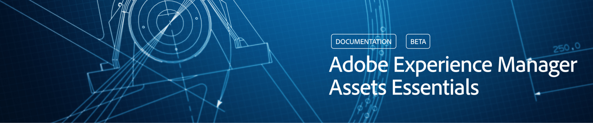
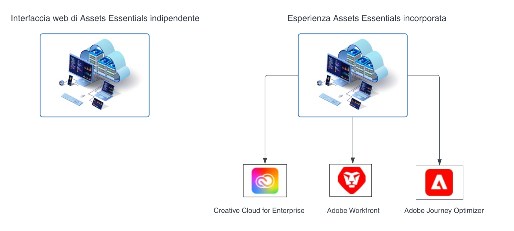

# Panoramica di [!DNL Adobe Experience Manager Assets Essentials] {#assets-essentials}

<!-- 
TBD: Update this banner to remove Beta label. 

-->

Adobe offre una solida soluzione di gestione delle risorse digitali (DAM) che consente di ottenere il massimo dalle risorse digitali. Adobe Experience Manager Assets Essentials è la soluzione Adobe leggera per la gestione delle risorse per archiviare, gestire, individuare e utilizzare le risorse digitali.

## Cos’è Assets Essentials? {#assets-essemtials-overview}

Experience Manager Assets Essentials è un’edizione leggera di Adobe Experience Manager Assets Cloud Service. Assets Essentials offre funzioni per la gestione unificata delle risorse e la collaborazione, con un’interfaccia utente semplificata e moderna. La facilità d’uso di questa soluzione consente ai team creativi e di marketing di archiviare, individuare e distribuire le risorse digitali.

Assets Essentials consente di:

* Gestire, organizzare e amministrare le risorse in una posizione centralizzata.

* Collaborare allo sviluppo di contenuti tra i team.

* Cercare, trovare e accedere alle risorse finali approvate.

* Condividere e scaricare le risorse per la consegna a valle.

## Come accedere ad Assets Essentials? {#access-options}

Assets Essentials offre un’interfaccia utente web indipendente per gli utenti finali e gli amministratori, consentendo loro di accedere a tutte le funzionalità della soluzione. Gli utenti di altre soluzioni Adobe possono inoltre accedere alle risorse di Assets Essentials e lavorare su di esse tramite un’esperienza incorporata, disponibile nelle applicazioni Creative Cloud for enterprise, Adobe Journey Optimizer e Adobe Workfront.

## Perché Assets Essentials? {#assets-essentials-features}

Assets Essentials offre vantaggi chiave che consentono di:

* **Iniziare rapidamente a lavorare** con strumenti per la gestione delle risorse pronti all’uso.

* Estendere l’accesso alle risorse a più team per fornire ai clienti una esperienza d&#39;uso coerente attraverso la **gestione semplificata delle risorse**.

* Unificare il ciclo di vita dei contenuti con **integrazioni native in altre soluzioni Adobe**.

* Sfruttare una **piattaforma basata su cloud** sicura e pronta per essere scalata in qualsiasi momento, ovunque.

* Iniziare con funzionalità DAM di base e **crescere** fino a utilizzare funzioni DAM di livello enterprise.

**Introduzione rapida**

La soluzione Assets Essentials viene fornita da Adobe ed è disponibile al termine del processo di provisioning. Gli amministratori possono accedere al prodotto da Adobe Admin Console e inziare subito a configurare il sistema e a eseguire l’onboarding degli utenti.

Scopri di più sull’ [amministrazione e l&#39;onboarding degli utenti](deploy-administer.md) di Assets Essentials.

**Gestione semplificata delle risorse**

L’interfaccia utente semplificata di Assets Essentials agevola la gestione, l’individuazione e la distribuzione delle risorse digitali. Un ampio insieme di utenti con diverse funzioni, compresi i team creativi, di marketing e line-of-business, possono collaborare alle risorse e accedere alle risorse approvate, quando e dove ne hanno bisogno.

Per ulteriori informazioni, consulta la [Guida introduttiva di Assets Essentials per le tue esigenze di gestione delle risorse](get-started.md).

**Integrazione con altre applicazioni Adobe**

Assets Essentials si integra con le soluzioni Adobe supportate e offre un’esperienza incorporata direttamente nell’interfaccia di tali applicazioni. Consente agli utenti di accedere facilmente alle risorse di cui hanno bisogno direttamente nella loro applicazione. Tutti gli utenti possono lavorare con le stesse risorse gestite a livello centrale, utilizzando gli strumenti e le applicazioni che già conoscono.

L’esperienza incorporata di Assets Essentials è disponibile per le applicazioni Creative Cloud for enterprise, Adobe Journey Optimizer e Adobe Workfront.

Per ulteriori informazioni, consulta [Integrazioni con altre soluzioni Adobe](integration.md).

**Piattaforma basata su cloud**

Basato sull’infrastruttura cloud di Adobe, Assets Essentials consente alle organizzazioni di concentrarsi sulle esigenze business relative alla creazione, gestione e distribuzione delle risorse digitali. Inoltre, Adobe garantisce che la soluzione sia disponibile, sicura, scalabile e sempre aggiornata, con innovazioni di prodotto fornite in automatico tramite frequenti aggiornamenti.

**Funzionalità che crescono assieme a te**

Inizia subito a usare Assets Essentials per sfruttare le funzionalità principali per la gestione delle risorse digitali tra i vari team.

Quando le tue esigenze business aumentano e hai bisogno di supporto per soddisfare requisiti avanzati di gestione delle risorse digitali, quali personalizzazioni, estensibilità e integrazioni, automazione, Dynamic Media e Brand Portal, Adobe offre anche [Adobe Experience Manager Assets as a Cloud Service](https://experienceleague.adobe.com/docs/experience-manager-cloud-service/content/assets/home.html?lang=it).

## Passaggi successivi {#next-steps}

* Fornisci feedback sui prodotti utilizzando l’opzione [!UICONTROL Feedback] disponibile nell’interfaccia utente di Assets Essentials

* Fornisci feedback alla documentazione utilizzando [!UICONTROL Modifica questa pagina]  o [!UICONTROL Segnala un problema]  disponibile sulla barra laterale destra

* Contatta il [Servizio clienti](https://experienceleague.adobe.com/it?support-solution=General&lang=it#support)

>[!MORELIKETHIS]
>
>* Pagina dei tutorial su[[!DNL Assets Essentials] &#x200B;](https://experienceleague.adobe.com/docs/experience-manager-learn/assets-essentials/overview.html?lang=it)
