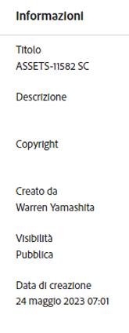
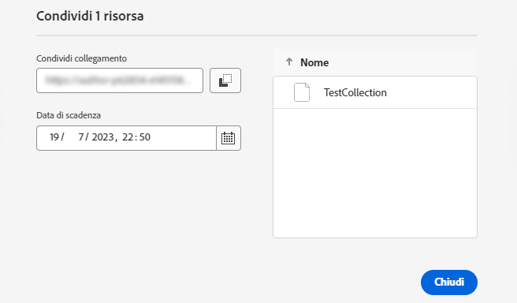

# Gestire le raccolte {#manage-collections}

>[!CONTEXTUALHELP]
>id="assets_collections"
>title="Gestire le raccolte"
>abstract="Una raccolta è un set di risorse, cartelle o altre raccolte all’interno di Assets Essentials. Puoi utilizzare le raccolte per condividere le risorse tra i vari utenti. A differenza delle cartelle, una raccolta può includere risorse da posizioni diverse. Puoi condividere più raccolte con un utente. Ogni raccolta contiene riferimenti alle risorse. L’integrità dei riferimenti alle risorse viene mantenuta tra le varie raccolte."

Una raccolta è un set di risorse, cartelle o altre raccolte all’interno di Adobe Experience Manager Assets Essentials. Puoi utilizzare le raccolte per condividere le risorse tra i vari utenti.

A differenza delle cartelle, una raccolta può includere risorse da posizioni diverse.

<!--
You can share collections with various users that are assigned different levels of privileges, including viewing, editing, and so on.
-->

Puoi condividere più raccolte con un utente. Ogni raccolta contiene riferimenti alle risorse. L’integrità dei riferimenti alle risorse viene mantenuta tra le varie raccolte.

Per gestire e utilizzare le raccolte, puoi eseguire le seguenti attività:

* [Creare una raccolta](#create-collection)

* [Aggiungere risorse a una raccolta](#add-assets-to-collection)

* [Rimuovere risorse da una raccolta](#remove-assets-from-collection)

* [Creare una raccolta avanzata](#create-smart-collection)

* [Modificare una raccolta avanzata](#edit-smart-collection)

* [Visualizzare e modificare i metadati di una raccolta](#view-edit-collection-metadata)

* [Condividere collegamenti per le raccolte](#share-collection-links)

* [Scaricare una raccolta](#download-collection)

* [Eliminare una raccolta](#delete-collection)

* [Gestire le autorizzazioni per una raccolta privata](#manage-permissions-private-collection)

## Creare una raccolta {#create-collection}

Per creare una raccolta:

1. Fai clic su **[!UICONTROL Raccolte]** nella barra a sinistra, quindi fai clic su **[!UICONTROL Crea raccolta]**.

1. Specifica un titolo e una descrizione facoltativa per la raccolta.

1. Seleziona se devi creare una raccolta privata o pubblica. Una raccolta pubblica è accessibile a tutti gli utenti per la visualizzazione e la modifica. Una raccolta privata, invece, è accessibile solo da parte di chi l’ha creata e degli utenti con privilegi di amministratore.

1. Fai clic su **[!UICONTROL Crea]** per creare la raccolta.

   

<!--
   
   for viewing and editing only to users with the appropriate [permissions](#manage-collection-access).

-->

## Aggiungere risorse a una raccolta {#add-assets-to-collection}

Per aggiungere risorse a una raccolta:

1. Fai clic su **[!UICONTROL Risorse]** nella barra a sinistra e seleziona le risorse da aggiungere a una raccolta.

1. Fai clic su **[!UICONTROL Aggiungi alla raccolta]**.

1. Nella finestra di dialogo [!UICONTROL Raccolte] seleziona le raccolte a cui aggiungere le risorse selezionate.

1. Fai clic su **[!UICONTROL Aggiungi]** per aggiungere la risorsa alle raccolte selezionate.

## Rimuovere risorse da una raccolta {#remove-assets-from-collection}

Per rimuovere le risorse da una raccolta:

1. Fai clic su **[!UICONTROL Raccolte]** nella barra a sinistra per visualizzare l’elenco delle raccolte.

1. Fai clic sulla raccolta e seleziona le risorse da rimuovere.

1. Fai clic su **[!UICONTROL Rimuovi]**.

## Gestire una raccolta avanzata {#manage-smart-collection}

Salva i risultati della ricerca come Raccolta avanzata per aggiornare dinamicamente il contenuto della raccolta. Se nell’archivio Assets Essentials sono state aggiunte risorse che soddisfano i criteri di ricerca definiti durante la creazione della raccolta avanzata, i contenuti di questa vengono aggiornati automaticamente.

### Creare una raccolta avanzata {#create-smart-collection}

Per creare una raccolta avanzata:

1. Fai clic su **[!UICONTROL Filtro]** e [definisci i criteri di ricerca](search.md##refine-search-results).

1. Fai clic su **[!UICONTROL Salva con nome]**, quindi seleziona **[!UICONTROL Raccolta avanzata]**.

   

1. Sulla finestra di dialogo [!UICONTROL Crea raccolta avanzata], specifica il titolo e la descrizione da assegnare alla raccolta avanzata.

1. Se tutti gli utenti dovranno poter accedere alla raccolta, seleziona **[!UICONTROL Raccolta pubblica]**. Se solo un gruppo limitato di utenti dovrà poter accedere alla raccolta, seleziona **[!UICONTROL Raccolta privata]**.

1. Fai clic su **[!UICONTROL Crea]** per creare la raccolta avanzata.

### Modificare una raccolta avanzata {#edit-smart-collection}

Per modificare una raccolta avanzata:

1. Fai clic su **[!UICONTROL Raccolte]** nella barra a sinistra, quindi fai doppio clic sul nome della raccolta da modificare.

1. Fai clic su **[!UICONTROL Modifica raccolta avanzata]**.

1. Dalla finestra di dialogo [!UICONTROL Modifica i filtri di raccolta avanzata], [aggiorna i criteri di ricerca](search.md##refine-search-results) per la raccolta avanzata.

1. Fai clic su **[!UICONTROL Salva]**.

<!--

## Manage access to a Private collection {#manage-collection-access}

The permission management for collections function in the same manner as folders in [!DNL Assets Essentials]. Administrators can manage the access levels for collections available in the repository. As an administrator, you can create user groups and assign permissions to those groups to manage access levels. You can also delegate the permission management privileges to user groups at the collection-level.

For more information, see [Manage permissions for folders and collections](manage-permissions.md).

-->

<!--

## Search a collection {#search-collections}

Click **[!UICONTROL Collections]** in the left rail and use the Search box to specify a text as the criteria to search for a collection. [!DNL Assets Essentials] uses the specified text to search collection names, metadata including tags defined for a collection and returns appropriate results.

>[!NOTE]
>
>Assets Essentials performs search in collections available at the root level. It does not perform search in assets and folders available in collections.

-->

## Visualizzare e modificare i metadati di una raccolta {#view-edit-collection-metadata}

I metadati di una raccolta includono dati sulla raccolta, come titolo e descrizione.

Per visualizzare e modificare i metadati di una raccolta:

1. Fai clic su **[!UICONTROL Raccolte]** nella barra a sinistra, seleziona una raccolta e fai clic su **[!UICONTROL Dettagli]**.
1. Visualizza i metadati della raccolta utilizzando la scheda **[!UICONTROL Base]**.
1. Se necessario, modifica i campi di metadati. Puoi modificare i campi [!UICONTROL Titolo] e [!UICONTROL Descrizione].

   

## Condividere collegamenti per le raccolte {#share-collection-links}

[!DNL Assets Essentials] consente di generare un collegamento e di condividere raccolte e risorse al loro interno con le parti interessate che non hanno accesso all’applicazione [!DNL Assets Essentials]. Puoi definire una data di scadenza del collegamento e condividerlo con altri utilizzando il metodo di comunicazione preferito, ad esempio e-mail o servizi di messaggistica. I destinatari del collegamento possono visualizzare in anteprima le risorse e scaricarle.

Per ulteriori informazioni su come condividere i collegamenti di raccolte con soggetti esterni, consulta [Condividere collegamenti alle risorse](share-links-for-assets.md).

## Scaricare una raccolta {#download-collection}

Per scaricare una raccolta:

1. Fai clic su **[!UICONTROL Raccolte]** nella barra a sinistra.

1. Seleziona la raccolta da scaricare e fai clic su **[!UICONTROL Scarica]**.

1. Nella finestra di dialogo [!UICONTROL Scarica risorsa] fai clic su **[!UICONTROL OK]**.

Gli elementi della raccolta selezionati vengono scaricati come file .ZIP sul computer locale.

## Eliminare una raccolta {#delete-collection}

Per eliminare una raccolta:

1. Fai clic su **[!UICONTROL Raccolte]** nella barra a sinistra.

1. Seleziona la raccolta da eliminare.

1. Fai clic su **[!UICONTROL Elimina]**.

## Gestire le autorizzazioni per una raccolta privata{#manage-permissions-private-collection}

Puoi consentire agli amministratori di gestire i [livelli di accesso](/help/using/manage-permissions.md#manage-permissions-on-folders) per le raccolte private disponibili nell’archivio. Puoi assegnare le autorizzazioni come `Can View` e `Can Edit` ai gruppi di utenti o agli utenti. Puoi anche delegare i privilegi di gestione delle autorizzazioni ai gruppi di utenti. Gli utenti che creano raccolte private sono i proprietari di tali raccolte. Possono utilizzare l’azione [!UICONTROL Gestisci autorizzazioni] per concedere l’accesso agli altri utenti. Inoltre, gli amministratori possono visualizzare e gestire le autorizzazioni delle raccolte private nell’archivio di [!DNL Experience Manager].
<!--
>[!NOTE]
>
>Adobe does not recommend to assign permissions to users.
-->
Per informazioni su come assegnare le autorizzazioni disponibili ai gruppi di utenti, consulta [Aggiungere autorizzazioni ai gruppi di utenti](/help/using/manage-permissions.md#add-permissions).

Per ulteriori informazioni sul flusso di lavoro end-to-end, consulta [gestire le autorizzazioni](/help/using/manage-permissions.md).

## Passaggi successivi {#next-steps}

* Fornisci feedback sui prodotti utilizzando l’opzione [!UICONTROL Feedback] disponibile nell’interfaccia utente di Assets Essentials

* Fornisci feedback alla documentazione utilizzando [!UICONTROL Modifica questa pagina]  o [!UICONTROL Segnala un problema]  disponibile sulla barra laterale destra

* Contatta il [Servizio clienti](https://experienceleague.adobe.com/it?support-solution=General#support)
