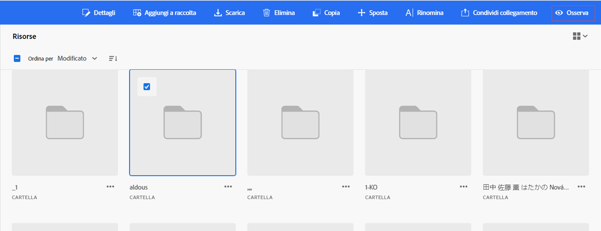

# Osservare risorse, cartelle e raccolte {#watch-assets-folders}

Le notifiche di Assets Essentials consentono di monitorare le operazioni eseguite sulle risorse, cartelle o raccolte disponibili nell’archivio. Devi selezionare e iscriverti al contenuto per il quale ti vengono inviate le notifiche. Puoi anche configurare le categorie per le quali vengono inviate le notifiche.

## Iscriversi alle categorie di notifica {#subscribe-to-notification-categories}

Puoi scegliere un elenco di categorie e iscriverti per ricevere le notifiche. Assets Essentials invia le notifiche solo per le categorie selezionate tra le opzioni disponibili:

<table>
    <tbody>
     <tr>
      <th><strong>Categoria di notifica</strong></th>
      <th><strong>Descrizione</strong></th>
     </tr>
     <tr>
      <td>Richieste</td>
      <td>Quando si assegna un’attività a un utente, si riceve una notifica quando l'utente esegue un’azione su tale attività.</td>
     </tr>
     <tr>
      <td>Assegnato a me</td>
      <td>Ricevi una notifica quando un’attività ti è stata assegnata da un altro utente.</td>
     </tr>
     <tr>
      <td>Commento a contenuti sottoscritti</td>
      <td>Ricevi una notifica quando un utente aggiunge un commento alla risorsa a cui ti sei iscritto.</td>
     </tr>
     <tr>
      <td>Eliminazione di contenuti sottoscritti</td>
      <td>Ricevi una notifica quando un utente elimina la risorsa, la cartella o la raccolta a cui ti sei iscritto.</td>
     </tr>
     <tr>
      <td>Condivisione esterna di contenuti sottoscritti</td>
      <td>Ricevi una notifica quando un utente genera un collegamento pubblico per la risorsa, la cartella o la raccolta a cui ti sei iscritto.</td>
     </tr>
     <tr>
      <td>Modifica di contenuti sottoscritti</td>
      <td>Ricevi una notifica quando un utente crea una nuova versione della risorsa a cui ti sei iscritto.</td>
     </tr>
     <tr>
      <td>Spostamento o ridenominazione di contenuti sottoscritti</td>
      <td>Ricevi una notifica quando un utente sposta o rinomina la risorsa o la cartella sottoscritta.</td>
     </tr>
     <tr>
      <td>Aggiornamenti alle cartelle e alle raccolte sottoscritte</td>
      <td>Ricevi una notifica quando un utente aggiunge o rimuove una risorsa da una cartella o raccolta sottoscritta.</td>
     </tr>    
    </tbody>
   </table>

Per iscriversi alle categorie di notifica:

1. Fai clic su  all’estremità destra della barra dei menu nell’interfaccia utente di Assets Essentials.

1. Fai clic su  per visualizzare la pagina [!UICONTROL Preferenze di Experience Cloud].

1. Fai clic sul pulsante **[!UICONTROL Notifiche]** nel riquadro a sinistra.

1. Nella sezione **[!UICONTROL Notifiche]**, passa alla sezione [!UICONTROL Assets Essentials] e assicurati che l’opzione di attivazione sia attivata.

   

1. Fai clic su **[!UICONTROL Personalizza]** per visualizzare le categorie di notifiche.
   

1. Seleziona le categorie di notifica per le quali vuoi ricevere una notifica.

## Osservare e non osservare più cartelle, risorse o raccolte {#watch-unwatch-assets}

Dopo l’[iscrizione alle categorie di notifica](#subscribe-to-notification-categories), devi iscriverti al contenuto per iniziare a ricevere le notifiche.

>[!NOTE]
>
>* Per le categorie di notifiche **[!UICONTROL Richieste]** e **[!UICONTROL Assegnato a me]**, non è necessario iscriversi ai contenuti dopo l’iscrizione alle categorie di notifica. Le notifiche vengono inviate automaticamente per le richieste che crei e quando un&#39;attività viene assegnata a te.
>* Assets Essentials invia notifiche solo quando altri utenti eseguono azioni sui contenuti a cui si è iscritti. Non si ricevono notifiche per le azioni eseguite personalmente sui contenuti a cui si è iscritti.

Per iscriverti al contenuto, seleziona la cartella, la risorsa o la raccolta che ti interessa e fai clic su **[!UICONTROL Osserva]**.

Assets Essentials visualizza un messaggio di successo. Puoi fare clic su **[!UICONTROL Vai alle preferenze per le notifiche]** nel messaggio di successo per cambiare le [categorie di notifica che ti interessano](#subscribe-to-notification-categories).

Assets Essentials ora invia notifiche per le categorie sottoscritte. Per risparmiare tempo, puoi anche selezionare più risorse, cartelle o raccolte e fare clic su **[!UICONTROL Osserva]**. Tuttavia, se selezioni più entità di cui alcune sono già state sottoscritte, l’opzione **[!UICONTROL Osserva]** non viene visualizzata.

Allo stesso modo, per annullare l’iscrizione a una risorsa, cartella o raccolta, selezionala e fai clic su **[!UICONTROL Non osservare più]**.

## Visualizzare le notifiche {#view-notifications}

>[!CONTEXTUALHELP]
>id="assets_express_integration"
>title="Integrazione Adobe Express"
>abstract="[!DNL Experience Manager Assets] fornisce molti campi di metadati standard per impostazione predefinita. Le organizzazioni hanno l’esigenza di aggiungere altri metadati e ulteriori campi di metadati, specifici per l’azienda. I moduli di metadati consentono alle aziende di aggiungere campi di metadati personalizzati alla pagina Dettagli di una risorsa. I metadati specifici per l’azienda migliorano la governance e l’individuazione delle risorse."

Le notifiche vengono visualizzate all’estremità destra della barra dei menu nell’interfaccia utente di Assets Essentials.

Quando fai clic su una notifica, Assets Essentials ti consente di passare alla risorsa o cartella appropriata a cui fa riferimento la notifica.
