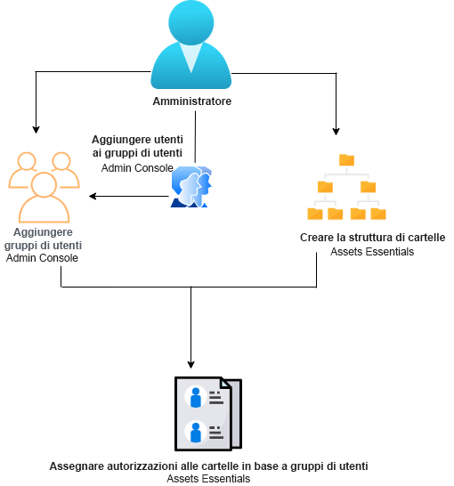
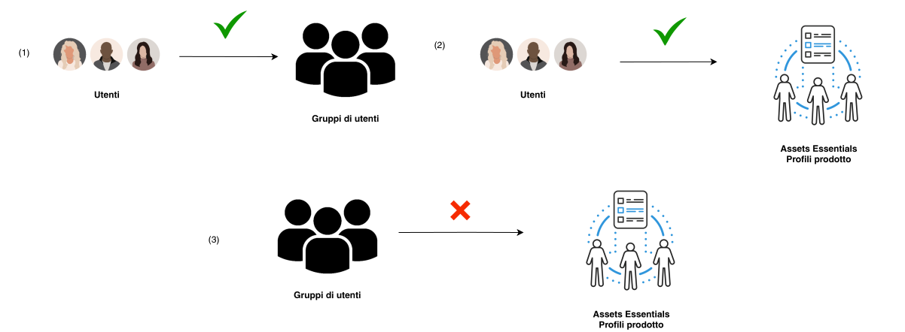
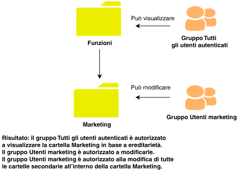
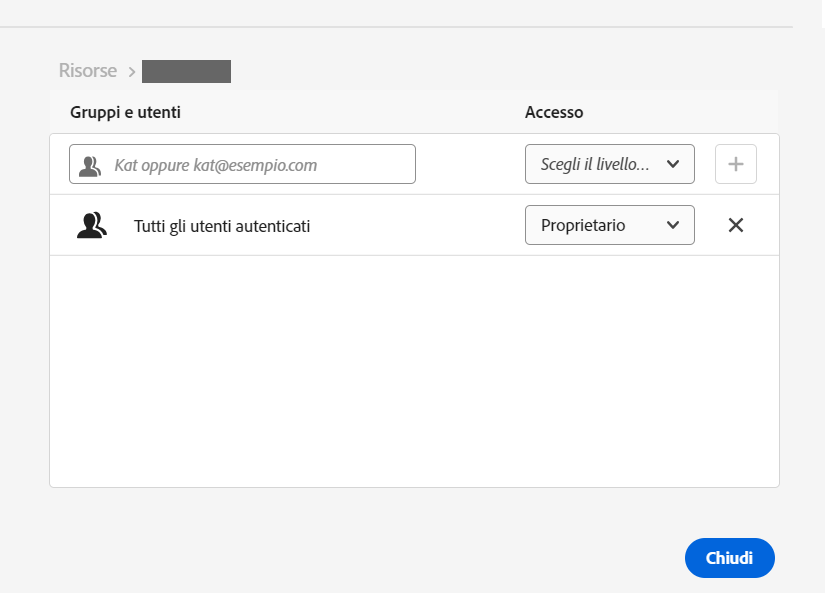
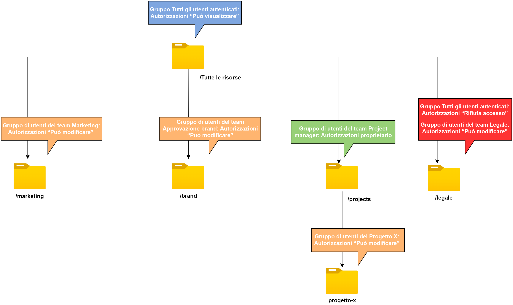

# Gestione delle autorizzazioni per le cartelle {#manage-permissions}

>[!CONTEXTUALHELP]
>id="assets_permissions_folders"
>title="Gestione delle autorizzazioni"
>abstract="[!DNL Assets Essentials] consente agli amministratori di gestire i livelli di accesso per le cartelle disponibili nell’archivio. In qualità di amministratore, puoi creare gruppi di utenti e assegnare autorizzazioni a tali gruppi per gestire i livelli di accesso. Puoi anche delegare i privilegi di gestione delle autorizzazioni ai gruppi di utenti a livello di cartella."

Assets Essentials consente agli amministratori di gestire i livelli di accesso per le cartelle disponibili nell’archivio. In qualità di amministratore, puoi creare gruppi di utenti e assegnare autorizzazioni a tali gruppi per gestire i livelli di accesso. Puoi anche delegare i privilegi di gestione delle autorizzazioni ai gruppi di utenti a livello di cartella.

Il seguente diagramma di flusso dei dati illustra la sequenza di attività da eseguire per configurare e gestire le autorizzazioni sulle cartelle disponibili nell’archivio Assets Essentials:

## Prima di gestire le autorizzazioni per le cartelle {#before-managing-permissions}

Prima di iniziare a gestire le autorizzazioni per le cartelle nell’archivio Assets Essentials, è necessario eseguire alcune attività, ad esempio aggiungere gli amministratori che possono creare una struttura logica di cartelle, creare gruppi di utenti e gestire le autorizzazioni delle cartelle per vari gruppi di utenti.

### Aggiungere gli amministratori {#add-admin-users}

Aggiungi gli amministratori per l’applicazione Assets Essentials in modo che possano gestire le autorizzazioni della cartella per altri gruppi di utenti.

Per aggiungere gli amministratori:

1. Accedi ad [Admin Console](https://adminconsole.adobe.com) per la tua organizzazione, fai clic su **[!UICONTROL Prodotti]** nella barra superiore, quindi su **[!UICONTROL AEM Assets Essentials]**, infine sull’ambiente [!DNL Assets Essentials]. [!DNL Assets Essentials] dispone di tre profili prodotto che rappresentano il punto di accesso per amministratori, utenti standard e consumer.

   

1. Per aggiungere un utente a un gruppo, fai clic sul gruppo amministratori di Assets Essentials, seleziona **[!UICONTROL Aggiungi utente]**, specifica i dettagli utente, quindi fai clic su **[!UICONTROL Salva]**.

   

   Quando aggiungi un utente, quest’ultimo riceve un invito e-mail per poter iniziare a utilizzare la soluzione. È possibile disattivare gli inviti e-mail dalle impostazioni del profilo prodotto in [!DNL Admin Console].

1. Per rimuovere un utente da un gruppo, fai clic sul gruppo, seleziona un utente esistente, quindi seleziona **[!UICONTROL Rimuovi utente]**.

### Aggiungere gruppi di utenti {#add-user-groups}

Crea gruppi di utenti e assegna le autorizzazioni a tali gruppi per gestire i livelli di accesso alle cartelle nell’archivio Assets Essentials. In seguito potrai assegnare gli utenti desiderati ai gruppi di utenti.

Puoi aggiungere utenti ai gruppi di utenti (1) e [utenti ai profili di prodotto di Assets Essentials (2)](#add-admin-users). Tuttavia, non è possibile aggiungere gruppi di utenti direttamente ai profili di prodotto di Assets Essentials (3).

Per informazioni su come gestire i gruppi di utenti, consulta `Create user groups` e `Edit user groups` disponibili in [Gestione di gruppi di utenti](https://helpx.adobe.com/it/enterprise/using/user-groups.html).

>[!NOTE]
>
>Se Admin Console è configurata per sfruttare un sistema esterno per la gestione delle assegnazioni di utenti/gruppi, ad esempio i connettori di Azure o Google, lo strumento di sincronizzazione degli utenti o l’API REST di User Management, i gruppi e le assegnazioni utente vengono configurate automaticamente. Per ulteriori informazioni, consulta [Utenti Adobe Admin Console](https://helpx.adobe.com/it/enterprise/using/users.html).

### Aggiungere utenti ai gruppi {#add-users-to-uesr-groups}

Dopo aver creato i gruppi di utenti, puoi iniziare ad aggiungere gli utenti a tali gruppi.

Per informazioni su come gestire l’aggiunta di utenti ai gruppi di utenti, consulta `Add users to groups` disponibile in [Gestione di gruppi di utenti](https://helpx.adobe.com/it/enterprise/using/user-groups.html#add-users-to-groups).

### Creare una struttura di cartelle {#create-folder-structure}

Per creare una struttura di cartelle nell’archivio Assets Essentials, puoi utilizzare i seguenti metodi:

* Fai clic sull’opzione **[!UICONTROL Crea cartella]** disponibile nella barra degli strumenti per creare una cartella vuota.

* Fai clic sull’opzione **[!UICONTROL Aggiungi risorse]** disponibile nella barra degli strumenti per [caricare una struttura di cartelle disponibile nel computer locale](add-delete.md).

Crea una struttura di cartelle che sia adatta agli obiettivi aziendali dell’organizzazione. Se carichi nell’archivio Assets Essentials una struttura di cartelle già esistente, sarà necessario sottoporla a una verifica. Per ulteriori informazioni, consulta [Best practice per una gestione efficace delle autorizzazioni](permission-management-best-practices.md).

## Gestione delle autorizzazioni sulle cartelle {#manage-permissions-on-folders}

Puoi assegnare le seguenti autorizzazioni ai gruppi di utenti o agli utenti. Adobe sconsiglia di assegnare autorizzazioni agli utenti.

| Nome autorizzazione | Descrizione |
|-----|------|
| Può visualizzare | <ul><li>Accesso in lettura per visualizzare e sfogliare le cartelle </li><li>Visualizzare l’anteprima delle risorse</li><li>Scaricare le risorse</li><li>Copiare le risorse</li><li>Condividere collegamenti alle risorse</li><ul> |
| Può modificare | <ul><li>Tutti i privilegi disponibili per le autorizzazioni Può visualizzare </li><li>Creare cartelle</li><li>Rimuovere cartelle</li><li>Rinominare le cartelle</li><li>Creare le risorse</li><li>Aggiornare le risorse</li><li>Rimuovere le risorse</li><li>Spostare le risorse</li><li>Rinominare le risorse</li><ul> |
| Proprietario | <ul><li>Tutti i privilegi disponibili per le autorizzazioni Può modificare</li><li>Gestire le autorizzazioni per una cartella e le relative sottocartelle</li>Questa autorizzazione consente agli amministratori di delegare i privilegi di amministratore ad altri utenti per una cartella e le relative sottocartelle.<ul> |
| Nega accesso | Rimuovere le autorizzazioni Può visualizzare, Può modificare e Proprietario per una cartella e le relative sottocartelle. |

**Autorizzazioni predefinite**

Tutti gli utenti autenticati e che possono accedere all’applicazione Assets Essentials hanno inizialmente le autorizzazioni `Can Edit` per l’archivio Assets Essentials. L’amministratore può intervenire sulle autorizzazioni predefinite mediante la [modifica delle autorizzazioni per l’intero archivio Assets Essentials](#edit-permissions-entire-repository).

**Sequenza per assegnare le autorizzazioni della cartella ai gruppi di utenti**

Crea alcune regole per assegnare le autorizzazioni della cartella ai gruppi di utenti. La sequenza utilizzata per assegnare le autorizzazioni per una cartella è importante e determina il tipo di accesso disponibile ai gruppi di utenti e in seguito agli utenti.

Ad esempio, se assegni le autorizzazioni `Can View` per una cartella a un super gruppo e successivamente assegni le autorizzazioni `Can Edit` al relativo sottogruppo, ne deriva che solo i membri del sottogruppo dispongono delle autorizzazioni di modifica per la cartella. Gli utenti del super gruppo hanno l’accesso in visualizzazione alla cartella.

Se devi fornire le autorizzazioni di modifica per la cartella `Marketing` solo al reparto marketing della tua organizzazione e le autorizzazioni di visualizzazione ad altri, puoi assegnare le autorizzazioni `Can View` al super gruppo `All Authenticated Users` e le autorizzazioni `Can Edit` al relativo sottogruppo `Marketing`.

**Ereditarietà delle autorizzazioni**

Assets Essentials utilizza l’ereditarietà delle autorizzazioni, che consente alla cartella secondaria di ereditare le autorizzazioni impostate per la cartella principale. Ad esempio, se la cartella principale ha le autorizzazioni `Can View` per il gruppo `All Authenticated Users` e la cartella secondaria ha le autorizzazioni `Can Edit` per il gruppo di utenti `Marketing`, questo consente a tutti gli utenti autenticati di avere le autorizzazioni di visualizzazione per la cartella secondaria e al gruppo di utenti `Marketing` di disporre di quelle di modifica per la cartella secondaria. Il gruppo di utenti `Marketing` dispone delle autorizzazioni di modifica per ulteriori livelli di cartelle nella cartella secondaria (Marketing).

>[!NOTE]
>
> L’impostazione delle autorizzazioni `Deny Access` per un gruppo in una cartella di livello superiore e il conseguente ripristino dell’accesso (`Can view`, `Can edit` o `Owner`) per tale gruppo o i suoi membri non è supportato. Utilizza `Deny Access` con moderazione.

### Aggiungere le autorizzazioni ai gruppi di utenti {#add-permissions}

Per assegnare le autorizzazioni di gruppo alle cartelle:

1. Seleziona la cartella e fai clic su **[!UICONTROL Gestisci autorizzazioni]**.

1. Nella finestra di dialogo **[!UICONTROL Gestisci autorizzazioni]** specifica il nome del gruppo o di un utente nel campo **[!UICONTROL Gruppi e utenti]**.

1. Seleziona il [livello di accesso](#manage-permissions-folders) dall’elenco a discesa **[!UICONTROL Accesso]**.

1. Fai clic su **[!UICONTROL Aggiungi]** per apportare una modifica immediata alle autorizzazioni per l’utente o il gruppo di utenti.

1. Ripeti i passaggi 1-3 per aggiungere altre regole nella finestra di dialogo **[!UICONTROL Gestisci autorizzazioni]**.

   

   >[!NOTE]
   >
   > L’ordine utilizzato per assegnare le autorizzazioni per una cartella è importante e determina l’accesso disponibile ai gruppi di utenti e in seguito agli utenti aggiunti ai gruppi.

   Se gestisci le autorizzazioni per più cartelle, puoi anche selezionare qualsiasi altra cartella dal riquadro a sinistra e iniziare a gestire le autorizzazioni per tale cartella.

1. Fai clic su **[!UICONTROL Chiudi]**.

>[!CAUTION]
>
> Si consiglia di gestire le autorizzazioni per gruppi di utenti anziché per singoli utenti. L’impostazione dell’autorizzazione `Deny access` è supportata solo per gruppi di utenti, ma non per utenti singoli.

### Modificare le autorizzazioni assegnate ai gruppi di utenti {#edit-permissions}

Per modificare le autorizzazioni assegnate ai gruppi di utenti per le cartelle:

1. Seleziona la cartella e fai clic su **[!UICONTROL Gestisci autorizzazioni]**.

1. Nella finestra di dialogo **[!UICONTROL Gestisci autorizzazioni]**, modifica il [livello di accesso](#manage-permissions-folders) dall’elenco a discesa **[!UICONTROL Accesso]**.

1. [Aggiungi altri gruppi di utenti o utenti](#add-permissions) alle regole di autorizzazione esistenti, se necessario.

1. Fai clic su X per rimuovere le autorizzazioni assegnate a un gruppo di utenti.

### Modificare le autorizzazioni per l’intero archivio Assets Essentials {#edit-permissions-entire-repository}

L’amministratore dell’applicazione può modificare le autorizzazioni per tutto l’archivio Assets Essentials dal livello `Can Edit` predefinito a qualsiasi altro livello di accesso.

Per modificare le autorizzazioni per l’intero archivio Assets Essentials:

1. Seleziona una cartella e fai clic su **[!UICONTROL Gestisci autorizzazioni]**.

1. Nella finestra di dialogo **[!UICONTROL Gestisci autorizzazioni]**, fai clic su **[!UICONTROL Tutte le risorse]** nella barra a sinistra.

1. [Modifica le autorizzazioni](#edit-permissions) e chiudi la finestra di dialogo.

>[!NOTE]
>
>Un amministratore non può selezionare il livello di autorizzazione `Deny Access` per l’intero archivio Assets Essentials per garantire che gli utenti dispongano almeno dell’accesso in lettura all’applicazione. Analogamente, `All Authenticated Users` hanno almeno le autorizzazioni di lettura per l’archivio, anche se l’amministratore rimuove esplicitamente le autorizzazioni `Can Edit` nella finestra dialogo [!UICONTROL Gestisci autorizzazioni].

## Esempi di gestione efficace delle autorizzazioni {#example-permission-management}

**Caso d’uso**

* Il gruppo Tutti gli utenti autenticati dispone dell’accesso di visualizzazione all’archivio.
* I gruppi di utenti specifici del team dispongono delle autorizzazioni di modifica per la propria cartella specifica alla funzione.
* La cartella legale non è disponibile per la visualizzazione ad alcun utente autenticato, ad eccezione del team legale.

Crea i seguenti gruppi di utenti in Admin Console:

* Team di marketing

* Team approvatori del marchio

* Team di Project Manager

* Team del progetto X

* Team legale

Il diagramma seguente illustra la gerarchia delle cartelle e le autorizzazioni assegnate a ciascun gruppo di utenti:

Di seguito sono riportati i livelli di accesso per tutti i gruppi di utenti nella gerarchia delle cartelle:

* /Tutte le risorse: l’amministratore modifica le autorizzazioni a livello principale dal valore predefinito `Can Edit` a `Can View`. Tutti gli utenti possono visualizzare cartelle e risorse, ma non possono modificarle.

* /marketing: tutti gli utenti possono visualizzare le cartelle e le relative sottocartelle in base all’ereditarietà delle autorizzazioni. Tuttavia, il gruppo di utenti Team marketing dispone delle autorizzazioni di modifica per la cartella.

* /brand: tutti gli utenti possono visualizzare le cartelle e le relative sottocartelle in base all’ereditarietà delle autorizzazioni. Tuttavia, il gruppo di utenti Team approvatori del marchio dispone delle autorizzazioni di modifica per la cartella.

* /progetti: tutti gli utenti possono visualizzare le cartelle e le relative sottocartelle in base all’ereditarietà delle autorizzazioni. Il gruppo utenti del Team di project manager dispone delle seguenti autorizzazioni:

   * Autorizzazioni di modifica

   * Autorizzazioni di proprietario: consente di gestire le autorizzazioni per una cartella e le relative sottocartelle.

* /progetti/progetto-x: tutti gli utenti possono visualizzare le cartelle e le relative sottocartelle. Il gruppo utenti Team di project manager dispone delle autorizzazioni di modifica e può gestire le autorizzazioni per una cartella e le relative sottocartelle (autorizzazioni di proprietario). Il gruppo utenti del Team del progetto X dispone di autorizzazioni di modifica.

* /legal: nessun utente può accedere alla cartella basata sulle autorizzazioni `Deny Access` per il gruppo `All Authenticated Users`. Il gruppo utenti del Team legale dispone di autorizzazioni di modifica.

## Passaggi successivi {#next-steps}

* [Guarda un video per gestire le autorizzazioni in Assets Essentials](https://experienceleague.adobe.com/docs/experience-manager-learn/assets-essentials/configuring/permissions-management.html?lang=it)

* Fornisci feedback alla documentazione utilizzando [!UICONTROL Modifica questa pagina]  o [!UICONTROL Segnala un problema]  disponibile sulla barra laterale destra

* Contatta il [Servizio clienti](https://experienceleague.adobe.com/?support-solution=General&amp;lang=it#support)
