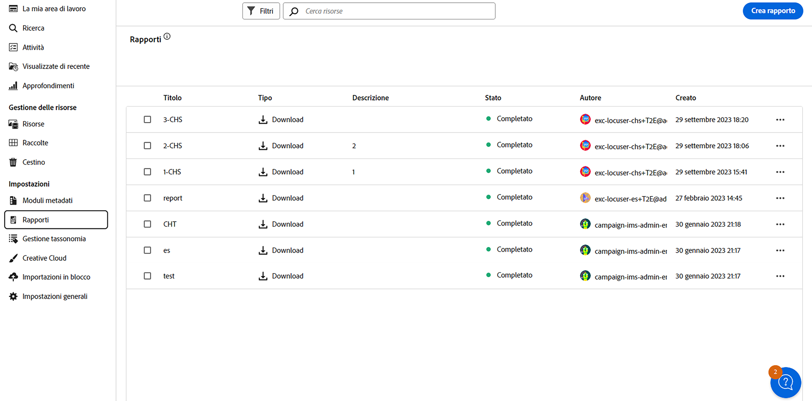
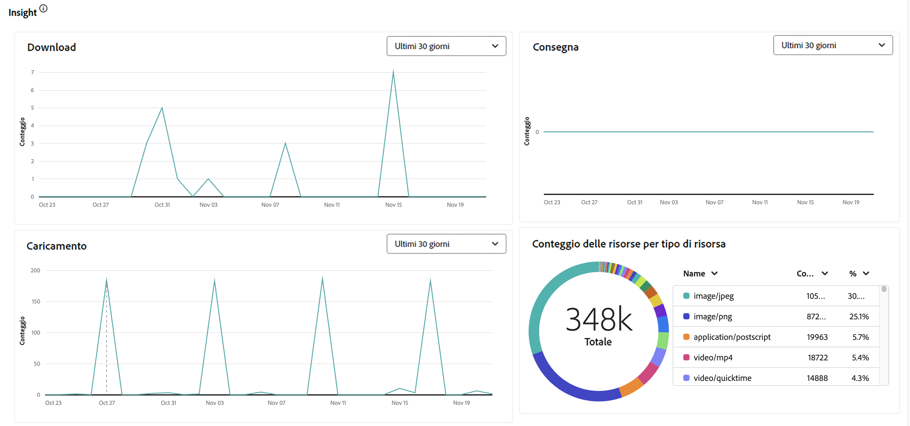
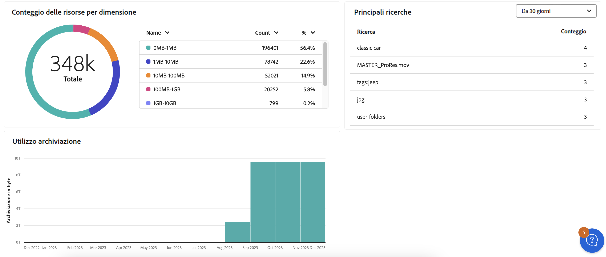

# Gestire i rapporti {#manage-reports}

La funzionalità di reporting sulle risorse offre agli amministratori visibilità sulle attività dell’ambiente Adobe Experience Manager Assets Essentials. Questi dati forniscono informazioni utili su come gli utenti interagiscono con i contenuti e il prodotto. Tutti gli utenti possono accedere alla dashboard Insight e quelli assegnati al profilo di prodotto Amministratori possono creare rapporti definiti dall’utente.

## Accedere ai rapporti {#access-reports}

Tutti gli utenti assegnati al [profilo di prodotto per amministratori di Assets Essentials](deploy-administer.md) possono accedere alla dashboard Insight e creare rapporti definiti dagli utenti in Assets Essentials.

Per accedere ai rapporti, passa a **[!UICONTROL Rapporti]** in **[!UICONTROL Impostazioni]**.

<!--
In the **[!UICONTROL Reports]** screen, various components are shown in the tabular format which includes the following:

* **Title**: Title of the report
* **Type**: Determines whether the report is uploaded or downloaded to the repository
* **Description**: Provide details of the report that was given during uploading/downloading the report
* **Status**: Determines whether the report is completed, under progress, or deleted.
* **Author**: Provides email of the author who has uploaded/downloaded the report.
* **Created**: Gives information of the date when the report was generated.
-->

## Creare un rapporto {#create-report}

L’ambiente AEM Assets Essentials offre funzionalità di reporting complete tramite la dashboard Rapporti. Questa funzionalità consente agli utenti di generare e scaricare rapporti CSV che descrivono nel dettaglio i caricamenti e i download delle risorse entro intervalli di tempo specifici, che vanno da una tantum a intervalli giornalieri, settimanali, mensili o annuali.

**Per creare un report:**

1. Passa a **Rapporti** e fai clic su **Crea rapporto** (in alto a destra). La finestra di dialogo **crea report** visualizza i campi seguenti:
   

   **Nella scheda Configurazione:**

   1. **Tipo di report:** Seleziona tra il tipo di caricamento e quello di download.
   1. **Titolo:** Aggiungi un titolo al report.
   1. **Descrizione:** Aggiungere una descrizione facoltativa al report.
   1. **Seleziona il percorso della cartella:** Seleziona un percorso della cartella per generare il rapporto delle risorse caricate e scaricate all&#39;interno di quella cartella specifica. Ad esempio, se hai bisogno del rapporto sulle risorse caricate in una cartella, specifica il percorso di tale cartella.
   1. **Seleziona intervallo date:** Seleziona l&#39;intervallo di date per visualizzare l&#39;attività di caricamento o download nella cartella.
    

   >[!NOTE]
   >
   > Assets Essentials converte tutti i fusi orari locali nel Tempo coordinato universale (UTC).

   **Nella scheda Colonne:** selezionare i nomi delle colonne da visualizzare nel report. Nella tabella seguente viene illustrato l&#39;utilizzo di tutte le colonne:

   <table>
    <tbody>
     <tr>
      <th><strong>Nome colonna</strong></th>
      <th><strong>Descrizione</strong></th>
      <th><strong>Tipo di rapporto</strong></th>
     </tr>
     <tr>
      <td>Titolo</td>
      <td>Titolo della risorsa.</td>
      <td>Caricare e scaricare</td>
     </tr>
     <tr>
      <td>Percorso </td>
      <td>Percorso della cartella in cui la risorsa è disponibile in Assets Essentials.</td>
      <td>Caricare e scaricare</td>
     </tr>
     <tr>
      <td>Tipo MIME</td>
      <td>Tipo MIME della risorsa.</td>
      <td>Caricare e scaricare</td>
     </tr>
     <tr>
      <td>Dimensione</td>
      <td>Dimensione della risorsa in byte.</td>
      <td>Caricare e scaricare</td>
     </tr>
     <tr>
      <td>Scaricato da</td>
      <td>ID e-mail dell’utente che ha scaricato la risorsa.</td>
      <td>Scarica</td>
     </tr>
     <tr>
      <td>Data di download</td>
      <td>Data in cui è stata eseguita l’azione di download della risorsa.</td>
      <td>Scarica</td>
     </tr>
     <tr>
      <td>Autore</td>
      <td>Autore della risorsa.</td>
      <td>Caricare e scaricare</td>
     </tr>
     <tr>
      <td>Data creazione</td>
      <td>La data in cui la risorsa è stata caricata in Assets Essentials.</td>
      <td>Caricare e scaricare</td>
     </tr>
     <tr>
      <td>Data di modifica</td>
      <td>Data dell’ultima modifica apportata alla risorsa.</td>
      <td>Caricare e scaricare</td>
     </tr>
     <tr>
      <td>Scaduta</td>
      <td>Stato di scadenza della risorsa.</td>
      <td>Caricare e scaricare</td>
     </tr>
     <tr>
      <td>Scaricato da nome utente</td>
      <td>Nome dell’utente che ha scaricato la risorsa.</td>
      <td>Scarica</td>
     </tr>           
    </tbody>
   </table>

## Visualizza e scarica il rapporto esistente {#View-and-download-existing-report}

I report esistenti vengono visualizzati nella scheda **Report eseguiti**. Fai clic su **Report** e seleziona **Report eseguiti** per visualizzare tutti i report creati con lo stato **Completati**, indicando che sono pronti per il download. Per scaricare il rapporto in formato CSV o eliminarlo, seleziona la riga corrispondente. Quindi seleziona **Scarica CSV** o **Elimina**.

## Pianificare un rapporto {#schedule-report}

Nell&#39;interfaccia utente di AEM Essentials, **Pianifica rapporto** imposta una generazione automatica di rapporti a intervalli futuri specifici, ad esempio giornalieri, settimanali, mensili o annuali. Questa funzione consente di semplificare le esigenze di reporting ricorrenti e assicura aggiornamenti tempestivi dei dati. Mentre **Crea report** genera report per le date passate. I report completati sono elencati in **Report eseguiti** e i report futuri si trovano in **Report pianificati**.

Per pianificare un rapporto, effettua le seguenti operazioni:

1. Fare clic su Rapporti nel riquadro di sinistra e quindi su Crea rapporto (dall&#39;alto a destra).
1. Nella finestra di dialogo del rapporto vengono visualizzate le informazioni riportate di seguito.
   1. **Tipo di report:** Seleziona tra il tipo di caricamento e quello di download.
   1. **Titolo:** Aggiungi un titolo al report.
   1. **Descrizione**: aggiungere una descrizione facoltativa al report.
   1. **Seleziona il percorso della cartella:** Seleziona il percorso di una cartella per generare un report per le risorse che verranno caricate o scaricate in futuro da tale cartella specifica.
   1. Attiva/disattiva **Pianifica report:** Attiva/disattiva la pianificazione del report per un momento successivo o per la sua occorrenza ripetuta.
      

   1. **Scegliere la frequenza:** Specificare l&#39;intervallo di generazione del report (ad esempio giornaliero, settimanale, mensile, annuale o una volta) e impostare la data e l&#39;ora di esecuzione del report insieme alla data di fine per la ricorrenza. Per un rapporto una tantum, seleziona l’intervallo di date per il rapporto sul tipo di attività selezionato nell’ambiente AEM. Ad esempio, se hai bisogno di un rapporto sulle risorse scaricate dal 10 al 29 (date future) di un mese specifico, seleziona queste date nel campo **Seleziona intervallo date**.

   >[!NOTE]
   >
   > Assets Essentials converte tutti i fusi orari locali nel Tempo coordinato universale (UTC).

## Visualizza i Report Programmati {#view-scheduled-reports}

I report pianificati vengono visualizzati nella scheda **Report pianificati** in modo sistematicamente organizzato. Tutti i report completati per ogni report pianificato vengono memorizzati in una singola cartella di report. Fare clic su  per visualizzare i report completati. Ad esempio, se hai pianificato un rapporto giornaliero, tutti i rapporti completati sono raggruppati in un’unica cartella. Questa organizzazione semplifica sia la navigazione che la reperibilità dei rapporti. Per visualizzare i report pianificati, fare clic su **Report** e quindi su **Report pianificati**. Vengono visualizzati tutti i rapporti pianificati con il relativo stato in corso o completato. I rapporti completati sono pronti per il download.

## Modifica e Annulla i Report Programmati {#edit-cancel-scheduled-reports}

1. Passa alla scheda **Rapporti pianificati**.
1. Seleziona la riga del rapporto.
1. Fai clic su **Modifica**.
1. Fare clic su **Annulla pianificazione** e quindi su **Conferma** per annullare il report pianificato. Per i rapporti annullati, la fase di esecuzione successiva diventa vuota e lo stato viene visualizzato come annullato.
   

### Riprendi pianificazione {#resume-schedule}

Per riprendere la pianificazione annullata, selezionare la riga del report e fare clic su **Riprendi pianificazione**. Quando viene ripresa, le voci di runtime successive vengono nuovamente visualizzate e lo stato è Continua.

>[!NOTE]
>
> Se si riprende un rapporto annullato prima della data di fine programmata, vengono generati automaticamente i rapporti dalla data di annullamento alla data di ripresa.

## Visualizzare gli insight {#view-live-statistics}

>[!CONTEXTUALHELP]
>id="assets_reports"
>title="Rapporti"
>abstract="La dashboard Insights consente di visualizzare le metriche degli eventi in tempo reale per l’ambiente Experience Manager Assets negli ultimi 30 giorni o 12 mesi. L’elenco degli eventi include il numero di download, caricamenti, ricerche principali e così via."

Assets Essentials consente di visualizzare in tempo reale i dati del tuo ambiente Assets Essentials, con la dashboard Insight. Puoi visualizzare le metriche degli eventi in tempo reale negli ultimi 30 giorni o negli ultimi 12 mesi.

<!---->

Fai clic su **[!UICONTROL Insight]** nel riquadro di navigazione a sinistra per visualizzare i seguenti grafici generati automaticamente:

* **Download**: numero di risorse scaricate dall’ambiente Assets Essentials negli ultimi 30 giorni o 12 mesi rappresentato da un grafico a linee.
  

* **Caricamenti**: numero di risorse caricate nell’ambiente Assets Essentials negli ultimi 30 giorni o 12 mesi rappresentato da un grafico a linee.
  

<!--* **Asset Count by Size**: The division of count of assets based on their range of various sizes from 0 MB to 100 GB.-->

* **Utilizzo archiviazione**: utilizzo dell’archiviazione, in byte, per l’ambiente di Assets Essentials rappresentato da un grafico a barre.
  
  <!--* **Delivery**: The graph depicts the count of assets as the delivery dates.-->

<!--* **Asset Count by Asset Type**: Represents count of various MIME types of the available assets. For example, application/zip, image/png, video/mp4, application/postscripte.-->

* **Ricerche principali**: visualizza i termini più cercati e il numero di volte in cui tali termini sono stati cercati nell’ambiente Assets Essentials negli ultimi 30 giorni o 12 mesi rappresentato in formato tabulare.
  

  <!--
   
   
   -->

* **Conteggio risorse per dimensione:** Segmenta il conteggio totale delle risorse nell&#39;ambiente Assets Essentials in intervalli di dimensioni diversi, evidenziando il conteggio e la percentuale di risorse in ogni intervallo di dimensioni, rappresentate da un grafico ad anello.
  

* **Conteggio risorse per tipo di risorsa:** Segmenta il conteggio totale delle risorse nell&#39;ambiente Assets Essentials, evidenziando il conteggio e la percentuale delle risorse in base ai relativi tipi di file, rappresentati da un grafico ad anello.
  

