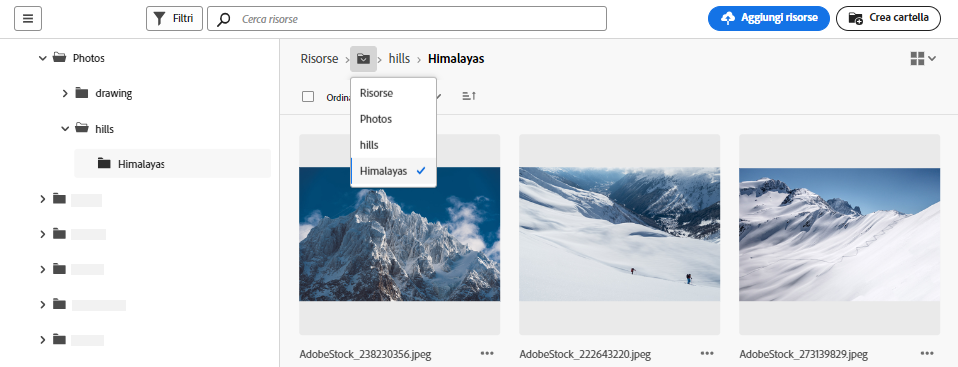
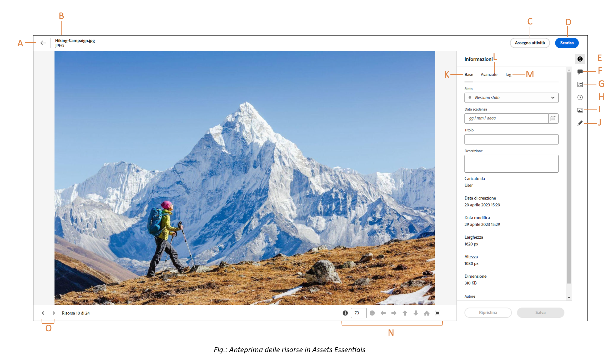

# Accedere ai file e alle cartelle e visualizzare le risorse {#view-assets-and-details}

<!-- TBD: Give screenshots of all views with many assets. Zoom out to showcase how the thumbnails/tiles flow on the UI in different views. -->

<!-- TBD: The options in left sidebar may change. Shared with me and Shared by me are missing for now. Update this section as UI is updated. -->

## Interfaccia utente di [!DNL Assets Essentials] {#understand-interface-navigation}

[!DNL Assets Essentials] offre un’interfaccia utente intuitiva. che consente di trovare e ricordare facilmente le risorse e le relative informazioni.

Quando accedi a [!DNL Assets Essentials], viene visualizzata la seguente interfaccia.

![[!DNL Assets Essentials] - Interfaccia utente](assets/essentials-interface.png)

**A**: barra laterale sinistra per sfogliare l’archivio, fornisce l’accesso ad alcune altre opzioni **B**: visualizzare o comprimere la barra laterale sinistra per aumentare l’area di visualizzazione delle risorse **C**: filtrare i risultati della ricerca **D**: selezionare tutti i contenuti della cartella selezionata **E**: opzioni di ordinamento delle risorse **F**: casella di ricerca **G**: caricare o trascinare file utilizzando il pulsante `Add Assets` **H**: creare una nuova cartella **I**: passare da una visualizzazione all’altra

<!-- TBD: Need an embedded video here with narration. It has to be hosted on MPC to be embeddable. -->

## Sfogliare e visualizzare le risorse e le cartelle {#browse-repository}

È possibile sfogliare le cartelle dall’interfaccia utente principale o dalla barra laterale a sinistra. Durante la navigazione, puoi visualizzare le miniature delle risorse per sfogliare visivamente l’archivio oppure i dettagli delle risorse per trovare rapidamente quella desiderata. Le opzioni disponibili nella barra laterale a sinistra sono:

* [La mia area di lavoro](https://experienceleague.adobe.com/docs/experience-manager-assets-essentials/help/my-workspace.html?lang=it): Assets ora include un’area di lavoro personalizzabile che fornisce widget per accedere facilmente a specifiche aree dell’interfaccia di Assets e alle informazioni che ti interessano di più. Questa pagina funge da soluzione unica per fornire una panoramica degli elementi di lavoro e consentire un accesso rapido ai flussi di lavoro chiave. L’accesso più comodo a queste opzioni aumenta l’efficienza e la velocità dei contenuti.
* [Attività](https://experienceleague.adobe.com/docs/experience-manager-assets-essentials/help/my-workspace.html?lang=it): nella scheda **Le mie attività** puoi visualizzare le attività che ti sono state assegnate. Nella scheda **Attività assegnate** trovi invece le attività che hai creato. Inoltre, le attività che hai completato si trovano nella scheda **Attività completate**.
* [Risorse](https://experienceleague.adobe.com/docs/experience-manager-assets-essentials/help/manage-organize.html?lang=it): elenco di tutte le cartelle a cui ai accesso, con struttura ad albero.
* **Visualizzate di recente**: elenco delle risorse visualizzate in anteprima di recente. [!DNL Assets Essentials] mostra solo le risorse visualizzate in anteprima. Non visualizza le risorse che scorri quando esplori i file o le cartelle dell’archivio.
* [Raccolte](https://experienceleague.adobe.com/docs/experience-manager-assets-essentials/help/manage-collections.html?lang=it): una raccolta è un set di risorse, cartelle o altre raccolte all’interno di Adobe Experience Manager Assets Essentials. Puoi utilizzare le raccolte per condividere le risorse tra i vari utenti. A differenza delle cartelle, una raccolta può includere risorse da posizioni diverse. Puoi condividere più raccolte con un utente. Ogni raccolta contiene riferimenti alle risorse. L’integrità dei riferimenti alle risorse viene mantenuta tra le varie raccolte.

* [Approfondimenti](https://experienceleague.adobe.com/docs/experience-manager-assets-essentials/help/manage-reports.html?lang=it#view-live-statistics): in [!DNL Assets Essentials], puoi visualizzare insight in tempo reale nella tua dashboard. Assets Essentials consente di visualizzare in tempo reale i dati del tuo ambiente Assets Essentials, con la dashboard Insight. Puoi visualizzare le metriche degli eventi in tempo reale negli ultimi 30 giorni o negli ultimi 12 mesi.

* **Cestino**: mostra l’elenco delle risorse eliminate dalla cartella principale **[!UICONTROL Risorse]**. Puoi selezionare una risorsa nella cartella Cestino per ripristinarla nella posizione originale o eliminarla definitivamente. Puoi specificare una parola chiave o applicare filtri quali stato della risorsa, tipo di file, tipo di mime, dimensione dell’immagine, creazione della risorsa, modifica e date di scadenza, nonché filtrare in base alle risorse eliminate dall’utente corrente. Puoi anche applicare filtri personalizzati per cercare le risorse appropriate all’interno della cartella Cestino. Per ulteriori informazioni sull’utilizzo di filtri standard e personalizzati, consulta [Cercare risorse in Assets Essentials](search.md).

* **Impostazioni**: puoi utilizzare **Impostazioni** per configurare diverse opzioni di Assets Essentials, ad esempio i moduli dei metadati, i rapporti e la gestione delle tassonomie.

<!-- TBD: Not sure if we want to publish these right now. CC Libs are beta as per Greg.
* **Libraries**: Access to [!DNL Adobe Creative Cloud Team] (CCT) Libraries view. This view is visible only if the user is entitled to CCT Libraries.
-->

<!-- TBD: My Work Space shows task inbox and it is not visible on AEM Cloud Demos as of now. It is the source of truth server hence not documenting My Work Space option for now.
-->

Puoi aprire o comprimere la barra laterale a sinistra per aumentare l’area disponibile per la visualizzazione delle risorse.

In [!DNL Assets Essentials], puoi visualizzare le risorse, le cartelle e i risultati di ricerca in quattro diversi tipi di layout.

*  [!UICONTROL Vista a elenco]
*  [!UICONTROL Vista a griglia]
*  [!UICONTROL Vista galleria]
*  [!UICONTROL Vista a cascata]

Per individuare una risorsa, puoi ordinare le risorse in ordine crescente o decrescente di `Name`, `Relevancy`, `Size`, `Modified` e `Created`.

Per accedere a una cartella, fai doppio clic sulle miniature della cartella oppure selezionala dalla barra laterale a sinistra. Per visualizzare i dettagli di una cartella, selezionala e fai clic su Dettagli nella barra degli strumenti in alto. Per spostarsi verso l’alto o il basso nella gerarchia, utilizza la barra laterale a sinistra o le breadcrumb in alto.

*Figura: Per sfogliare la gerarchia, utilizza le breadcrumb in alto o la barra laterale a sinistra.*

## Visualizzare l’anteprima delle risorse {#preview-assets}

Prima di utilizzare, condividere o scaricare una risorsa, puoi visualizzarla più da vicino. La funzione di anteprima consente di visualizzare non solo le immagini ma anche alcuni altri tipi di risorse supportati.

Per visualizzare in anteprima una risorsa, selezionala e fai clic sull’[!UICONTROL Dettagli]  dalla barra degli strumenti nella parte superiore. Inoltre, puoi visualizzarne i metadati e intraprendere altre azioni.

**A**: tornare alla cartella corrente o al risultato della ricerca corrente nell’archivio **B**: nome e formato del file che si sta visualizzando in anteprima **C**: assegnare le attività **D**: metadati avanzati **E**: parole chiave e tag avanzati **F**: commentare e annotare **G**: visualizzare le attività relative alla risorsa selezionata **H**: visualizzare e gestire le versioni **I**: visualizzare le rappresentazioni dell&#39;immagine **J**: modificare l’immagine **K**: metadati di base **L**: metadati avanzati **M**: parole chiave e tag avanzati **N**: visualizzare un’anteprima più dettagliata. Zoom, schermo intero e altre opzioni **O**: passare alla risorsa precedente o successiva nella cartella corrente senza tornare alla cartella

Puoi anche visualizzare in anteprima i video.

Se visualizzi esplicitamente l’anteprima di una risorsa, [!DNL Assets Essentials] la mostra come risorsa visualizzata di recente.

<!-- TBD: Describe the options.

Explicitly previewed assets are displayed as recently viewed assets. Give screenshot of this.
Other use cases after previewing.
-->

## Configurare la visualizzazione delle colonne per la vista Elenco risorse {#configure-columns-list-view}

Puoi selezionare le colonne da visualizzare nella vista Elenco risorse, ad esempio Stato, Formato, Dimensioni, Dimensione file e così via:

1. Seleziona **[!UICONTROL Risorse]** nel riquadro di navigazione a sinistra, passa alla vista Elenco risorse e fai clic sull’.

1. Seleziona le colonne da visualizzare nella vista a elenco e fai clic su **[!UICONTROL Conferma]**.

   

## Passaggi successivi {#next-steps}

* Fornisci feedback sui prodotti utilizzando l’opzione [!UICONTROL Feedback] disponibile nell’interfaccia utente di Assets Essentials

* Fornisci feedback alla documentazione utilizzando [!UICONTROL Modifica questa pagina]  o [!UICONTROL Segnala un problema]  disponibile sulla barra laterale destra

* Contatta il [Servizio clienti](https://experienceleague.adobe.com/?support-solution=General&amp;lang=it#support)

>[!MORELIKETHIS]
>
>* [Visualizzare le versioni di una risorsa](/help/using/manage-organize.md#view-versions).
