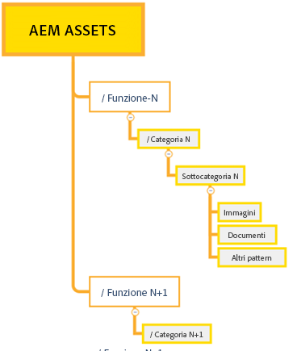
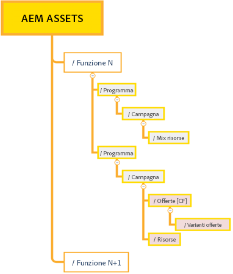
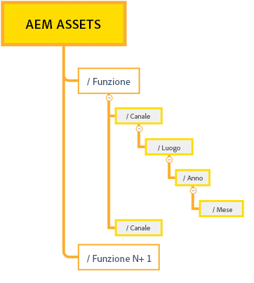

# Best practice per una gestione efficace delle autorizzazioni {#best-practices-permissions-management}

In qualità di amministratore, prima di iniziare a gestire le autorizzazioni per le cartelle dell’archivio Assets Essentials, puoi implementare diverse best practice per rendere l’infrastruttura intuitiva sia per gli amministratori, sia per gli utenti finali quando si tratterà di gestire le operazioni.

Puoi incorporare le best practice durante una delle seguenti operazioni:

* [Creazione di gruppi di utenti in Admin Console](#admin-console-best-practices)

* [Creazione di una struttura di cartelle nell’archivio Assets Essentials](#folder-structure-assets-essentials)

* [Gestione delle autorizzazioni nell’archivio Assets Essentials](#folder-permissions)

## Admin Console {#admin-console-best-practices}

Identifica le esigenze di accesso in base ai gruppi di utenti della tua organizzazione. Pianifica e crea gruppi di utenti per l’organizzazione e aggiungi gli utenti a tali gruppi. È più facile gestire le autorizzazioni delle cartelle in base ai gruppi di utenti che non ai singoli utenti.

## Struttura di cartelle per l’archivio Assets Essentials {#folder-structure-assets-essentials}

Quando inizi a pianificare la creazione di una struttura di cartelle nell’archivio Assets Essentials, considera quanto segue:

* Governance futura: le cartelle gestite dagli amministratori e quelle di cui le [autorizzazioni sono delegate ad altri utenti come proprietari](manage-permissions.md##manage-permissions-folders).

* Scalabilità: la struttura di cartelle deve soddisfare le esigenze future della tua organizzazione e deve essere facilmente scalabile.

* Dimensioni: una cartella non deve contenere un numero eccessivo di risorse. Potrebbe diventare difficile da usare e da gestire.

* Intuitività: la struttura di cartelle deve essere facile da sfogliare e intuitiva per gli utenti finali. Gli utenti devono essere in grado di capire facilmente dove caricare una nuova risorsa nella struttura di cartelle.

Sono disponibili vari tipi di strutture di cartelle che puoi utilizzare nella tua organizzazione. Di seguito sono riportati alcuni esempi di tipiche strutture di cartelle:

* Basata su funzioni e categorie

  

* Basata su campagne

  

* Basata sulla posizione dell’offerta (o sul canale)

  

## Autorizzazioni delle cartelle {#folder-permissions}

Dopo aver creato i gruppi di utenti per la tua organizzazione, aver aggiunto gli utenti a tali gruppi e selezionato e creato una struttura di cartelle nell’archivio Assets Essentials in base alle specifiche esigenze, puoi ora iniziare a gestire le autorizzazioni per le cartelle per la tua organizzazione. Quando inizi a gestire le autorizzazioni della cartella, considera quanto segue:

* Applica le autorizzazioni per i gruppi di utenti, non per i singoli utenti. Ciò si traduce in una struttura delle autorizzazioni più semplice ed efficiente.

* Mantieni la struttura delle autorizzazioni il più semplice possibile per garantire l&#39;efficienza operativa.

* È consigliabile negare le autorizzazioni di accesso con attenzione e preferibilmente applicare alla struttura di cartelle autorizzazioni di tipo positivo (Può modificare, Può visualizzare, Proprietario).

Per esempi su come ottenere una struttura di cartelle semplice ed efficiente, consulta [Gestione delle autorizzazioni sulle cartelle](manage-permissions.md##manage-permissions-folders).

## Passaggi successivi {#next-steps}

* Fornisci feedback sui prodotti utilizzando l’opzione [!UICONTROL Feedback] disponibile nell’interfaccia utente di Assets Essentials

* Fornisci feedback alla documentazione utilizzando [!UICONTROL Modifica questa pagina]  o [!UICONTROL Segnala un problema]  disponibile sulla barra laterale destra

* Contatta il [Servizio clienti](https://experienceleague.adobe.com/?support-solution=General&amp;lang=it#support)
