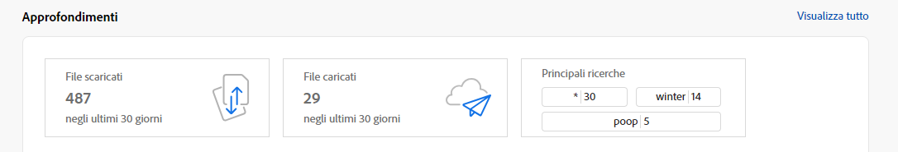

# Note sulla versione di [!DNL Assets Essentials] {#release-notes}

L’attuale versione di Assets Essentials è stata rilasciata il 18 aprile 2024.

Alcune delle funzioni aggiunte di recente includono:

**Ricerca contestuale**

Ora puoi cercare le risorse disponibili nell’archivio definendo i prompt di testo. Experience Manager Assets trasforma automaticamente i prompt di testo in filtri di ricerca e visualizza i risultati della ricerca. È possibile visualizzare e modificare i filtri automatici utilizzando il riquadro Filtri per limitare ulteriormente i risultati della ricerca.

<!--

**Dynamic renditions**

You can now view and download dynamic renditions (including smart crops) in Experience Manager Assets. Dynamic renditions are customized versions of image assets created in real-time to meet specific needs, such as resizing images based on device resolution or cropping to fit different aspect ratios. These renditions enable organizations to deliver personalized and optimized experiences to diverse audience needs.

-->

**Ridenominazione diretta di risorse e cartelle**

Experience Manager Assets ora offre un’esperienza utente semplificata grazie alla possibilità di rinominare una risorsa o una cartella tramite un singolo clic.

**Azioni rapide per video Express**

Experience Manager Assets ora include strumenti di editing video semplici e intuitivi basati su Adobe Express per aumentare il riutilizzo dei contenuti e velocizzarne la realizzazione. Le opzioni di modifica includono il taglio, il ritaglio, il ridimensionamento di un video e anche la conversione di un file MP4 in GIF.

>[!NOTE]
> Sono obbligatori i diritti di accesso a [!DNL Adobe Express] e almeno un ambiente in AEM Assets. L’ambiente può essere uno qualsiasi degli archivi all’interno di [!DNL Assets as a Cloud Service] o [!DNL Assets Essentials].

**Assegnare o rimuovere il modulo metadati in più cartelle**

Ora è possibile assegnare o rimuovere un modulo di metadati da più cartelle.

**Gestire autorizzazioni per le raccolte private**

Puoi consentire agli amministratori o non amministratori (altri utenti) di gestire i livelli di accesso per le raccolte private disponibili nell’archivio. Puoi assegnare le autorizzazioni come `Can View` e `Can Edit` ai gruppi di utenti o agli utenti. Puoi anche delegare i privilegi di gestione delle autorizzazioni ai gruppi di utenti.

**Miglioramenti in base al feedback ricevuto dai clienti**

Miglioramenti e correzioni di bug in base al feedback ricevuto dai clienti.

## Problemi noti {#known-issues}

L’elenco dei problemi noti di [!DNL Assets Essentials] viene regolarmente rivisto e aggiornato:

<!--

* Assets Essentials does not support creating Private collections.

-->

<!--* Private collections are available to creator and the users with administrator privileges. As an administrator, you cannot delegate the permissions to access the collection to other users.-->

In caso di problemi o richieste di miglioramenti, ti invitiamo a [fornire un feedback](#provide-feedback) al team.

## Versioni precedenti {#past-releases}

### Versione di gennaio 2024 {#january-2024-release}

**Tag avanzati nell’elenco Bloccati**

Assets Essentials ora consente di definire l’elenco Bloccati per le parole che non devono essere aggiunte come tag avanzati alle risorse quando vengono caricate nell’archivio. Questa funzionalità consente di mantenere la conformità al marchio e di ridurre gli sforzi nella moderazione dei tag avanzati.

**Creare immagini basate su IA generativa con Adobe Firefly**

Creazione di nuove immagini basate su query di ricerca con integrazione della funzione testo-immagine di Adobe Firefly (richiede una licenza Adobe Firefly).

**Trovare immagini simili**

Ora è possibile trovare facilmente il contenuto selezionando un’immagine e visualizzando immagini simili nell’archivio di Experience Manager Assets.

**Editor Adobe Express incorporato in AEM Assets**

Gli utenti con accesso a Express ora dispongono di strumenti integrati per la modifica e la creazione di immagini da Adobe Express e Adobe Firefly disponibili direttamente in AEM Assets, per migliorare il riutilizzo dei contenuti e accelerarne la creazione.

**Rapporti sull’utilizzo dello spazio di archiviazione in Insights**:

Gli amministratori ora possono visualizzare i rapporti sull’utilizzo dello spazio di archiviazione, disponibili come parte di Insights.

**Configurazione della pagina Home Cerca prima**

Assets Essentials ora consente di configurare l’esperienza della pagina home per la tua organizzazione. Se, per la pagina Home, selezioni l’opzione Cerca prima, puoi configurare l’allineamento della barra di ricerca, l’immagine di sfondo e il logo della tua organizzazione. Scegliendo [!UICONTROL Impostazioni generali] viene sostituita la pagina di destinazione predefinita. Ad esempio, la destinazione predefinita è [!UICONTROL La mia area di lavoro] per amministratori e [!UICONTROL Cerca prima] per i non amministratori, la scelta di una delle opzioni in Impostazioni generali viene applicata a tutti gli utenti

### Versione di ottobre 2023 {#october2023-release}

**Importazione in blocco di risorse da un’origine dati OneDrive**

Gli amministratori ora possono [importare un numero elevato di risorse da OneDrive a AEM Assets](/help/using/bulk-import-assets-view.md). L’elenco aggiornato delle origini dati supportate per l’importazione in blocco include Azure, AWS, Google Cloud, Dropbox e OneDrive.

**Supporto di diritti tra diverse organizzazioni per le librerie**

Experience Manager Assets ora consente di configurare l’accesso alle librerie Creative Cloud in un’organizzazione IMS diversa. Questo consente di accedere più facilmente ai flussi di lavoro di prodotti più recenti tra Creative Cloud e Experience Manager, riducendo i tempi e agevolando il lavoro dei creativi.

### Versione di settembre 2023 {#september2023-release}

**Assegnare un modulo di metadati a una cartella**

Ora puoi assegnare un modulo di metadati a una cartella specifica all’interno dell’implementazione di Assets Essentials. Per tutte le risorse nella cartella, comprese le risorse nelle sottocartelle, vengono quindi visualizzate le proprietà definite nel modulo di metadati assegnato.

**Importazione in blocco dalle origini dati**

Gli amministratori ora possono importare un numero elevato di risorse da un’origine dati a AEM Assets. Gli amministratori non devono più caricare singole risorse o cartelle in AEM Assets. Le origini dati supportate per l’importazione in blocco includono Azure, AWS, Google Cloud e Dropbox.

**Strumenti di editing delle immagini basati su Adobe Express**

Strumenti di editing delle immagini semplici e intuitivi gestiti da Adobe Express disponibili direttamente in AEM Assets per aumentare il riutilizzo dei contenuti e velocizzarne la creazione.

**Flessibilità durante il fissaggio di elementi in Accesso rapido dell’area di lavoro personale**

Possibilità di selezionare e fissare gli elementi per te, per l’intera organizzazione o per un elenco di gruppi in modo che vengano visualizzati nella sezione Accesso rapido dell’Area di lavoro personale in base alla selezione.

### Versione di luglio 2023 {#july2023-release}

**Framework di intelligenza artificiale migliorato per i tag avanzati delle immagini**

Experience Manager Assets ora utilizza un framework di intelligenza artificiale migliorato per i tag avanzati delle immagini. Offre un livello di intelligence sui contenuti che migliora la pertinenza e la precisione dei tag avanzati per tutte le risorse di tipo immagine al momento della loro acquisizione.

**Configurare la visualizzazione delle colonne per la vista Elenco risorse**

Assets Essentials ora consente di selezionare le colonne da visualizzare nella vista Elenco risorse, ad esempio Stato, Formato, Dimensioni, Dimensione file e così via.

**Ordinare i risultati della ricerca in base alla rilevanza**

Per impostazione predefinita, Assets Essentials ora ordina i risultati della ricerca in base alla rilevanza. Puoi ordinare le risorse trovate in ordine crescente o decrescente per `Name`, `Relevance`, `Size`, `Modified` e `Created`.

### Versione di giugno 2023 {#june2023-release}

**Assegnazione tag gerarchica alle risorse per un’esperienza di ricerca più veloce**

Gli elenchi semplici dei vocabolari controllati diventano ingestibili nel tempo. Assets Essentials ora supporta la struttura gerarchica dell’assegnazione tag, che semplifica l’applicazione di metadati rilevanti, la classificazione delle risorse, il supporto della ricerca, il riutilizzo dei tag, il miglioramento della reperibilità e così via.

**Fissare file, cartelle e raccolte per un accesso rapido**

È ora possibile fissare file, cartelle e raccolte per accedervi più rapidamente quando se ne avrà bisogno. Gli elementi fissati vengono visualizzati nella sezione **Accesso rapido** dell’area di lavoro personale. È possibile accedervi utilizzando l’area di lavoro personale anziché passare alla posizione in cui sono stati salvati nell’archivio.

**Filtrare le risorse nella cartella Cestino**

Assets Essentials ora consente di filtrare le risorse disponibili nella cartella Cestino. Puoi applicare filtri standard o personalizzati per cercare le risorse appropriate all’interno della cartella Cestino per ripristinarle o eliminarle definitivamente.

**Anteprime delle miniature per risorse 3D**

Assets Essentials ora genera anteprime di miniature per i formati comuni di file 3D, tra cui gLB, USDz, FBX, 3DS, OBJ e SBSAR. Quando questi file vengono caricati in Assets Essentials, per impostazione predefinita le miniature vengono generate automaticamente dal sistema.

**Visualizzare i termini più cercati**

Assets Essentials ora supporta la visualizzazione dei termini più ricercati nella distribuzione di Assets Essentials utilizzando la sezione **Approfondimenti** dell’area di lavoro personale. Puoi anche passare alla sezione Approfondimenti per visualizzare le ricerche principali degli ultimi 30 giorni o 12 mesi.

**Miglioramenti al modulo metadati**

Assets Essentials ora consente di aggiungere componenti di proprietà di testo multi-valore ed elenchi a discesa ai moduli metadati.

### Più versioni nel 2023 {#multiple-releases-2023}

L’elenco delle funzioni aggiunte di recente include:

**Risorse più scaricate**

Nell’area di lavoro personale, nella sezione [!UICONTROL Contenuto] vengono ora visualizzate le dieci risorse più scaricate per l’ambiente Assets Essentials. Per ciascuna risorsa elencata puoi anche visualizzare il tipo di formato e il numero di download.

**Aggiornamenti in blocco dei metadati delle risorse**

Gli aggiornamenti in blocco dei metadati consentono di eseguire aggiornamenti di metadati comuni su più risorse contemporaneamente. Non è necessario aggiornare i record singolarmente ed è possibile applicare rapidamente le proprietà alle risorse o alle cartelle accessibili tramite ricerca. Inoltre, gli aggiornamenti in blocco dei metadati sovrascrivono eventuali valori esistenti, il che significa che le parole chiave esistenti vengono sovrascritte dall’aggiornamento in blocco dei metadati.

**Area di lavoro personale con widget configurabili**

Assets fornisce ora un’area di lavoro personalizzata che funge da soluzione unica per fornire un accesso conveniente alle aree chiave dell’interfaccia utente di Assets e alle informazioni più rilevanti per te. L’accesso più rapido a queste opzioni aumenta la velocità dei contenuti e l’efficienza dei progetti.

L’area di lavoro personale include widget per approfondimenti, attività e contenuti. Puoi configurare la modalità di visualizzazione di questi widget nell’area di lavoro in base alle tue preferenze.

**Interfaccia utente dedicata per la gestione delle attività**

Assets Essentials ora consente di gestire l’elenco delle attività attualmente assegnate a te, create e già completate da te in una posizione centralizzata tramite la nuova opzione **[!UICONTROL Attività]** disponibile nel riquadro di navigazione a sinistra. È inoltre possibile adottare le azioni appropriate selezionando un’attività per approvarla o rifiutarla o aprendo i dettagli dell’attività per approvarla, rifiutarla, modificarla o eliminarla.

**Collegamenti generati automaticamente per condividere le risorse**

Assets Essentials ora genera un collegamento automaticamente non appena scegli di condividere una risorsa usando l’interfaccia utente di Assets Essentials. Il collegamento generato rimane valido anche se modifichi la data di scadenza.

**Miglioramenti in base al feedback ricevuto dai clienti**

Miglioramenti e correzioni di bug in base al feedback ricevuto dai clienti.

### 2022.11.0 {#november-2022}

L’attuale versione di [!DNL Assets Essentials] è stata rilasciata il 17 novembre 2022.

Questa versione offre le seguenti funzionalità:

**Anteprima di documenti con visualizzatore Document Cloud**

Assets Essentials ora consente di caricare documenti in altri tipi di formati supportati e di visualizzarli in anteprima utilizzando il visualizzatore di Document Cloud incluso. I tipi di formato supportati sono TXT, RTF, DOC, DOCX, PPT, PPTX, XLS e XLSX.

<!--

**View Smart Tags moderation reports**

Asset reporting now provides administrators with visibility into the Smart Tags promoted or deleted for an asset. You can specify a folder path and the report lists the Smart Tags promoted or deleted for all assets available at the folder path.

-->

<!--
**Read-only access to large number of users**

Assets Essentials allows administrators to provide read-only access to a large number of users for selected assets or folders in the repository. 
You can easily synchronize the user groups available on the external identity management of an organization with Adobe Admin Console and then manage permissions in Admin Console and Assets Essentials to provide the users with read-only access for selected assets or folders.

-->

**Nuova opzione Salva metadati**

È ora disponibile una nuova opzione Salva metadati nell’interfaccia utente di Assets Essentials per una migliore governance dei metadati.

**Miglioramenti in base al feedback ricevuto dai clienti**

Miglioramenti e correzioni di bug in base al feedback ricevuto dai clienti.

**Adobe Asset Link versione 3.3**

La versione 3.3 di [Adobe Asset Link](https://helpx.adobe.com/it/enterprise/using/adobe-asset-link.html) è stata rilasciata il 13 dicembre 2022 con le seguenti caratteristiche:

* Supporto per [Creative Cloud for teams](https://www.adobe.com/it/creativecloud/business/teams.html) oltre al supporto precedente di [Creative Cloud for enterprise](https://www.adobe.com/it/creativecloud/business/enterprise.html).

* Supporto per le applicazioni Adobe InDesign, Photoshop e Illustrator 2023 più recenti.

* Supporto per l’utilizzo dei plug-in di Adobe Asset Link CEP in ambienti con server proxy.

### 2022.8.0 {#august-2022}

L’attuale versione di [!DNL Assets Essentials] è stata rilasciata il 22 agosto 2022.

Questa versione offre le seguenti funzionalità:

**Notifiche per le raccolte**

Le notifiche Assets Essentials consentono di monitorare le operazioni eseguite sulle raccolte disponibili nell’archivio. Devi selezionare e iscriverti alle raccolte per le quali ti vengono inviate le notifiche. Puoi anche configurare le operazioni per le quali vengono inviate le notifiche, ad esempio le operazioni di eliminazione, condivisione dei collegamenti, spostamento, ridenominazione e aggiornamento eseguite sulle raccolte.

**Modificare raccolte avanzate**

Assets Essentials ora consente anche di modificare i criteri di ricerca utilizzati durante la creazione di una raccolta avanzata.  Salva i nuovi criteri di ricerca per aggiornare dinamicamente il contenuto della raccolta.

**Visualizzare statistiche live per l’account di archiviazione**

Assets Essentials consente ora di visualizzare i dati degli account di archiviazione in tempo reale per l’ambiente Assets Essentials mediante la dashboard Statistiche live. È possibile visualizzare le metriche degli eventi in tempo reale per gli ultimi 30 giorni o 12 mesi.

**Visualizzare i rapporti di caricamento**

Il reporting delle risorse offre ora agli amministratori la visibilità delle risorse caricate nell’implementazione Adobe Experience Manager Assets Essentials. Gli amministratori possono già generare rapporti per le risorse scaricate dall’implementazione Assets Essentials. Questi dati forniscono informazioni utili su come gli utenti interagiscono con i contenuti e il prodotto.

**Miglioramenti in base al feedback ricevuto dai clienti**

Miglioramenti e correzioni di bug in base al feedback ricevuto dai clienti.

### 2022.6.0 {#june-2022}

La versione di giugno di [!DNL Assets Essentials] è stata rilasciata il 14 luglio 2022.

Questa versione offre le seguenti funzionalità:

**Raccolte avanzate**

Salva i risultati della ricerca come Raccolta avanzata per aggiornare dinamicamente il contenuto della raccolta. Se sono presenti risorse aggiunte all’archivio Assets Essentials che soddisfano i criteri di ricerca definiti durante la [creazione della raccolta avanzata](manage-collections.md#create-smart-collection), il contenuto della raccolta avanzata viene aggiornato automaticamente.

**Notifiche**

Le notifiche di Assets Essentials consentono di [monitorare le operazioni eseguite sulle risorse o cartelle disponibili nell’archivio](manage-notifications.md). Devi selezionare e iscriverti al contenuto per il quale ti vengono inviate le notifiche. Puoi anche configurare le categorie per le quali vengono inviate le notifiche.

**Reporting**

La funzionalità di reporting sulle risorse consente agli amministratori di valutare le attività degli utenti in Adobe Experience Manager Assets Essentials. I rapporti e la dashboard delle statistiche live forniscono informazioni utili sul modo in cui gli utenti interagiscono con le risorse disponibili nell’implementazione. [Utilizza le informazioni contenute nei rapporti](manage-reports.md) per derivare le metriche di successo chiave con cui misurare il livello di adozione di Assets all’interno della tua azienda e da parte dei clienti.

Visualizza i rapporti di download delle risorse e il modulo della dashboard delle statistiche live per vedere quali risorse vengono scaricate e la frequenza dei download.

### 2022.5.0 {#may-2022}

La versione di maggio di [!DNL Assets Essentials] è stata rilasciata il 16 giugno 2022.

Questa versione offre le seguenti funzionalità:

**Miglioramenti allo stato delle risorse**

* Assets Essentials ora consente di [impostare una data di scadenza per una risorsa](manage-organize.md#set-asset-status). Inoltre, è possibile [filtrare le risorse](search.md#refine-search-results) in base allo stato `Expired` delle risorse e a un intervallo di date di scadenza.

* Ora puoi visualizzare l’indicatore di stato per tutte le risorse disponibili nel Cestino. Di conseguenza, potrai decidere se ripristinare una risorsa in base al suo stato.

**Miglioramenti ai filtri di ricerca**

* Assets Essentials ora consente di [filtrare le risorse](search.md#refine-search-results) in base allo stato `No Status` delle risorse.

<!--

* Assets Essentials now supports [using a wildcard operator (*) while using custom filters](search.md#custom-filters) to enable Assets Essentials to display assets in the results that partially match the search criteria.

-->

**Miglioramenti alle raccolte**

<!--

* Assets Essentials now enables you to [create Private collections](manage-collections.md#create-collection).

-->

* Assets Essentials ora supporta il [download di una raccolta](manage-collections.md).

* È ora possibile modificare il campo metadati Descrizione di una raccolta.

**Miglioramenti alla documentazione**

* È disponibile una nuova versione della [documentazione Panoramica di Assets Essentials](introduction.md).

**Miglioramenti in base al feedback ricevuto dai clienti**

* Miglioramenti e correzioni di bug in base al feedback ricevuto dai clienti.

### 2022.4.0 {#april-2022}

L’attuale versione di [!DNL Assets Essentials] è stata rilasciata il 12 maggio 2022. Questa versione offre le seguenti funzionalità:

* [!DNL Assets Essentials] ora supporta la [creazione di raccolte](manage-collections.md). Una raccolta è un insieme di risorse in Experience Manager Assets Essentials. Puoi utilizzare le raccolte per condividere le risorse tra i vari utenti. A differenza delle cartelle, una raccolta può includere risorse da posizioni diverse.

* Assets Essentials ora consente anche di [aggiungere filtri personalizzati](search.md#custom-filters) all’interfaccia utente. Puoi applicare i filtri personalizzati in aggiunta ai filtri standard, per perfezionare i risultati della ricerca.

* Assets Essentials ora consente di [impostare lo stato](manage-organize.md#set-asset-status) delle risorse disponibili nell’archivio. Imposta lo stato di una risorsa per gestire meglio il consumo a valle di risorse digitali.

* Miglioramenti e correzioni di bug in base al feedback ricevuto dai clienti.

#### Modalità di navigazione in incognito in Chrome {#incognito-mode}

Con questa versione stiamo ottimizzando le prestazioni della distribuzione dell’interfaccia utente e specifiche funzionalità di Assets Essentials (aggiunta di commenti alle risorse e modifica delle immagini) che dipendono dall’archiviazione locale del browser e dall’attivazione di cookie di terze parti. Per impostazione predefinita, la modalità di navigazione in incognito nel browser web Chrome blocca i cookie di terze, e gli utenti hanno alcune opzioni per continuare ad accedere a tutte le funzionalità:

* Utilizzare i profili Chrome invece della modalità di navigazione in incognito, se l&#39;utente ha bisogno di sessioni browser separate

* Disattivare `Block third-party cookies` nella schermata della modalità in incognito in Chrome

### 2022.2.0 {#march-2022}

[!DNL Assets Essentials] è stato rilasciato il 9 marzo 2022, con i seguenti aggiornamenti:

* [!DNL Assets Essentials] ora consente di [generare un collegamento e condividere le risorse con le parti interessate](share-links-for-assets.md), che non hanno accesso all’applicazione [!DNL Assets Essentials]. Puoi definire una data di scadenza del collegamento e condividerlo con altri utilizzando il metodo di comunicazione preferito, ad esempio e-mail o servizi di messaggistica. I destinatari del collegamento possono visualizzare in anteprima le risorse e scaricarle.

* [!DNL Assets Essentials] ora comprende [un profilo di prodotto amministratore](deploy-administer.md#add-users-to-essentials) su Admin Console, oltre ai profili di prodotto standard e consumer esistenti. Un amministratore può ora assegnare altri utenti al profilo di prodotto dell’amministratore.

* Assets Essentials consente ora agli amministratori di [gestire i livelli di accesso per le cartelle disponibili nell’archivio](manage-permissions.md). In qualità di amministratore, puoi creare gruppi di utenti e assegnare autorizzazioni a tali gruppi per gestire i livelli di accesso. Puoi anche delegare i privilegi di gestione delle autorizzazioni ai gruppi di utenti a livello di cartella.

* Miglioramenti e correzioni di bug in base al feedback ricevuto dai clienti.

Inoltre, l’estensione [!DNL Adobe Asset Link] per Creative Cloud (Photoshop, Illustrator e InDesign) ha rilasciato una [nuova versione 3.2](https://exchange.adobe.com/creativecloud.details.106875.adobe-asset-link-cep.html), con miglioramenti delle prestazioni del tempo di avvio del pannello e nella velocità di download.

### Versione 2022.1.0 {#january-2022}

[!DNL Assets Essentials] è stato rilasciato il 3 febbraio 2022, con i seguenti aggiornamenti:

* Miglioramenti delle prestazioni per l’operazione [!UICONTROL Crea cartella]. <!-- CQ-4338818 -->

### Versione 2021.11.0 {#november-2021}

[!DNL Assets Essentials] è stato rilasciato il 16 dicembre 2021, con i seguenti aggiornamenti:

* Al termine del processo di provisioning, Adobe implementa automaticamente Assets Essentials. Gli amministratori non devono eseguire alcun passaggio aggiuntivo per implementare Assets Essentials tramite l’interfaccia utente di [!DNL Cloud Manager]. L’implementazione automatica sarà disponibile per gli ambienti per i quali è stato eseguito il provisioning dopo il 6 gennaio 2022.
* In Adobe Exchange sono disponibili nuove versioni dei plug-in Creative Cloud che funzionano con Assets Essentials: [Adobe Asset Link per Adobe XD v. 2.1.0](https://exchange.adobe.com/creativecloud/plugindetails.html/app/cc/61d229b9) e [Adobe Asset Link for Photoshop/InDesign/Illustrator v. 3.1.65](https://exchange.adobe.com/creativecloud.details.106875.adobe-asset-link-cep.html).
* Vari bug e miglioramenti dei prodotti, tra cui problemi noti precedenti (dopo il caricamento, le cartelle ora vengono visualizzate correttamente nella struttura di spostamento a sinistra<!-- CQ-4337638 -->; il caricamento mediante trascinamento della selezione consente di selezionare la cartella corrente o una sottocartella al momento del rilascio per il caricamento<!-- CQ-4327753 -->).

### Versione 2021.8.0 {#august2021}

[!DNL Assets Essentials] 2021.8.0 è stato rilasciato il 30 agosto 2021 con i seguenti aggiornamenti:

* Integrazioni con [!DNL Adobe Workfront] che consentono agli utenti di [!DNL Workfront] di gestire le proprie risorse digitali nel contesto di gestione del proprio lavoro.

### Versione 2021.7.0 {#july2021}

[!DNL Assets Essentials] 2021.7.0 è stato rilasciato il 29 luglio 2021 con i seguenti aggiornamenti:

* Puoi creare e gestire moduli di metadati personalizzati da utilizzare per consentire agli utenti di visualizzare le proprietà dei metadati nella schermata dei dettagli delle risorse dall’opzione [!UICONTROL Moduli metadati] in [!DNL Settings]. Consulta [Moduli di metadati](metadata.md#metadata-forms).
* Varie correzioni di bug e miglioramenti al prodotto, incluse migliori prestazioni durante il caricamento di cartelle nidificate contenenti numerose sottocartelle.

### Versione 2021.6.0 {#june2021}

La prima versione di [!DNL Assets Essentials], rilasciata il 21 giugno 2021, offre funzionalità leggere per la gestione delle risorse. Supporta le seguenti funzioni principali e operazioni CRUD (Create, Read, Update, Delete: crea, leggi, aggiorna, elimina):

* Caricare e aggiungere risorse, incluse cartelle nidificate. Visualizzare l’anteprima di risorse e versioni.
* Ricerca full-text, filtri di ricerca mirata, e ricerche salvate per individuare rapidamente le risorse.
* Operazioni di base per la gestione delle risorse, come aggiornamento, eliminazione, download e gestione dei metadati.
* [!DNL Assets Essentials] è disponibile per gli utenti di [!DNL Adobe Journey Optimizer] per la gestione delle risorse durante la creazione dei messaggi.
