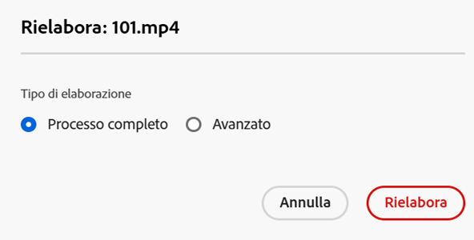
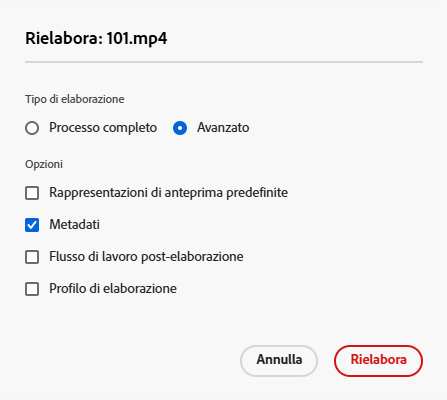
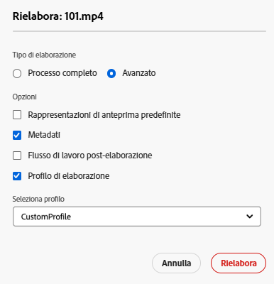

# Rielaborazione delle risorse digitali {#reprocessing-digital-assets}

Puoi rielaborare le risorse in una cartella che dispone già di un profilo metadati esistente che hai modificato in un secondo momento. Se desideri applicare nuovamente il predefinito appena modificato alle risorse esistenti nella cartella, devi rielaborare la cartella. Puoi rielaborare tutte le risorse necessarie.

Rielabora le risorse in una cartella se si verifica uno dei due scenari seguenti:

* Desideri eseguire un predefinito per set di batch in una cartella di risorse esistente in cui sono già caricate risorse.
* Modifichi un predefinito per set di batch esistente che era precedentemente applicato a una cartella di risorse in un secondo momento.

## Rielaborazione risorse {#reprocessing-steps}

Per rielaborare le risorse in una cartella:

1. In [!DNL Assets Essentials], dalla pagina Risorse, seleziona le risorse appena aggiunte o quelle che desideri rielaborare.
Se selezioni una cartella:

   * Il flusso di lavoro considera tutti i file nella cartella selezionata in modo ricorsivo.
   * Se nella cartella principale selezionata sono presenti una o più sottocartelle con risorse, il flusso di lavoro rielabora ogni risorsa nella gerarchia di cartelle.
   * Come best practice, evita di eseguire questo flusso di lavoro su una gerarchia di cartelle con più di 1000 risorse.

1. Seleziona **[!UICONTROL Rielabora risorse]**. Scegli tra le due opzioni:

   

   * **[!UICONTROL Processo completo]:** seleziona questa opzione se desideri eseguire il processo complessivo, inclusi il profilo predefinito, il profilo personalizzato, l’elaborazione dinamica (se configurata) e i flussi di lavoro di post-elaborazione.
   * **[!UICONTROL Avanzata]:** seleziona questa opzione per scegliere la rielaborazione avanzata.

     

     Seleziona una delle seguenti opzioni avanzate:

      * **[!UICONTROL Rappresentazioni di anteprima predefinite]:** scegli questa opzione per rielaborare le rappresentazioni visualizzate in anteprima per impostazione predefinita.

      * **[!UICONTROL Metadati]:** scegli questa opzione per estrarre le informazioni sui metadati e i tag avanzati per le risorse selezionate.

      * **[!UICONTROL Elaborazione dei profili]:** scegli questa opzione se desideri rielaborare un profilo selezionato. Puoi scegliere l’opzione **[!UICONTROL Processo completo]** per includere l’elaborazione predefinita e il profilo personalizzato assegnato a livello di cartella.
        <!--When assets are uploaded to a folder, [!DNL Assets Essentials] checks the containing folder's properties for a processing profile. If none is applied, a parent folder in the hierarchy is checked for a processing profile to apply.-->

      * **[!UICONTROL Flusso di lavoro post-elaborazione]:** scegli questa opzione se è necessaria un’ulteriore elaborazione delle risorse che non può essere ottenuta utilizzando i profili di elaborazione. È possibile aggiungere alla configurazione ulteriori flussi di lavoro post-elaborazione. La post-elaborazione consente di aggiungere un’elaborazione completamente personalizzata oltre a quella configurabile utilizzando i microservizi per le risorse.

Consulta [Utilizzare i microservizi delle risorse e i profili di elaborazione](https://experienceleague.adobe.com/docs/experience-manager-cloud-service/content/assets/manage/asset-microservices-configure-and-use.html?lang=it) per ulteriori informazioni su profili di elaborazione e flussi di lavoro post-elaborazione.

Dopo aver selezionato le opzioni appropriate, fai clic su **[!UICONTROL Rielabora]**. Viene visualizzato il messaggio di operazione riuscita.

## Scenari per la rielaborazione delle risorse digitali {#scenarios-reprocessing}

[!DNL Experience Manager] consente di rielaborare le risorse digitali per i seguenti componenti.

### Tag avanzati {#reprocessing-smart-tags}

Le organizzazioni che si occupano di risorse digitali utilizzano sempre più spesso il vocabolario controllato dalla tassonomia nei metadati delle risorse. In sostanza, si tratta di elenchi di parole chiave che dipendenti, partner e clienti utilizzano abitualmente per ricercare specifiche categorie di risorse digitali. L’assegnazione dei tag alle risorse tramite un vocabolario controllato dalla tassonomia consente di identificarle e recuperarle facilmente.

A differenza del linguaggio naturale, l’assegnazione di tag alle risorse in base alla tassonomia aziendale garantisce un perfetto allineamento con i processi di business, assicurando che i risultati di ricerca siano sempre pertinenti e accurati.

Ulteriori informazioni sui [Tag avanzati per risorse video](https://experienceleague.adobe.com/docs/experience-manager-cloud-service/content/assets/manage/smart-tags-video-assets.html?lang=it).

Ulteriori informazioni sulla [Rielaborazione dei tag colore per immagini esistenti in DAM](https://experienceleague.adobe.com/docs/experience-manager-cloud-service/content/assets/manage/color-tag-images.html?lang=it#color-tags-existing-images).

### Ritaglio avanzato {#reprocessing-smart-crop}

Ulteriori informazioni sul [Ritaglio avanzato in Dynamic Media](https://experienceleague.adobe.com/docs/experience-manager-cloud-service/content/assets/dynamicmedia/image-profiles.html?lang=it) che consente di applicare configurazioni di nitidezza e ritaglio specifiche (**[!UICONTROL Ritaglio avanzato]** e ritaglio pixel) alle risorse caricate.

### Metadati {#reprocessing-metadata}

[!DNL Adobe Experience Manager Assets] mantiene i metadati per ogni risorsa. Consente di categorizzare e organizzare più facilmente le risorse, ottimizzando la ricerca di risorse specifiche. Grazie alla possibilità di estrarre i metadati dai file caricati in Experience Manager Assets, la gestione dei metadati si integra con il flusso di lavoro creativo. Grazie alla possibilità di conservare e gestire i metadati con le risorse, è possibile organizzare ed elaborare automaticamente le risorse in base ai relativi metadati.

Ulteriori informazioni sulla [Rielaborazione dei profili metadati](https://experienceleague.adobe.com/docs/experience-manager-cloud-service/content/assets/manage/metadata-profiles.html?lang=it).

### Rielaborare le risorse in una cartella in Dynamic Media {#reprocessing-dynamic-media}

È possibile rielaborare le risorse in una cartella che dispone già di un profilo immagine Dynamic Media esistente o di un profilo video Dynamic Media modificato successivamente. Per ulteriori informazioni, consulta [Rielaborare le risorse in una cartella in Dynamic Media.](https://experienceleague.adobe.com/docs/experience-manager-cloud-service/content/assets/admin/about-image-video-profiles.html?lang=it)

>[!NOTE]
>
>È necessario configurare [!DNL Dynamic Media] nell’ambiente per abilitare la finestra di dialogo Dynamic Media.
>

### Flussi di lavoro

Ulteriori informazioni su [profili di elaborazione e flussi di lavoro post-elaborazione](https://experienceleague.adobe.com/docs/experience-manager-cloud-service/content/assets/manage/asset-microservices-configure-and-use.html?lang=it).
